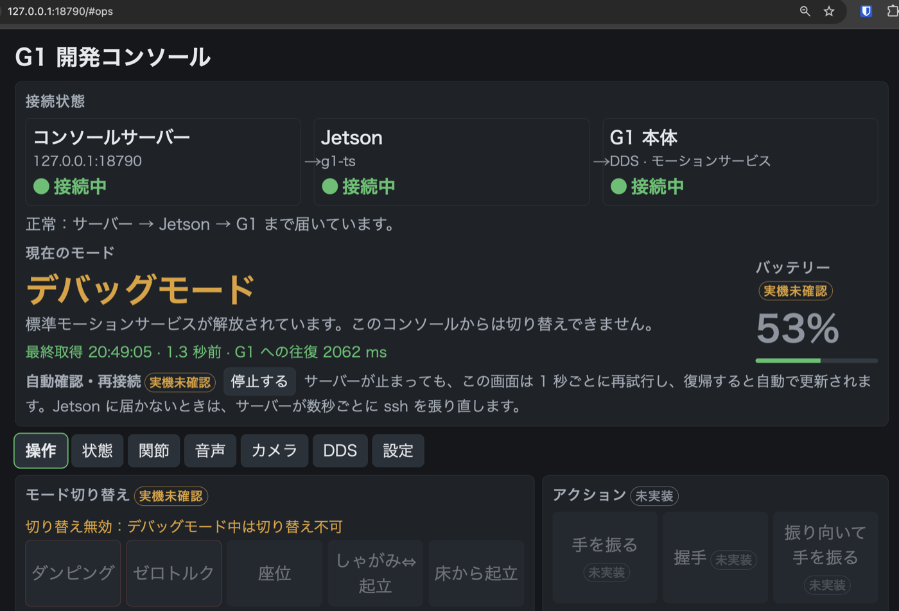
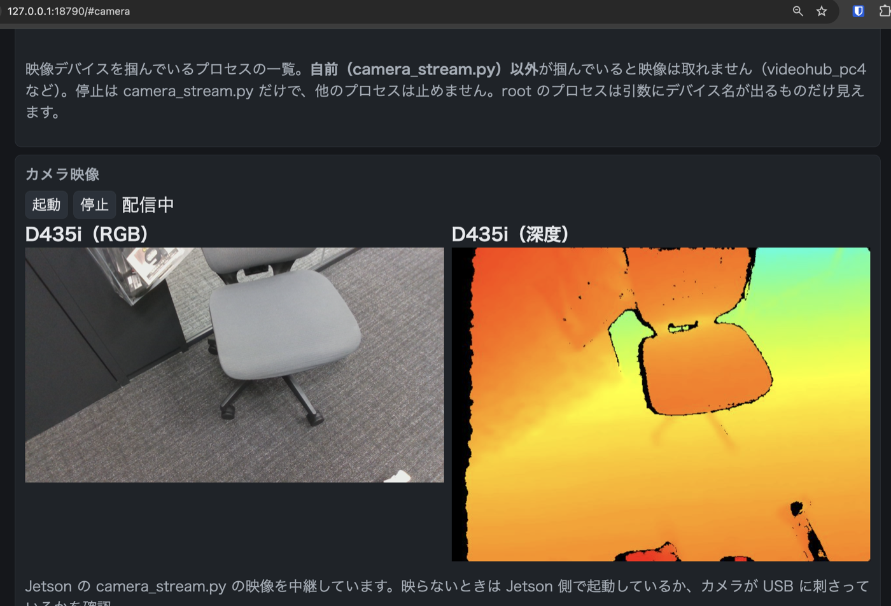

# Console — G1 のモード表示・切り替え（物理リモコン置き換えの第一歩）

G1 の**現在の動作モードを表示**し、**ボタンでモードを切り替える**だけの小さな開発コンソール。
専用リモコンでやっている操作をブラウザに移していくための土台で、
歩行操作（速度指令）などは**将来ここに足す予定**（現状は入っていない）。

位置づけ・リモコンとの対応・SDK での実現手段は **[docs/REMOTE_CONTROLLER.md](docs/REMOTE_CONTROLLER.md)** にまとめた。
画面にも「未実装」「実機未確認」を表示する（定義は [`g1console/modes.py`](g1console/modes.py) の `FEATURES`）。

## 状態（2026-09-30）

| 基本機能 | 実装 | 実機確認 |
|---|---|---|
| 接続状態表示（サーバー → Jetson → G1、最終取得時刻つき） | ✅ | ⚠ 未確認 |
| 自動再接続 | ✅ | ⚠ 未確認 |
| モード変更（6 種） | ✅ | ⚠ **`SetFsmId` を実機で押したことはない**（2026-09-30 の実機取得はデバッグモードのみで、その後電池切れ） |
| アクション実行（手を振る・握手） | ❌ 未実装 | — |
| 矢印キーで移動 | ❌ 未実装 | — |
| バッテリー表示（`rt/lf/bmsstate`） | ✅ | ✅ 値は取得済み（単位 mV/mA は推定） |
| デバッグ情報（IMU・関節・指令・オドメトリ・メインボード・Jetson・DDS 受信） | ✅ | ✅ 値は取得済み（関節名の対応・メインボード `value` の意味は未確認） |
| 音声・LED（音量・頭部 LED・読み上げ） | ✅ | ⚠ 音量取得と LED/TTS の送信は実施。成功は目視・聴取（LED は読み戻し不可）、再生の開始・終了は `rt/audio_msg` で観測可 |
| DDS リストタブ（65 トピック・25 サービスの表示済み/未実装/対象外） | ✅ | — |
| 準備（固定立位）・Run・デバッグへの切替 | ❌ 未実装（ID／手順が未確認） | — |

✅ は「別スクリプトやログで実機の値を取得できた」の意味。**コンソール経由で実機確認した機能はまだ無い**（`g1console/modes.py` の `FEATURES` の `verified` は全て `False`）。

確認できているのは、**模擬モードでのサーバ・画面・許可 ID の検査**（`tests/run_tests.sh`）と、
別スクリプトによる通常モードの状態取得（`GetFsmId=501`、`CheckMode name=ai`。根拠ログはこの PR に含まれない）だけ。
コンソールを G1 電源オンで通したことはまだ無い。

## 動かす

```bash
# 実機（設定タブで Jetson の IP を入れる。Jetson 上でヘルパーが DDS に繋ぐ）
python3 server.py

# 実機なしで画面だけ確認（状態は作り物。画面右上の「模擬シナリオ」で
# 正常 / G1 未応答 / Jetson に届かない / デバッグモード を切り替えて表示を確認できる）
python3 server.py --mock
# 模擬シナリオ「実機ログの再生」は tests/fixtures/g1_live_sample.jsonl（2026-09-30 の実機ログを
# 20 秒に 1 件へ間引いたもの）の値を、デバッグモードとして循環表示する（replay.py）
```

ブラウザで `http://127.0.0.1:18790` を開く。標準ライブラリだけで動く（追加の pip は不要）。

**PC の呼び分け:** 操作用 PC = このコンソール（`server.py`）とブラウザを動かす PC（OS は問わない）。開発用 PC = 開発作業用の別の PC（設定タブに IP を記録するだけ）。Jetson PC = ロボット搭載 PC。
動作確認をした操作用 PC の OS は macOS だけで、Windows は未確認（`ssh` の引数のクォート、`tools/*.sh` の bash）。

## ディレクトリ構成

```
Console/
├── server.py          起動用（python3 Console/server.py）。HTTP サーバと ssh ヘルパー呼び出し
├── g1console/         サーバが使う Python 部品（modes / settings / dds_catalog / replay / api_spec）
├── web/index.html     ブラウザ画面（1 ファイル）
├── jetson/            Jetson 側で動くもの（remote_helper.py・camera_stream.py・camera_ctl.sh）
├── tools/             実機調査・ログ取得の単発スクリプト（live_logger.py ほか）
├── tests/             テストと実機ログの fixture
├── docs/              設計・API 定義・実機調査・チェックリスト（.md / openapi.yaml）
└── settings.json      設定タブの保存先（git 対象外）
```

## つくり

```
ブラウザ ─HTTP→ server.py（操作用 PC, 127.0.0.1:18790）
                  └─ ssh（設定タブの Jetson、標準入出力で JSON 1 行ずつ）
                       └─ jetson/remote_helper.py（Jetson, Python 3.8, unitree_sdk2py）
                            └─ DDS（eth0, domain 0）→ G1 のモーションサービス
```

操作用 PC は G1 の DDS ネットワーク（`192.168.123.0/24`）に入っていないため、DDS を直接は話せない。
Jetson 上で SDK を動かし、`ssh` 越しに呼ぶ。ヘルパーのソースは `ssh` の引数として送り込むので、
Jetson にファイルは残らない。

## 表示と切り替え

- **接続状態:** 「コンソールサーバー → Jetson（ssh） → G1（DDS）」の 3 段で表示。上流が切れたら下流は「未確認」にする。
  サーバー停止・Jetson に届かない・G1 が応答しない、をそれぞれ区別し、次にやることを 1 行で出す。
- **現在のモード:** `GetFsmId` の値を名前で表示。`CheckMode` の `name` が空ならデバッグモード。
  未接続のときはモードを出さず「未接続」とし、最後に確認できた値を小さく添える。
- **更新の仕組みと鮮度:** サーバーの背景スレッドが約 1 秒ごと（Jetson に届かないときは 3 秒ごと）に G1 を確認して
  最新値を保持し、画面は 1 秒ごとにその保持値を読む。**画面に「最終取得時刻・何秒前・G1 への往復時間」を常に出す。**
  取得が 2.5 秒を超えて古いと黄、8 秒を超えると赤にし、8 秒を超えたらモード切り替えを無効にする。
  タブを増やしても ssh／DDS への負荷は増えない。
- **遷移中表示:** 送信の受理（`SetFsmId` が 0 を返す）と、目標のモードに着いたことは別。着くまで「遷移中」を出し、
  15 秒経っても着かなければ履歴に残す（この間もダンピングは押せる）。
- **ボタン:** ダンピング / ゼロトルク / 座位 / しゃがみ⇔起立 / 床から起立 / 通常歩行。
  押すと確認ダイアログ。歩行中にダンピングやゼロトルクを押すと転倒の警告が付く。
- **許可 ID:** サーバ側でも [`g1console/modes.py`](g1console/modes.py) の `BUTTONS` にある ID 以外は拒否する。

| FSM ID | 状態 | 出典 |
|---|---|---|
| 0 | ゼロトルク | `unitree_sdk2_python` の `g1_loco_client.py` |
| 1 | ダンピング | 同上 |
| 3 | 座位 | 同上 |
| 500 / 501 | 通常歩行（腰1軸 / 腰3軸） | 500 は SDK、501 は公式マニュアル系資料。実機は 501 を返した |
| 702 | 床から起立 | SDK |
| 706 | しゃがみ⇔起立 | SDK |

## 画面の構成（タブ = URL ハッシュ = API 名）

ヘッダー: 3 段の接続状態・現在のモード・バッテリー%（固定表示にはしていない）。その下に 7 タブ。

**操作タブ（`#ops`、デバッグモード中の例）**



**カメラタブ（`#camera`）** — 掴んでいるプロセスの表示、配信の起動／停止、RGB と深度の映像。RGB は公式の `VideoClient` 経路、深度は `pyrealsense2` で取り、どちらも `videohub_pc4` を止めない。深度は RGB の視点に位置合わせして同じ縦横比（16:9）で出す（下の画像は位置合わせ前の撮影）。



| タブ | ハッシュ | 中身 | JSON |
|---|---|---|---|
| 操作 | `#ops` | モード切替・アクション・移動・操作履歴 | `/api/status` |
| 状態 | `#state` | バッテリー詳細・IMU・オドメトリ・Jetson/メインボード・リモコン/非常停止 | `/api/state` |
| 関節 | `#joints` | 29 軸の角度・速度・トルク・温度・指令 | `/api/joints` |
| 音声 | `#audio` | 音量・LED・読み上げ（認識結果は未実装） | `/api/audio/volume` |
| カメラ・lidar | `#camera` | 配信プロセスの表示・起動・停止、RGB／深度の映像（lidar は未実装） | `/api/cameras`・`/api/camera/status`・`/api/camera/start`・`/api/camera/stop` |
| DDS | `#dds` | トピック/サービス台帳・受信状況・機能の状態 | `/api/dds` |
| 設定 | `#settings` | 開発用 PC／Jetson／G1 の IP（Jetson は ssh 接続先に反映。`settings.json` に保存） | `/api/settings`（GET/POST） |

自動確認・再接続の停止／再開はヘッダーのボタン（`POST /api/monitor` `{"paused": true}`、1 回だけ確認は `{"check": true}`）。

`/api/snapshot` は全タブ分を 1 回で返す。実機での確認項目は [`docs/REAL_ROBOT_CHECKLIST.md`](docs/REAL_ROBOT_CHECKLIST.md)。

## 実機調査の記録

2026-09-30 に取った実機データ・解析・未確認リストは [`docs/G1_FINDINGS.md`](docs/G1_FINDINGS.md)。
生ログ・スナップショットは `docs/g1_logs/`・`docs/g1_snapshot/`（git 対象外）、
取得スクリプトは `tools/`、ロガーは `tools/live_logger.py`。
主な知見: デバッグモードでは `CheckMode` が `(0, {'form':'0','name':''})`、`rt/arm_sdk` は効かない、
腕アクション 27 種は未実行、lidar は帯域が大きいため購読しない。

## 未搭載（意図的）

- **準備（ロック立位）:** 対応する FSM ID が SDK に無く、未確認。
- **Run:** 801 という情報が資料 1 件にあるだけで、公式では未確認。
- **デバッグモードへの切り替え:** `MotionSwitcherClient.ReleaseMode` が要る。失敗すると復帰が面倒なので、
  実機で挙動を見てから足す。

## ⚠️ 実機で使うときの注意

- **物理リモコンと同時に操作しない。** リモコンは SDK を通らず本体に直接入るため、
  コンソールの表示とリモコンの操作が食い違いうる。
- **Jetson 上に別のプロセスが制御を持っていることがある**（歩行リレー等）。
  コンソールから切り替えると、そのプロセスと競合する。
- 初回は**吊るすか周囲を空けて**から押すこと。ダンピング／ゼロトルクは立っていれば倒れる。
- `SetFsmId` の実機挙動は未検証。**最初は座位や起立など危険の小さい遷移から**試す。
- ローカルのみ（`127.0.0.1`）で待ち受ける。ネットワークに公開しない。認証は無い。

## テスト

```bash
bash tests/run_tests.sh
```

模擬ヘルパー・DDS 台帳・リプレイ（`replay.py`）を含む。

実機も ssh も要らない（模擬ヘルパーと標準ライブラリのみ）。
