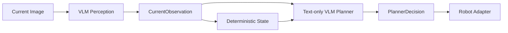

# PHASE 3.2 実測結果

基準commit: `7557503a51757b1a27e7d142c0bf988a2dea9158`。既存113 testsを変更せず保持。
**Architecture分離はPASS（実装・unit tests）。4B NF4 loadはPASS。今回4Bの不在検出が2Bを上回る改善は確認できず、実GPU Plannerは未実施。**
最終固定promptで2Bは9/9の有効Observation、4Bは6/9。追加の人物不在3枚は両方3/3正解。
4Bでは7/8/12秒のenumが未引用でJSON不正となり、Stateに採用できなかった。値を補正してPASSにしていない。

## Architecture



- PerceptionはCURRENT画像1枚だけ。previous画像、Memory、previous action、scenario/期待値を受け取らない。5-field flat JSONだけを検証。
- Stateはprevious/currentの有効なperson_visibleから4つの遷移を決定。初回はUNKNOWN。falseではlast direction保持、trueではcurrent directionで更新。
- Plannerの入力はimmutable CurrentObservationとStateSnapshotのみ。画像やState更新APIは渡さない。confidenceはoptional。
- 不正PerceptionはStateを更新せずPlannerをskip。不正PlannerはWAIT fallback、Perception/Stateは保持。valid Actionは置換しない。
- `run_video.py`のdefaultはsplit経路。`--legacy`はPhase 2A Action-only、`--observation`/`--temporal`はPhase 3.1 experimental。Phase 1画像/Webcamと既存reportsは維持。
- 図は実装経路。今回実GPUで測定したのはPerceptionだけ。Plannerの接続/不変性/画像非入力はunit testsで確認。

## 2B BF16 vs 4B NF4（最終prompt）

評価対象: 3,7,8,9,9.5,10,10.25,12,13秒、合計9枚。ラベルはevaluatorだけが読む。
方向正解率はGT人物あり5枚を分母とし、不正JSONも失敗として数える。人物有無も9枚を分母として不正JSONを失敗とする。
3秒はLEFT/CENTER境界に近い画像で、比較前にCENTERと固定した。方向のスコアは小サンプル/境界注釈の制約を持つ。
今回の動画・設定の比較であり、モデル一般性能の比較とは呼ばない。

|指標|2B BF16|4B NF4|
|---|---:|---:|
|person presence|100.0%|66.7%|
|person direction（人物あり5枚、invalidも失敗）|80.0%|20.0%|
|schema-valid Observation JSON|100.0%|66.7%|
|bare JSON（fenceなし）|100.0%|66.7%|
|Perception latency平均 s|6.155|8.426|
|Perception peak allocated GiB|4.048|2.830|
|Perception peak reserved GiB|4.084|3.031|
|image tokens|84|84|
|input tokens|339|339|
|output tokens|43–44|40–44|
|追加不在3枚の有効なfalse|3/3|3/3|
|追加不在のfalse positive|0/3|0/3|

同一prompt SHA256、同一384px入力、max_new_tokens=96、greedy generation。9枚の保存PNGが両モデルで同一SHA256であることも後処理で確認。
input identityのhashは評価provenanceにだけ使用し、Actionを選ぶ条件にはしない。
Perception latencyはmodel loadを除いたprocessor/generation/decodeの計測。PIL縮小/validationの時間は含まない。
VRAM reservedには同じprocessのCUDA allocator履歴を含む。driver計測はsystem GPU全体で0.5秒間隔。

## Model load / environment

|指標|2B BF16|4B NF4|
|---|---:|---:|
|load s|11.761|32.183|
|allocated after load GiB|3.964|2.705|
|load peak allocated GiB|3.964|2.879|
|load peak reserved GiB|3.965|2.957|

2b driver Perception peak: 4891 MiB。

4b driver Perception peak: 3813 MiB。

4B: revision `ebb281ec70b05090aa6165b016eac8ec08e71b17`、公式LFS size/SHA256を両shardで検証。BF16 full modelをGPUへロードしていない。
bitsandbytes 0.49.2 / NF4 / compute BF16 / double quant。356 Linear4bit layersすべてNF4、356 layersすべてnested quant。全parameter CUDA配置を確認。
RTX 3060 Ti 8GB内、VRAM fraction 0.80、OOMなし。import、cuda128 DLLのNF4 kernel、4bit model loadを別stageとして検証した。
`.venv4b`はbitsandbytesだけを独立installし、既存`.venv`の依存packageを`.pth`で共有するoverlay。完全複製ではない。共有packageは再install/update/deleteしない。
stable `.venv`にbitsandbytesが追加されていないこととpackage versionsを確認。両venvでpip check PASS。Driver/system CUDAの変更なし。
公式参照: [bitsandbytes 0.49.2 Windows CUDA対応表](https://huggingface.co/docs/bitsandbytes/v0.49.2/en/installation)、
[Transformers NF4設定](https://huggingface.co/docs/transformers/v4.57.1/en/quantization/bitsandbytes)、
[Qwen3-VL-4B-Instruct](https://huggingface.co/Qwen/Qwen3-VL-4B-Instruct)。

## Observation timeline

各cellは有効Observationのvisible / direction / distance / obstacle。INVALIDはMemoryへ採用しない。person_countはvalid true=1、false=0。

|秒|2B|4B|
|---:|---|---|
|3|true / CENTER / NEAR / NONE|true / LEFT / MID / NONE|
|7|true / LEFT / NEAR / NONE|INVALID（enum引用符欠落）|
|8|true / LEFT / NEAR / LEFT|INVALID（enum引用符欠落）|
|9|false / UNKNOWN / UNKNOWN / UNKNOWN|false / UNKNOWN / UNKNOWN / NONE|
|9.5|false / UNKNOWN / UNKNOWN / RIGHT|false / UNKNOWN / UNKNOWN / NONE|
|10|false / UNKNOWN / UNKNOWN / RIGHT|false / UNKNOWN / UNKNOWN / NONE|
|10.25|false / UNKNOWN / UNKNOWN / NONE|false / UNKNOWN / UNKNOWN / NONE|
|12|true / LEFT / NEAR / LEFT|INVALID（enum引用符欠落）|
|13|true / CENTER / NEAR / NONE|true / LEFT / MID / NONE|

4Bの7/8/12秒はrawテキストにtrue/LEFTが見えるが、enum未引用のため有効Observationにはしない。
この比較で残る主な4B失敗は出力形式。方向率20%はinvalidを含むスコアであり、rawの視覚判断だけの方向精度とは区別する。

## State timeline（保存Observationの再生、実GPU Brainではない）

`replay_state.py`は8→10→12秒の保存済み有効Observationだけを再生。9/9.5秒を間に入れた場合、10秒はSTILL_ABSENTになるため、指定した比較遷移を独立して検証した。
最初の8秒はUNKNOWN。Actionやexpected stateを入力/生成していない。

|model|秒|transition|last direction|visible last frame|missed frames|State update ms|
|---|---:|---|---|---|---:|---:|
|2b|8|UNKNOWN|LEFT|True|0|0.4554|
|2b|10|DISAPPEARED|LEFT|False|1|0.0084|
|2b|12|APPEARED|LEFT|True|0|0.0039|
|4b|8|UNKNOWN|UNKNOWN|None|0|0.0002|
|4b|10|UNKNOWN|UNKNOWN|False|1|0.0113|
|4b|12|UNKNOWN|UNKNOWN|False|1|0.0002|

2B: 8秒LEFT→10秒falseでDISAPPEAREDとlast_seen LEFTを保持、12秒true LEFTでAPPEARED。State単体PASS。
4B: 8秒は不正Observationで更新しない。10秒は最初の有効ObservationなのでUNKNOWN、last direction UNKNOWN。12秒も不正なので更新しない。消失/再出現のState遷移FAIL。

## Planner / Decision timeline / Total latency

**実GPU PlannerはNOT RUN。Decision timelineは空、Planner latency/peak VRAM/total Brain latencyはN/A。**
ユーザー指定「4B Perceptionで改善が確認できた場合のみState + Plannerへ接続」に従った。
最終比較の不在検出は2B=3/3、4B=3/3で差がない。さらに4Bの8/12秒は不正で今回のシナリオの知覚入力として成立しない。
条件を緩めて実行せず、SEARCH LEFTをrunnerやreplayで生成していない。
text-only Plannerとsplit Brainは実装し、画像非入力、immutable State/Observation、invalid Planner→WAIT、Action非置換をunit testsで確認。
State update latencyは上の保存Observation replayの実測であり、未実施のtotal Brain latencyへ流用しない。

## Stage results

|項目|結果|
|---|---|
|Perception / State / Planner split|PASS（実装・unit tests）|
|4B import / CUDA backend / NF4 model load|PASS|
|4B VRAM <8GB|PASS|
|2B valid Observation JSON|PASS 9/9|
|4B valid Observation JSON|FAIL 6/9|
|4B absence detection strictly better than current 2B|FAIL（両方3/3）|
|8→10 Perception absence|PASS（両方10秒false）|
|8→10 State DISAPPEARED|2B PASS / 4B FAIL（保存Observation replay）|
|Planner SEARCH LEFT|NOT RUN（条件未達）|
|10→12 Perception reappearance|2B PASS / 4B FAIL（12秒JSON不正）|
|10→12 State APPEARED|2B PASS / 4B FAIL（保存Observation replay）|
|Planner structured output|実GPU NOT RUN、unit tests PASS|
|Tests / regressions|PASS|

## Protocol development and negative results

人物認識の方針や画像別promptは調整していない。promptの共通JSON形式指定だけを一度修正し、両モデルを同条件で再実行した。
1. 初回2Bではjson Markdown fenceを使用。単一fenceだけを取り除く互換処理を追加し、裸JSON率とschema-valid率を別記。enumの補完/quote修復はしない。
2. 初期比較: 2B valid=5/9（不在はfalseだがenum未引用でinvalid）、4B valid=4/9（不在4枚はvalid false、人物あり5枚はenum未引用）。Planner gateはFAIL。
3. 「enumはdouble-quoted JSON string、bool/intはunquoted、fenceなし」を全画像共通で一度追加。人物有無/方向やActionの期待値は追加しない。
4. 最終比較: 2B valid=9/9、4B valid=6/9。不在は双方3/3。ここでpromptを固定し、それ以上の修正はしていない。
初回と最終を別reportに保存。旧Phase 3.1の3/3 false positiveとはprompt/architectureが異なるため、それを今回の同一prompt baselineとして使わない。
4Bの方が優れていると結論するために初期2B/最終4Bを混ぜた比較はしない。

## Tests / regressions / files

183 tests PASS（旧113を変更せず保持＋追加70）。stable `.venv` / `.venv4b`の両方でPASS。
追加検証: minimal Observation、型/absence整合性、決定論的4遷移、方向保持/更新、Planner不変性、Perception履歴非入力、Planner画像非入力、
不正Perception/Planner fallback、JSON不正/重複/非finite、Action改変検出、CLI default/legacy/temporal、比較gateの等価/失敗条件、State replay。
Phase 1実GPU: LOOK RIGHT / PERSON / MID、fallbackなし。Phase 2A `--legacy` 実GPUの8/10/12秒はpipeline PASS（知覚精度PASSの意味ではない）。
Webcam実機は今回未再検証。既存113テストと旧reportsを保持し、Pepper/G1 SDK/接続は行わない。
compileall / pip check / git diff --checkを確認。

- `brain/split_schemas.py`, `brain/split_prompt.py`, `brain/split_brain.py`, `brain/split_vlm.py`, `brain/state.py`: 新しい分離経路。
- `run_brain.py`, `run_perception.py`, `run_video.py`: Perception単体、split video default、legacy/experimental routing。
- `adapters/robot_mock.py`: 同一execute interfaceでoptional confidenceを表示。
- `config.py`, `.gitignore`, `requirements-4bit.txt`, `setup_4b_env.ps1`, `probe_nf4.py`, `download_model4b.py`: NF4 overlayと固定revision、検証済み取得。
- `evaluate_perception.py`, `evaluate_split_scenario.py`, `replay_state.py`, `scenarios/IMG_7121_phase32_*.json`: evaluator-only labels、gate、State diagnostic。
- `tests/test_split_brain.py`, `tests/test_perception_evaluator.py`, `README.md`, `reports/phase32_*.json`, `reports/PHASE32.md`: tests・使用説明・正負の全実測。

## Reproduction

```powershell
.\setup_4b_env.ps1
.\.venv4b\Scripts\python.exe probe_nf4.py
.\.venv\Scripts\python.exe download_model4b.py
.\.venv\Scripts\python.exe run_perception.py "C:\Users\slowh\Downloads\IMG_7121.mp4" --report reports\phase32_2b_perception.json
.\.venv4b\Scripts\python.exe run_perception.py "C:\Users\slowh\Downloads\IMG_7121.mp4" --model Qwen/Qwen3-VL-4B-Instruct --4bit --report reports\phase32_4b_perception.json
.\.venv\Scripts\python.exe evaluate_perception.py reports\phase32_2b_perception.json reports\phase32_4b_perception.json scenarios\IMG_7121_phase32_perception.json --output reports\phase32_comparison.json
.\.venv\Scripts\python.exe replay_state.py reports\phase32_2b_perception.json --output reports\phase32_2b_state_replay.json
.\.venv\Scripts\python.exe replay_state.py reports\phase32_4b_perception.json --output reports\phase32_4b_state_replay.json
.\.venv\Scripts\python.exe -m pytest -q
```

同名reportへの再実行はそのreportを更新する。初期trialは`*_initial.json`に保存済み。
最終commit SHAとcommit後のgit statusは完了メッセージに記載。
