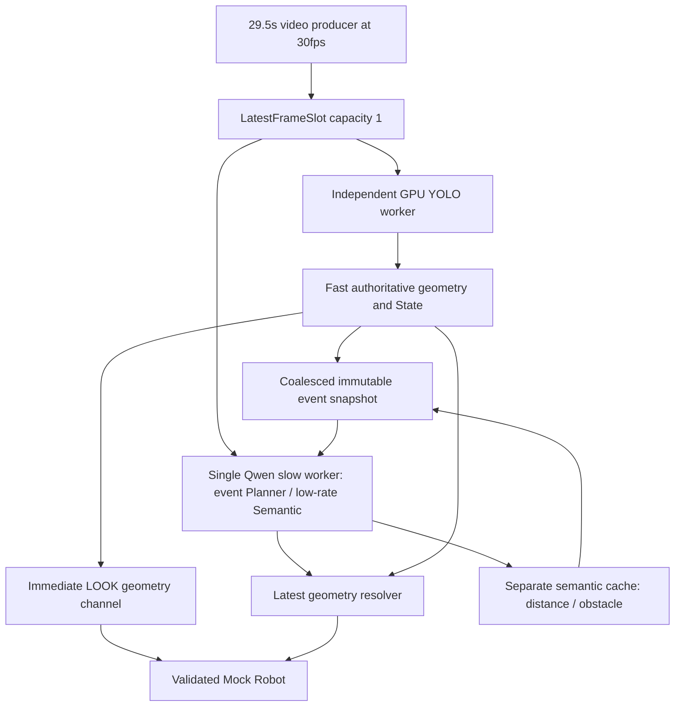

# PHASE 3.6 REAL-WORLD HYBRID ARCHITECTURE

**Chosen fast source: YOLO11n / CUDA / FP32 / imgsz640 / confidence0.10。** Fast loopはSlow completionを待たずに更新できた。意味的Actionは元のVLM JSON Plannerが選び、execution resolverはLOOK/FOUNDの方向だけを最新geometryへbindingする。SEARCH LEFTはmodelのraw JSONから選択され、3回ともRobot-ready commandへ到達した。

**Estimated readiness for Pepper integration: NOT READY。** 追従・消失・SEARCHの目標は今回のsimulationで達成したが、小さい部分頭部の再出現は保守的評価で250msを超える。動画1本のsimulation結果であり、実cameraの露光/通信や実Adapterの実行時間は未測定。

Base SHA `3c6d7f32c178702d968c03352207eb8c40b9f208`。RTX 3060 Ti 8GB / Windows WDDM / driver581.42。Qwen3-VL-2B pinned revision、BF16、384px、default SDPA、Phase 3.4 Linear、full JSON Plannerを維持。Pepper/G1接続、4B、新large model、新Action、driver/CUDA変更は実施していない。

## Architecture



Producerは常に最新1枚を更新し、workerはidle時に最新frameを取得する。入力FIFOはない。frame generationは動画frame index、capture_timestampはsimulation開始monotonic clock＋source video timestamp、decode_finished/processing_start/processing_finish/received/ready clockとresult ageを個別保存する。decodeが予定時刻に遅れた場合もframeをskipして現在へ追い付く。保存用の結果履歴を処理用frame queueとして使わない。

Fast結果だけがperson_visible/direction/countとdeterministic Stateを更新する。古いgeneration/source clock、future clock、不正metadata、500ms超のfast結果は受理しない。Semanticは別cacheに保持し、person geometry/last_seen/transitionを書き換えない。distanceは同じvisibility episode・同方向・TTL3秒以内の場合にだけ利用し、obstacleもTTLを持つ。古いsemanticを新しい取得時刻へ付け替えない。

Immediate channelはvisible personへのLOOK direction updateのみ。SEARCH/APPROACH/AVOID/FOUND/SURPRISEはFast ruleから出さない。そのchannelはVLM raw Decisionを変更せず、別のgeometry commandとして記録する。LOOK/FOUND PERSONのresolverは最新方向を使い、SEARCH directionはmodelが選んだMemory方向を保持する。

Planner triggerはINITIAL/APPEARED/DISAPPEARED/SEMANTIC_CHANGED/lease EXPIRED。STILL_VISIBLEのgeometry追従だけではPlannerを呼ばない。visibility eventを100ms安定待ちし、1つのpending slotで最新eventへcoalesceする。同じepisode内の重複はdebounceし、新episodeの同種eventは捨てない。visibility eventを低priorityのsemantic refreshで上書きしない。

State自体はFast更新ごとに進み続ける。Plannerには最新のpending eventで取得したimmutable Observation/StateSnapshotを渡す。DISAPPEAREDのsnapshot（missed=1）を保持することで、camera更新により一瞬でSTILL_ABSENTへ進んでもeventを失わない。snapshotのgeneration/取得時刻を保存し、古いeventをcurrent completionとして扱わない。Planner inputはcurrent_observation・memory・transitionの元JSONだけで、画像・timestamp・GT・expected Actionを含まない。

episodeが変わった際は古いVLM jobを次のtoken境界でcancelする。partial raw outputは保存し、quote補完、Action補正、WAITへ再解釈をせず、Robotへ渡さない。完了intentもepisode/取得ageを検証し、obsoleteならcommandを抑止する。SemanticはPlanner完了後に1.5秒quiet、直近visibility変化後も1.5秒quiet、前回Semanticから8秒以上の場合だけ実行する。動画の特定秒数に応じたtriggerはない。

## Dependency / YOLO profile

YOLOは独立`.venv36`へ導入。`.pth`でstable `.venv`の既存torch/torchvisionをread-only参照し、新packageをstableへinstallしない。optional packagesは[requirements-hybrid-lock](../requirements-hybrid-lock.txt)で固定し、[setup_hybrid.ps1](../setup_hybrid.ps1)で再現できる。stableにultralyticsは未導入、両venvのpip check PASS。

YOLO11n重みSHA256 `0ebbc80d4a7680d14987a577cd21342b65ecfd94632bd9a8da63ae6417644ee1`。[公式重み](https://github.com/ultralytics/assets/releases/download/v8.3.0/yolo11n.pt)を取得し検証した。bboxは元画像座標へ戻した値で、中心x<40% LEFT、40〜60% inclusive CENTER、>60% RIGHT。複数personは最大bbox面積、confidence、x/yの順でgenericに選び、countは全person数。境界・selectionはGTや13秒に応じて変更していない。

初期confidence0.25は既存G1実装から引き継いだ。全frameへ一律confidence0.10を適用する追加候補も比較し、元9点のaccuracyを維持しながらpartial-head応答を改善したため採用候補とした。初期0.25、改善前scheduler、safe serialized Fast VLM、cooperative Fast VLMの全rawを保持した。

APIは[Ultralytics predict公式](https://docs.ultralytics.com/modes/predict/)を参照。既存torch2.9.1 / torchvision0.24.1の対応は[PyTorch公式](https://pytorch.org/get-started/previous-versions/)と実環境で確認。旧G1 repositoryはread-onlyで参照し、Phase 3.5で保存したsource hashとの一致を確認した。旧RTX 5060 Ti/Linuxの5.4msを今回の3060 Ti実測値へ流用していない。

## Fast source accuracy / selected-image benchmark

同じ既存9点×3回、fresh 8→10→12を1回。元labelsは変更していない。warmupはYOLO dummy 3回、Qwen image/text warmupをload後に実行。同じ動画sourceを使うが、VLMは既存384px処理、YOLOは既存640px letterboxなので入力pixel数は同一ではない。

| Source | Presence | Direction | Main geometry / Memory | mean/median/p95/max inference ms | Peak allocated / reserved GiB |
|---|---|---|---|---|---|
| Fast VLM | 27/27 | 12/15 | PASS | 99.3/99.4/105.0/106.1 | 4.007/4.096 |
| YOLO conf .25 | 27/27 | 15/15 | PASS | 14.7/13.2/17.7/41.2 | 0.064/0.088 |
| YOLO conf .10 | 27/27 | 15/15 | PASS | 13.8/12.4/19.2/43.1 | 0.064/0.088 |

Fast VLMは13秒RIGHTの誤認を保持（direction80%）。YOLOは13秒LEFT、direction100%。mainでは8LEFT→10absent/DISAPPEARED/last_seenLEFT→12LEFT/APPEAREDを確認。この表のmainはFast geometry/Memoryの評価であり、選択frameごとにPlannerを呼んだ結果ではない。

## Actual WDDM contention / real-time simulation

動画を29.5秒・30fps相当でwall clockに合わせて再生。初期alone/stress各1本、改善したhybridは各variant3本、最終event-semantic schedulerも3本。連続stressではSlowを最大頻度で呼んで競合を作るが、それをproductのper-frame Planner方式には採用しない。

| Case | Fast mean/median/p95/max ms | Result age mean/p95/max ms | Update interval p95/max ms | Update Hz | Fast overlap with Slow | Fast loop | Fast peak GiB / GPU total max GiB |
|---|---|---|---|---:|---:|---|---|
| realtime/fast_vlm_alone_0 | 99.8/99.2/108.8/125.3 | 128.4/148.6/161.5 | 112.9/128.8 | 9.66 | 0 | PASS | 4.007/4.876 |
| realtime/fast_vlm_planner_0 | 101.2/99.0/112.8/113.3 | 127.7/149.6/152.2 | 1720.1/1762.3 | 0.61 | 0 | FAIL | 4.007/4.896 |
| realtime/fast_vlm_semantic_0 | 103.2/102.1/115.0/115.6 | 132.9/153.0/159.0 | 2449.8/2459.2 | 0.44 | 0 | FAIL | 4.007/4.870 |
| realtime/hybrid_0 | 16.3/13.9/30.9/84.4 | 29.4/44.9/94.0 | 49.9/92.2 | 29.97 | 527 | PASS | 0.064/5.129 |
| realtime/planner_alone_0 | N/A | N/A | N/A | 0.00 | 0 | N/A | N/A |
| realtime/yolo_alone_0 | 15.5/14.1/23.0/81.8 | 28.8/40.2/91.2 | 46.4/98.7 | 29.97 | 0 | PASS | 0.064/0.862 |
| realtime/yolo_planner_0 | 18.1/14.8/33.2/113.7 | 32.1/50.8/128.5 | 52.9/127.6 | 29.90 | 882 | PASS | 0.064/5.154 |
| realtime/yolo_semantic_0 | 17.9/14.7/33.2/115.7 | 32.5/50.2/131.2 | 51.4/120.7 | 29.86 | 881 | PASS | 0.064/5.119 |
| realtime_cooperative/fast_vlm_planner_cooperative_0 | 96.2/95.9/105.5/114.7 | 122.6/141.0/199.7 | 162.6/179.9 | 6.85 | 195 | PASS | 4.051/4.868 |
| realtime_cooperative/fast_vlm_semantic_cooperative_0 | 96.8/96.0/108.3/120.7 | 122.6/142.5/213.0 | 164.8/197.0 | 6.78 | 195 | PASS | 4.050/4.866 |
| realtime_eventsemantic/hybrid_0 | 15.6/13.3/30.4/103.4 | 28.9/45.2/123.3 | 50.0/130.7 | 29.93 | 502 | PASS | 0.064/5.113 |
| realtime_eventsemantic/hybrid_1 | 16.4/13.4/32.2/79.6 | 29.9/48.0/87.4 | 51.6/98.3 | 29.93 | 544 | PASS | 0.064/5.113 |
| realtime_eventsemantic/hybrid_2 | 16.2/13.4/31.2/78.7 | 29.8/49.4/89.8 | 49.7/97.5 | 29.97 | 495 | PASS | 0.064/5.113 |
| realtime_final/hybrid_0 | 16.9/13.5/32.7/81.1 | 31.5/53.5/109.6 | 51.0/85.4 | 29.93 | 490 | PASS | 0.064/5.113 |
| realtime_final/hybrid_1 | 16.9/13.6/32.3/107.1 | 31.3/50.8/124.6 | 50.8/112.3 | 29.93 | 523 | PASS | 0.064/5.113 |
| realtime_final/hybrid_2 | 16.8/13.5/32.4/102.6 | 31.1/51.9/114.4 | 51.6/123.2 | 29.93 | 522 | PASS | 0.064/5.113 |
| realtime_lowconfidence/hybrid_0 | 15.9/13.4/31.6/82.1 | 29.7/48.5/93.2 | 50.3/95.7 | 29.97 | 523 | PASS | 0.064/5.113 |
| realtime_lowconfidence/hybrid_1 | 16.1/13.5/31.5/76.8 | 29.8/49.7/83.9 | 51.1/94.0 | 29.93 | 520 | PASS | 0.064/5.113 |
| realtime_lowconfidence/hybrid_2 | 16.2/13.6/32.1/105.0 | 29.9/48.8/122.1 | 51.0/127.2 | 29.93 | 574 | PASS | 0.064/5.113 |
| realtime_preempt/hybrid_0 | 16.8/13.9/32.6/92.3 | 29.1/49.3/99.3 | 51.3/110.3 | 29.90 | 504 | PASS | 0.064/5.124 |
| realtime_preempt/hybrid_1 | 16.5/13.8/31.6/89.9 | 29.1/46.1/106.8 | 50.2/110.1 | 29.93 | 509 | PASS | 0.064/5.124 |
| realtime_preempt/hybrid_2 | 17.0/14.2/32.0/81.8 | 30.3/47.2/100.8 | 51.4/114.8 | 29.97 | 498 | PASS | 0.064/5.124 |

GPU totalはNVMLのadapter全体のsample最大値で、OS/他appの使用も含む。allocated/reservedはPyTorch各processの値で、合計値とは区別する。CPU%は1core=100%のpsutil値、GPU utilization/CPU各PIDのmean/p95/maxは全[evaluation JSON](phase36/evaluations/)とraw resourcesへ保存。負荷を無効化して数字を補完せず、取得できないtelemetryはN/A/errorとして保持する。

### Fast VLM while Slow runs

単一modelをjob単位で安全に直列化したnegative controlは、Fast intervalが約1.6〜2.6秒へ増えFAIL。単発fast inferenceだけが約0.1秒でもlive sourceとして成立しない。

追加のcooperative profileはSlow generateのtoken境界で最新shared frameを取得し、Fast geometryを実行してからSlowを続行する。model weightは二重ロードせず、1つのmodel/processor instanceを共有。Fast KV cacheは別generationで、model-level rope_deltasを保存・復元し、Slowのcacheを汚染しない。Fast結果はSlow completion前にparentへ送る。FastのSource generationは最新1枚だけで、paused Slowをinput frame queueへしない。

cooperative Fast update interval p95は約163〜165ms、max約180〜197msとなり、Slow job中の更新自体はPASS。ただし13秒direction誤認、部分頭部への遅れ、Slow自身のwall latency増加、RoPE cache管理の複雑さが残る。同じGPUへ2B weightを二重ロードして単に別processにした実験ではない。

| Case | JSON Planner mean/median/p95/max s | Full Semantic mean/median/p95/max s |
|---|---|---|
| realtime/fast_vlm_alone_0 | N/A | N/A |
| realtime/fast_vlm_planner_0 | 1.545/1.577/1.626/1.656 | N/A |
| realtime/fast_vlm_semantic_0 | N/A | 2.296/2.309/2.339/2.348 |
| realtime/hybrid_0 | 1.528/1.699/1.810/1.820 | 2.559/2.558/2.569/2.570 |
| realtime/planner_alone_0 | 0.985/0.982/1.020/1.027 | N/A |
| realtime/yolo_alone_0 | N/A | N/A |
| realtime/yolo_planner_0 | 1.635/1.679/1.782/1.909 | N/A |
| realtime/yolo_semantic_0 | N/A | 2.465/2.462/2.568/2.594 |
| realtime_cooperative/fast_vlm_planner_cooperative_0 | 4.196/4.571/4.627/4.628 | N/A |
| realtime_cooperative/fast_vlm_semantic_cooperative_0 | N/A | 6.068/6.576/6.613/6.618 |
| realtime_eventsemantic/hybrid_0 | 1.570/1.674/1.764/1.780 | 2.405/2.367/2.514/2.530 |
| realtime_eventsemantic/hybrid_1 | 1.594/1.671/1.777/1.779 | 2.284/2.282/2.292/2.293 |
| realtime_eventsemantic/hybrid_2 | 1.545/1.641/1.728/1.751 | 2.415/2.345/2.535/2.556 |
| realtime_final/hybrid_0 | 1.435/1.626/1.716/1.720 | 2.473/2.526/2.571/2.576 |
| realtime_final/hybrid_1 | 1.561/1.623/1.827/1.869 | 2.374/2.331/2.512/2.532 |
| realtime_final/hybrid_2 | 1.569/1.615/1.790/1.802 | 2.325/2.325/2.369/2.373 |
| realtime_lowconfidence/hybrid_0 | 1.547/1.644/1.742/1.771 | 2.366/2.309/2.527/2.552 |
| realtime_lowconfidence/hybrid_1 | 1.544/1.621/1.773/1.810 | 2.341/2.259/2.481/2.506 |
| realtime_lowconfidence/hybrid_2 | 1.585/1.626/1.796/1.807 | 2.302/2.302/2.320/2.322 |
| realtime_preempt/hybrid_0 | 1.528/1.730/1.859/1.870 | 2.575/2.613/2.642/2.645 |
| realtime_preempt/hybrid_1 | 1.562/1.689/1.747/1.758 | 2.559/2.558/2.654/2.661 |
| realtime_preempt/hybrid_2 | 1.509/1.704/1.856/1.889 | 2.558/2.597/2.647/2.653 |

**Chosen sourceはYOLO conf0.10**。precision、Slow負荷中のage/update、30Hz近い更新、小さいfast VRAM、独立workerの簡潔さを総合評価した。cooperative VLMの可能性は残すが、今回のdefault候補にはしない。GPU YOLOで長いstallを観測していないため、optional CPU/ONNX/OpenVINO導入はNOT NEEDED。

## Real-world KPI（最終3本）

既存の9点labelsはevent onsetを厳密には指定しない。追加の[evaluator専用visual annotation](../scenarios/IMG_7121_phase36_events.json)では、CENTER→LEFT区間5.900〜5.967秒、完全消失8.400〜8.467秒、最初の部分頭部の再出現10.367〜10.400秒を記録した。保存したcontact sheetsから目視し、detectorの発火時刻をGTへ流用していない。12秒は既存confirmed-present anchorとして維持する。区間の下端から測る保守的upper latencyと、上端から測るlower latencyを保存する。

| KPI | count | mean / median / p95 / max ms | 判定 |
|---|---:|---|---|
| look_frame_to_command_s | 2455 | 29.7/28.2/47.8/123.4 | PASS <=150/250ms |
| look_while_slow_frame_to_command_s | 1373 | 32.5/30.5/51.5/123.4 | PASS: Slow activeでも継続 |
| direction_event_upper_s | 3 | 97.9/101.2/101.3/101.3 | PASS <=150/250ms |
| disappearance_event_upper_s | 3 | 90.0/87.3/96.8/97.9 | PASS p95<=250ms |
| search_from_detection_s | 3 | 1869.5/1875.0/1881.4/1882.1 | PASS <=2.0s、raw SEARCH LEFT |
| search_event_upper_s | 3 | 1959.6/1967.1/1972.3/1972.9 | PASS: physical-event conservative upper<=2.0s |
| reappearance_event_upper_s | 3 | 258.8/261.6/261.6/261.6 | FAIL to certify <=250ms conservative target |
| reappearance_event_lower_s | 3 | 225.5/228.3/228.3/228.3 | first confirmed visible frameからは約220〜228ms |
| update_interval_s | 2647 | 33.4/31.6/50.5/130.7 | PASS: no slow-completion wait |
| inference_latency_s | 2650 | 16.1/13.3/31.3/103.4 | 参考、採用基準はこれだけではない |
| frame_age_s | 2650 | 29.5/28.1/47.5/123.3 | Source age、completion時刻へ付け替えない |

最終3本の元JSON Planner policy一致 **19/19**。policyはresolver前のraw Decisionに対し、変更しないPhase3.3 evaluatorのgeneric predicateで判定する。hybridの2model・高頻度Fast historyに単一model/full-frame版の全integrity判定を流用せず、raw一致、Fast State replay、generation、no image/no extra Planner input、resolved commandを別にstrict検証した。

verified empty windowでは最終3本ともfalse positiveなし。小さな頭部は10.6秒で初検出、10.633秒で1frameだけ失い、10.667秒で再検出する。Fastの実測visibilityはそのまま記録し、Stateをfalse PASS用に平滑化しない。100msのevent settlingとcoalescingにより、semantic Plannerへ短い揺れを全件FIFO投入しない。

| Contract | Result |
|---|---|
| Slow VLM active中のFast loop | PASS |
| Latest frame wins | PASS |
| No queue accumulation | PASS |
| Old generation/stale semantic rejection | PASS |
| VLM high-level Planner preserved | PASS |
| SEARCH memory direction unchanged | PASS |
| Validated resolved Decision only to Mock | PASS |
| Full reaction target for tiny partial head | NOT ESTABLISHED |

初期hybrid（cancelなし）は8秒台DISAPPEAREDのSEARCHが再出現後に完了し、obsoleteとして棄却された。この失敗を残し、visibility episodeの変更でold jobをtoken境界cancelする改善を行った。さらに新episode eventをdebounceで落とさないこと、visibility eventのpriority、100ms settling、media秒数に依存しないsemantic schedulingを最終構成として検証した。

## Recommended architecture / Pepper estimate

推奨は今回のYOLO fast source＋latest slot＋authoritative Fast State＋geometry-only LOOK channel＋event-driven full JSON VLM Planner＋occasional Full Semantic＋execution resolver。Slow workerだけでPlanner/Semanticを直列化し、Fast workerはそのcompletionを待たない。SEARCHはVLMがMemoryから選び、最新current directionで書き換えない。

**NOT READY for Pepper integration**。今回の核心であるGPU負荷中trackingは成立したが、小さな頭部のevent reaction、1frame検出揺れ、単一動画のための汎化未確認が残る。camera露光/通信からのage、身体とhead/LOOK commandのchannel所有、camera座標の左右、実Adapterのready→execution時間を次のmock/camera段階で計測する必要がある。実機を接続して結果を補う作業は今回行っていない。

## Tests / freeze / artifacts / Git

**392 passed in 5.88s**。既存356件を保持し、LatestFrameSlot、old metadata/generation拒否、Fast authoritative State、TTL/episode、LOOK resolver、SEARCH保持、event priority/debounce/coalescing/settling、no per-frame Planner、VLM busy時のmock Fast geometry更新、validated Mock、real GPU cooperative overlap/model reuse/RoPE restoration、cancelled raw抑止、GT runtime非混入を追加検証した。

[summary](phase36/summary.json)、[freeze](phase36/freeze.json)、[environment](phase36/environment.json)、[changed files](phase36/changed_files.json)、[git status before commit](phase36/git_status_before_commit.txt)。全rawは[phase36](phase36/)以下。selected、realtime、realtime_preempt、realtime_cooperative、realtime_lowconfidence、realtime_final、realtime_eventsemanticの各JSONを削除していない。全scheduler events・source/processing clocks・frame age・State・Planner input/raw・class logits/boxes・resolved commands・CPU/GPU telemetryを保存。

[test log](phase36_tests_final.log)、[stable pip check](phase36_pip_check_stable.log)、[optional pip check](phase36_pip_check_optional.log)、[dependency install](phase36_install.log)。old G1 repositoryと既存reports/labels/Phase3.5 stable pathを維持。`.gitignore`へ`.venv36/`だけ追加した。作業開始前からのreports/PHASE33.mdユーザー変更は内容hashを確認し、stage/commit対象に含めない。実装commit SHAとcommit後statusは[completion record](phase36/completion.json)に保存し、最終HEADを最終応答に記載する。

## Reproduce

```powershell
.\setup_hybrid.ps1
$env:HF_HUB_OFFLINE='1'
.venv36\Scripts\python.exe benchmark_fast_sources.py C:\Users\slowh\Downloads\IMG_7121.mp4
.venv36\Scripts\python.exe benchmark_fast_sources.py C:\Users\slowh\Downloads\IMG_7121.mp4 --backends yolo --confidence .1 --output-dir reports/phase36/selected_lowconfidence
.venv36\Scripts\python.exe run_hybrid_video.py C:\Users\slowh\Downloads\IMG_7121.mp4 --cases hybrid --confidence .1 --repeats 3 --output-dir reports/phase36/realtime_eventsemantic
.venv36\Scripts\python.exe run_hybrid_video.py C:\Users\slowh\Downloads\IMG_7121.mp4 --cases yolo_alone,fast_vlm_alone,planner_alone,yolo_planner,fast_vlm_planner,yolo_semantic,fast_vlm_semantic --confidence .25
.venv36\Scripts\python.exe run_hybrid_video.py C:\Users\slowh\Downloads\IMG_7121.mp4 --cases fast_vlm_planner_cooperative,fast_vlm_semantic_cooperative --output-dir reports/phase36/realtime_cooperative
.venv\Scripts\python.exe evaluate_hybrid.py
.venv\Scripts\python.exe -m pytest -q
.venv\Scripts\python.exe report_hybrid.py
```

各GPU commandは順番に実行する。既存resultを保存する場合は別output-dirを指定する。
