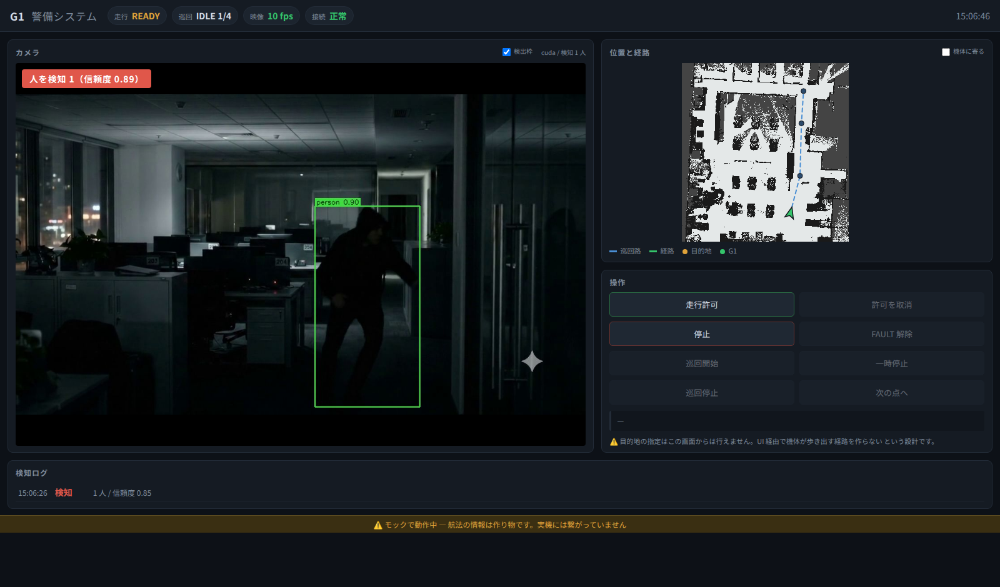

# UI — 警備システムの操作・監視画面

G1 のカメラ映像（YOLO の検知枠つき）・地図上の現在地と経路・操作ボタンを
**1つの画面**にまとめたもの。ブラウザで見る。



## 状態（2026-09-20）

| | |
|---|---|
| ✅ 動く | 映像 + YOLO 検知（**枠の表示は切り替え可**）、地図・巡回路・現在地・経路の描画、操作ボタン、検知ログ |
| 🟡 モック | **航法の情報はすべて作り物。** 実機にも ROS にも繋がっていない |
| ✅ 動く | **ROS アダプタ**（Docker 内で rclpy を喋る側） |
| ✅ 確認済み | **本物の Nav2 スタックに対して 20 項目**（2026-09-20。SDK だけ偽物） |
| ❌ 未検証 | **実機との接続**。物理・実 LiDAR・実際の歩容は通していない |

⚠️ **画面の下端に「モックで動作中」と出る。** 実機に繋ぐまでこの帯は消えない。
作り物の数字を実機のものと取り違えるのが、この段階でいちばん危ない。

## 動かす

```bash
# ① モックだけ（実機も ROS も要らない）
bash Main/run.sh

# ② ROS に繋ぐ（2つ立てる）
bash Adapter/run.sh &            # Docker の中で rclpy。既定 127.0.0.1:8081
bash Main/run.sh --nav http      # UI 本体は素の venv のまま
```

ブラウザで `http://127.0.0.1:8090` を開く。

⚠️ **ROS 環境を source したシェルで叩かないこと。** このプロセスは操作PC の素の venv
(`G1_HuggingFace/venv`) で動く。ROS を継承すると opencv/numpy が衝突しうる。

### 必要なもの

- `G1_HuggingFace/venv`（Python 3.12）に `ultralytics` が入っていること
  ```bash
  ../venv/bin/pip install -r ../../Perception/requirements.txt
  ```
- YOLO の重み `Main/yolo26n.pt`。無ければ初回起動時に自動ダウンロードされる
  （`.gitignore` の `*.pt` で除外。リポジトリには含めない）
- ⚠️ **既定は実機カメラ（`video.source: zmq`）。** 実機が無いところで画面だけ作るなら
  `video` に戻すこと。ただし**サンプル動画は git に入っていない**ので（2026-09-20 の判断。
  リポジトリを重くしないため）`Reference/` に自分で置く。無いと `run.sh` は
  「動画が見つかりません」で止まる

## つくり

```
ブラウザ ──┬── /video.mjpg   映像 + 検知枠（サーバ側で焼き込み）
           ├── /api/state    5Hz でポーリング
           └── /api/command/<名前>   ボタン

UI サーバ（操作PC の venv・ROS 非依存）
  ├── 映像: ZMQ(G1本体 192.168.123.164:5555) → YOLO     ← ROS を通らない
  └── 航法: NavSource
        ├── MockNavSource    … 実機も ROS も無しで画面を作るとき
        └── HttpNavSource ──HTTP──> Adapter/ros_adapter.py（Docker・rclpy）──> ROS
```

### 実機のカメラ（`Camera/`）

```bash
# ① 操作PC と G1 を有線でつなぐ（ケーブルを挿しただけでは IP が付かない）
nmcli connection up g1-link          # 192.168.123.222/24。戻すのは con down

# ② ロボット側で配信を始める
scp Camera/camera_server.py g1:~/g1_ui_camera/
ssh g1 'python3 ~/g1_ui_camera/camera_server.py --list'        # 開けるカメラと安定名
# ⚠️ --device は **by-id の安定名**を使う（下記）
ssh g1 'nohup setsid python3 ~/g1_ui_camera/camera_server.py \
        --device /dev/v4l/by-id/usb-SunplusIT_Inc_Full_HD_webcam_...-video-index0 \
        > ~/g1_ui_camera/camera.log 2>&1 < /dev/null &'
ssh g1 'pkill -f g1_ui_camer[a]'                                # 止める

# ③ UI 側は config.yaml の video.source を zmq にするだけ
```

#### ⚠️ G1 のカメラの割り当て（2026-09-23 に実測）

`/dev/video0`〜`7` が並ぶが、**開けるのは一部だけで、名前からは何か分からない。**
`--list` は平均輝度も出すので手掛かりになる。

| デバイス | 正体 |
|---|---|
| **`video6` `video7`** | **USB 接続の「Full HD webcam」**（Sunplus 1bcf:2283）。**カラー。これを使う** |
| `video0`〜`video3` | Intel RealSense（`video1` がカラー） |
| `video4` `video5` | Intel RealSense（`video2` `video5` は **IR**。赤外ドットパターンが写る） |

素性は `cat /sys/class/video4linux/video*/name` と `readlink -f .../device` で確かめられる。

#### ⚠️⚠️ 番号（`/dev/videoN`）で指定しないこと

**USB が再認識されると番号が変わる。** 2026-09-23 の実機で、配信中に
`/dev/video6` が消えて `/dev/video7` になり（USB の Device 番号も 005→006）、
映像が止まった。`--list` が出す **by-id の安定名**を使うこと。

```
--device /dev/v4l/by-id/usb-SunplusIT_Inc_Full_HD_webcam_J20230323V1-video-index0
```

読めなくなったら 10 回で**カメラを開き直す**ようにもしてある。安定名を指定していれば
再認識からそのまま復帰する（番号指定だと復帰できない）。

#### ⚠️ `run_g1_server.py --camera` を使わない理由

lerobot 同梱のあれは **DDS↔ZMQ のロボット指令ブリッジ**で、`LowCmd`（モーター指令）を
ロボットへ中継し `MotionSwitcherClient` を持つ。カメラはその「おまけ」に過ぎない。
**映像を見るためだけに指令経路を開けるべきではない。**
（ついでに `--camera-device` の既定値 4 は実機では開けない。）

#### ⚠️ JPEG は RGB で符号化すること

受信側（`ZmqFrameSource`）が `cv2.COLOR_RGB2BGR` で戻す前提。BGR のまま送ると
**赤と青が入れ替わる**。

#### ⚠️ `pkill -f` が自分自身に当たる

SSH で流すコマンド行に `camera_server.py` というパスが含まれるため、同じコマンドの中で
`pkill -f camera_server.py` すると**自分のシェルごと落ちる**（実際に2回踏んだ）。
停止と起動は**別の ssh に分ける**か、パスを含まないパターン（`g1_ui_camer[a]`）を使う。

### ROS アダプタ（`Adapter/`）

**ROS の語彙が出てくるのはこの1ファイルだけ。** 契約がずれないよう、UI 側と同じ
[`Main/nav/base.py`](Main/nav/base.py) を import して使う（コピーしない）。

| 読むもの | |
|---|---|
| TF `map→base_link` | 現在地。⚠️ **`/odom` は odom フレームなので地図に描けない** |
| `/map` | 地図（OccupancyGrid・latched）→ PNG に変換 |
| `/plan` / `/g1/patrol/route` | 経路 / 巡回路（巡回路は latched） |
| `/goal_pose` | 目的地 |
| `/g1/bridge_status` | 走行状態（DiagnosticArray の `g1_cmd_router` の message） |
| `/g1/patrol/status` | 巡回状態（String の中の JSON） |

| 呼ぶもの | |
|---|---|
| `/g1/enable_navigation` | SetBool（`disable_navigation` は false を送る） |
| `/g1/stop` `/g1/clear_fault` | Trigger |
| `/g1/patrol/{start,pause,stop,skip}` | Trigger |

#### ⚠️⚠️ DDS を有線に固定すること

操作PC は WiFi（既定経路）と有線（G1 側）の2つを持つ。固定しないと CycloneDDS が
**WiFi 側を選んで「トピックは見えるのにデータが来ない」**という分かりにくい壊れ方を
する（PC2 側も同じ理由で `eth0` に固定している）。`Adapter/run.sh` が
`cyclonedds_operator.xml` をコンテナへ渡して固定する。

- インターフェース名は `G1_UI_IFACE`（既定 `enp3s0`）。`ip -br addr` で確かめること
- ⚠️ **有線はケーブルを挿しただけでは IP が付かない。** `nmcli connection up g1-link`
- ⚠️ PC2 は 2026-09-15 に FastDDS → **CycloneDDS** に変わっている。
  `tools/rviz_operate.sh` の既定は `rmw_fastrtps_cpp` のままなので、あちらを使うときは
  `G1_RMW=rmw_cyclonedds_cpp` が要る

⚠️ **古い TF は出さない。** `--stale-s`（既定 3 秒）より古ければ現在地を `null` にして
UI に「取れていない」と描かせる。止まった自己位置が生きているように見えるのが
いちばん危ない。同じ理由で `/g1/bridge_status` が途絶したら `DISCONNECTED` にする。

⚠️ **断り文は言い換えずにそのまま UI へ通す。** 言い換えると原因が分からなくなる。

### 設計の要点

**UI は ROS を知らない。** ROS のトピック名・メッセージ型は Docker 内のアダプタに
閉じ込め、UI へは [`Main/nav/base.py`](Main/nav/base.py) の `NavState` を JSON にした
ものだけが渡る。これにより

- UI を **ROS 無しで開発・テストできる**（実際いまがその状態）
- ROS 側のトピック名や型が変わっても画面側に波及しない
- ROS を知らないメンバーが UI を触れる

代償として、**UI はデバッグ用途を兼ねられない**（生のトピックが見えないので、
切り分けのときは RViz か foxglove を併用する）。

**⚠️ 目的地を「送る」口は意図的に作っていない。** UI 経由で機体が歩き出す経路を
存在させない、という決定（2026-09-20）。地図のクリックでゴールを打てるようにしたく
なったら、`nav/base.py` の `COMMANDS` に足す前に安全側の影響を必ず見直すこと。

**検出枠の表示を切り替えても、YOLO は止まらない。** 切り替わるのは絵の上の枠だけで、
推論も検知ログの記録も続く（**表示を消しても記録は消さない**、が警備システムとしての
前提）。警報の帯と「検知 N 人」の表示も出たままにしてある — 枠を消したつもりで
警報まで消えるのは事故のもとなので。

実装は**枠あり・枠なしの2系統を配信**し、ブラウザが `/video.mjpg?boxes=0|1` で選ぶ。
1つの絵を共有して切り替えると**誰かが切り替えると全員の画面が変わる**ため。
検出が無いフレームでは2枚が同じ絵になるので二度エンコードしない（サンプル動画では
46% のフレームが該当）。

**⚠️ E-stop は画面に置いていない。** 通信が切れたときに押せない停止ボタンは、
あること自体が危険（押したのに止まらない、を誘発する）。停止は Navigation 側の
heartbeat 途絶による自動 FAULT に任せ、画面には状態表示だけを置く。

## ファイル

| | |
|---|---|
| `Main/server.py` | HTTP サーバ。標準ライブラリだけで書いてある（依存を増やさないため） |
| `Main/vision.py` | 映像取得 → YOLO → 枠の焼き込み。別スレッドで回る |
| `Main/mapimage.py` | ROS の `.pgm`+`.yaml` を PNG とメタ情報に変換 |
| `Main/video_realtime.py` | 動画ファイルを**実時間で**流す（下記） |
| `Main/nav/base.py` | **UI と ROS の境界。** ここに ROS の語彙を持ち込まない |
| `Main/nav/mock.py` | 実地図の上を歩くモック。状態機械は実機の断り方に合わせてある |
| `Main/nav/http_source.py` | ROS アダプタに繋ぐ側 |
| `Camera/camera_server.py` | **実機のカメラを ZMQ で配信する。ロボット本体で動かす**（下記） |
| `Adapter/ros_adapter.py` | **ROS アダプタ本体。** rclpy + HTTP。Docker の中で動く |
| `Adapter/run.sh` | アダプタを Docker で起動する |
| `Adapter/mock/fake_ros.py` | 偽の ROS 側（実機なしでアダプタを試すため） |
| `Adapter/mock_test.sh` | 偽の ROS を相手にした通し確認 |
| `Adapter/mock/nav2_check.py` | **本物の Nav2** を相手にした確認項目 |
| `Adapter/nav2_test.sh` | **本物の Nav2 を上げて**アダプタを通す |
| `Main/static/` | 画面（HTML/CSS/JS） |
| `Main/config.yaml` | 映像ソース・検出・航法ソースの設定 |
| `Log/` | 検知イベント（`events-YYYYMMDD.jsonl`） |
| `Reference/` | サンプル動画など |

## 設定でできること

[`Main/config.yaml`](Main/config.yaml) を書き換える。主なもの:

| 項目 | 既定 | 意味 |
|---|---|---|
| `video.source` | **`zmq`** | `zmq`（実機）/ `video`（手元の動画）/ `webcam` |
| `video.realtime` | true | 動画を実時間で流す（余りは捨てる）。下記 |
| `nav.source` | `mock` | `mock` / `http`（ROS アダプタ） |
| `detector.confidence_threshold` | 0.5 | 下げても検出はほぼ増えない（下記の実測） |
| `detector.present_frames` | 2 | これだけ連続で映ったら「検知」 |
| `detector.absent_grace_s` | 1.5 | これだけ映らなかったら「消失」 |

## 実測（2026-09-20）

**サンプル動画** `Reference/夜間監視.mp4`（1280×720 / 24fps / 20秒 / 夜間オフィス）に
`yolo26n.pt` の `person` を当てた結果:

| conf | 検出のあったフレーム | 信頼度 (min/中央/max) |
|---|---|---|
| **0.5** | 258/480 = **53.8%** | 0.51 / **0.84** / 0.92 |
| 0.25 | 269/480 = 56.0% | 0.26 / 0.84 / 0.92 |

2本目 `Reference/夜間監視2.mp4`（同じく 1280×720 / 10秒）も conf 0.5 で
140/240 = **58.3%**、信頼度中央値 **0.85**。傾向は同じ。

しきい値を下げてもほとんど増えないので **0.5 のままでよい**。

**検知ログの不感帯について。** 素の判定（1フレームでも外れたら消失）だと、
動画1周あたり 34 件ほど・うち「消失 1秒未満」が多数というちらつきになりログが
読めない。不感帯を入れて **1周あたり 6 件ほど・ちらつき 0 件**になった。

### ⚠️ 動画ファイルは実時間で流すこと（2026-09-20 に実測して判明）

**素の `VideoFileSource` には時間の概念が無い。** 「次の1フレーム」を返すだけなので、
24fps の動画を `target_fps: 10` で読むと **2.4 倍遅くなる**（20 秒の映像が 48 秒）。

| | 1周にかかる時間 | 再生速度 |
|---|---|---|
| 素の読み方 | **48.0 秒** | 0.42 倍 |
| `RealtimeVideoSource`（既定） | **20.2 秒** | **0.99 倍** |

見た目が間延びするだけでなく、**検知ログの継続時間が同じ倍率で水増しされる**。
実際、修正前は「人が 4.2 / 7.8 / 14.1 秒映っていた」と記録されていたが、
実時間では **1.6 / 3.1 / 5.6 秒**だった。警備の記録としては誤り。

⚠️ **実機の ZMQ には起きない。** `ZmqFrameSource` は `CONFLATE=True` で常に最新の
1枚しか持たないため、何 Hz で読んでも実時間の標本になる。**動画ファイル固有の問題。**

⚠️ **このサンプル動画で通ったことは、実機で通る根拠にならない。**
生成された映像に見えること、解像度が実機（`head_camera` は 640×480）と違うこと、
画角・高さ・照明が実機と違うことによる。実機での検出性能は**別に測る必要がある**。

## テスト

```bash
bash tests/run_tests.sh
```

見るのは次の2つ。

- `test_mock_nav.py` — `NavState` の契約・地図の座標変換・モックの状態機械。
  **YOLO/torch は要らない**
- `test_vision_boxes.py` — 検出枠の切り替え（同一フレームで枠あり/なしが別物になり、
  検出が無ければ同一バイトになること）。偽の検出器を差し込むので YOLO の推論は
  走らないが、`vision.py` の import が `ultralytics` を引くため、無い環境では飛ばす
- `test_realtime_video.py` — 動画が実時間で流れること。既知の fps の動画をその場で
  作って測る（サンプル動画は git に無いため）

⚠️ **同一フレームどうしを比べること。** 別フレーム同士を比べると動いている映像では
必ず違って見え、何も検証できない（一度この誤りで「差が出た」と判断しかけた）。

ROS アダプタは Docker が要るので別立てにしてある。**2段構え**:

```bash
bash Adapter/mock_test.sh   # ① 偽の ROS（速い。約30秒）
bash Adapter/nav2_test.sh   # ② 本物の Nav2 スタック（約4分）
```

**②を必ず通すこと。** ①だけでは見つからない不具合が実際に2件あった（下記）。
①は偽物なので、こちらが本物と食い違っていると**不具合を隠す**。

⚠️ ②が通ってもアダプタが**実機で**通る保証にはならない。物理・実 LiDAR・実際の
歩容が無い（SDK は `backend:=mock`）。

### ⚠️ 本物の Nav2 に当てて初めて分かったこと（2026-09-20）

**1. 巡回中の目的地は `/goal_pose` に流れない。**
`patrol_node` は Goal を `navigate_to_pose` **アクション**で送る。`/goal_pose` は
RViz の「2D Goal Pose」専用。**`/plan` の終点から取ること。**
偽の ROS が `/goal_pose` を出していたため、①では見つからなかった。

**2. Nav2 は Goal を畳んでも空の `/plan` を出し直さない。**
賞味期限（`--plan-stale-s`、既定5秒）を付けないと、最後の経路が残り続ける。
一時停止して12秒後も 94 点の経路と目的地が出たままだった。**止まっているのに
「まだ向かっている」と読める表示**になるので、ここは必ず消すこと。

⚠️ **CI はまだこれを拾わない。** `scripts/ci/run_all_tests.sh` の `FEATURE_DIRS` に
`G1_HuggingFace` が入っていないため。拾わせるなら1行足すこと。

## 次にやること

1. **自己位置を合わせる。** 2026-09-23 は**座位のまま・`map_to_odom` を `0 0 0`** で
   通しただけなので、**地図上の位置は合っていない**。手順書 §7
   （`find_map_offset.py --yaw-range 180`）が要る。⚠️ 座位だと LiDAR の高さが
   地図作成時と違うので、立たせてから測ること
2. **PC2 を再配置する。** 2026-09-23 時点の PC2 は 9/15 の配置のままで、
   **地図が 9/07 の旧版**（28.5×33.0m）、**巡回ノードが入っていない**（`g1_patrol` が
   ノード一覧に出ない＝巡回路は常に 0 点）。`deploy/README.md` の手順で更新すること
   - ⚠️ `ROS_DOMAIN_ID` を PC2 と合わせること（`G1_DOMAIN=...`）
   - ⚠️ **`/map` が来ないと地図が出ない。** `map_server` が上がっているか確認する
   - ⚠️ 地図の原点が回転している場合、UI の座標変換は軸平行を前提にしているのでずれる
     （アダプタが警告を出す）
3. **実機のカメラ映像を録る**（`run_g1_server.py --camera` の ZMQ を保存）。
   録画スクリプトはまだ無い
4. **コンテナの出どころを決める。** いまは Mapping トラックの
   `g1-mapping-visualization:local` を借りている。向こうが作り直すと動かなくなりうるので、
   固定するか派生イメージを持つかを決めること（`G1_UI_IMAGE` で差し替えられる）
