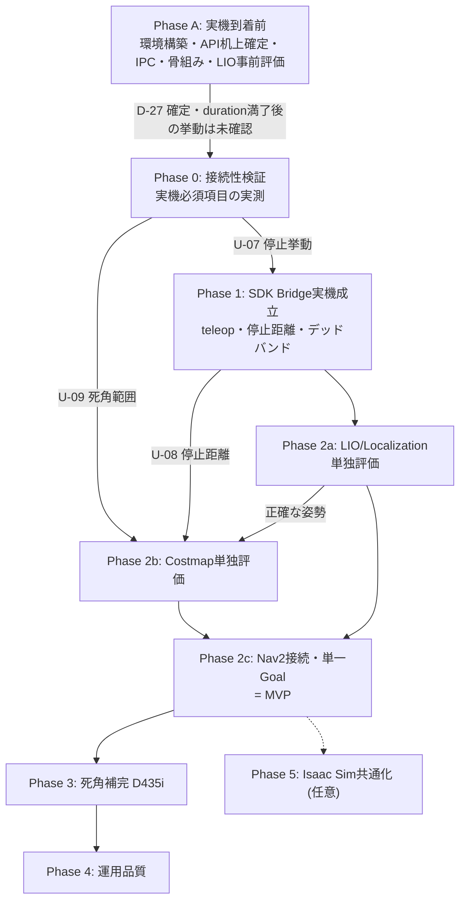

# Unitree G1 ROS 2 Navigation 実装計画

📌 **次に何をするかは [HANDOVER.md](HANDOVER.md) にまとめてある。**この文書は経緯と根拠の記録。

| 項目 | 内容 |
|---|---|
| 文書版 | v0.1 |
| 位置づけ | 実装仕様書 v0.1 の技術検討結果を受けた実装手順計画 |
| 管理単位 | **Nav2 方式の独立トラック**。`Navigation/` 直下の実装とは別系統として `nav2_option/` 配下で管理する |
| 前提 | G1 実機は発注済み・未着。実機到着前に進められる作業を先行フェーズとして分離する |
| 記述粒度 | 各フェーズの作業項目・完了条件・依存関係を記述する。期間・体制は含めない |
| 対象 | Unitree G1 EDU + ROS 2 Jazzy + Nav2 + Unitree SDK2 |

---

## 1. 確定した設計判断

技術検討を経て確定した事項。仕様書 v0.1 からの変更を含む。

### 1.1 ソフトウェア構成

| # | 決定事項 | 根拠 |
|---|---|---|
| D-01 | **ROS 2 Jazzy / Ubuntu 24.04 を継続する** | SDK2 をプロセス分離すれば Unitree 側の Humble 制約を受けない。Isaac Sim 6.0 は Humble/Jazzy 両対応 |
| D-02 | **`unitree_ros2` は使用しない** | 経路から外すことで CycloneDDS 0.10.2 固定の制約が消え、ROS 側の RMW 選択が自由になる。必要な state は SDK 側プロセスが取得し IPC で渡す |
| D-03 | **ROS 側 RMW は FastDDS（Jazzy デフォルト）** | D-02 の帰結。Isaac Sim のデフォルトとも一致し、将来の Sim 共通化で RMW 衝突が起きない |
| D-04 | **`g1_sdk_bridge` は最初から 2 プロセス構成**<br>（競合時のみ分離ではない） | Unitree 公式が「SDK2 は ROS/ROS2 が初期化された環境では起動できない」と明記。競合はほぼ確実に発生する |
| D-05 | **IPC は Unix domain socket（`SOCK_SEQPACKET`）** | メッセージ境界が保たれ、接続断で相手プロセスの死亡を検知できる。全ノードが同一ホスト（Orin）に載るため素直に使える |
| D-06 | **SDK 側プロセスは ROS 2 を一切初期化・リンクしない** | DDS ライブラリ競合の根本回避 |
| D-07 | **SDK 側プロセスは systemd 管理とし、ROS launch から起動しない**（ユニット作成済み: [deploy/](deploy/)、2026-09-13） | `ExecuteProcess` は `LD_LIBRARY_PATH` / `AMENT_PREFIX_PATH` を継承し ROS 側 CycloneDDS に誤リンクする。加えて、安全の最終防衛線を ROS launch のライフサイクルに従属させない |
| D-08 | **SDK 側プロセスは colcon workspace 外の独立 CMake プロジェクトとしてビルドする** | ROS 環境が source された状態でのビルドを構造的に防ぐ |
| D-30 | **Nav2 と ROS 側ノードは Humble コンテナで動かす**（2026-09-13、ユーザー確認済み） | PC2 ネイティブの Foxy には `nav2_velocity_smoother` / `nav2_behaviors` が存在せず、設計どおりに組めない（A-10c で実測）。Humble イメージは Mapping 用に既にあり、A-10b・A-10c の検証資産も全て Humble 上にある。**D-01（Jazzy 継続）はこの点で読み替えること。** 自作3パッケージは Foxy/Humble/Jazzy いずれでも無修正で動くので、後から Jazzy へ移っても配線は壊れない。**arm64(PC2) での成立も確認済み(A-10e)**。<br>**⚠️ 2026-09-15 追記: PC2 側の実体は「コンテナ」ではなく pixi にした。** PC2 の `unitree` は docker デーモンへの権限が無く（sudo はパスワード必須）、arm64 の Nav2 入りイメージも存在しなかった。robostack-humble に **aarch64 の `navigation2` 1.1.20** が在るのでこれを使う（[deploy/pc2_humble/](deploy/pc2_humble/)）。`/opt/ros/foxy` には触らず、撤退はディレクトリ削除のみ。**D-30 の意図（Foxy に無い `nav2_velocity_smoother` / `nav2_behaviors` を使う）は満たしている** |
| D-31 | **操作PC との通信が途絶したら巡回を停止する**（2026-09-13、ユーザー確認済み） | 警備 PoC の目的が「異常を見つけて人に知らせること」である以上、人と繋がっていない状態で動き続けることに価値が無い。実測では通信断後も 4.045 秒・0.85m 前進した。なお「減速して継続」は U-12 により選べない（`vx=0.2` で進行方向が定まらないため「ゆっくり歩いて帰る」が物理的に存在しない）。実装は Phase 2c 作業項目10 |
| D-32 | **「NAVIGATING なのに指令が来ない」は WARN にとどめ、状態遷移はさせない**（2026-09-13、ユーザー確認済み） | SafetyManager の「最初の指令を受けるまで `cmd_timeout` の計測を始めない」猶予は Nav2 の計画時間を待つための意図的な設計であり、変えない。配線ミスを可視化するだけにとどめる（`no_cmd_warn_s`、既定 3.0 秒、0 で無効）。物理的な安全は SDK 側 watchdog と `duration` 満了が別途担保する |
| D-29 | **`slam_operate` は `1801`(建図開始) と `1901`(SLAM終了) の 2 つだけを使う**（2026-09-09、ユーザー確認済み）。`1802`(建図保存) / `1804`(地図読込＋自己位置設定) は使わない。送信クライアントには**この 2 つだけを `_RegistApi()` し、`1102`(移動) は構造的に送れないようにする**（[tools/send_slam_api.py](tools/send_slam_api.py)） | 我々が内蔵 SLAM に求めるのは **odometry の供給だけ**（`/unitree/slam_mapping/odom`。これは 1801 で流れる）。`map→odom` は処理済み地図への ICP 合わせ、global costmap は `room_a_map.yaml` で足りるため、地図を PC1 に置く必要がなく 1802/1804 は不要。**これにより「外部で作った地図を PC1 へ転送できない」という制約自体が我々には効かない**。<br>諦めるのは「純正再定位でドリフトを補正する道」だけで、U-16（歩行中のドリフト）が許容範囲なら不要。許容できない場合の代替案として残す（その際はロボット自身に 1801→1802 で地図を作らせ、処理済み地図との変換を ICP で求める。詳細: [findings/g1_dds_sensors.md](findings/g1_dds_sensors.md) §8.6） |
| D-28 | **SDK 側プロセスの本番実装言語は C++ に決定**（2026-09-09、ユーザー確認済み） | 周期送信の安定性（GIL・GC由来のジッタ回避）で有利という当初の判断どおり。`g1_sdk_bridge/` の Python 実装（A-3）はプロトタイプに位置づけ、ロジック（`protocol.py`/`ipc_transport.py`/`sdk_process_mock.py`/`safety_manager.py`）を C++ に移植する。`unitree_sdk2`（C++版）の `LocoClient` シグネチャを正とする（[findings/sdk2_api.md](findings/sdk2_api.md) §4 の C++/Python 差異は、C++版で確定済みのため実質解消） |

### 1.2 制御・安全

| # | 決定事項 | 根拠 |
|---|---|---|
| D-09 | **20 Hz 周期送信と watchdog は SDK 側プロセスに置く** | ROS 側プロセスがクラッシュ・フリーズしても停止指令が発行される |
| D-10 | **watchdog は二重化する**<br>SDK 側: IPC 途絶 → ゼロ速度を周期送信し続ける<br>ROS 側: 異常時に**明示的ゼロ速度送信**＋**送信停止**の両方 | ROS 側が「送信を止めるだけ」に依存すると即効性がない。両方行うことで即効性と冗長性を両立 |
| D-11 | **SDK 側プロセスは起動直後に必ずゼロ速度を送信する** | クラッシュ後の systemd 再起動時に前回の速度が残らないようにする |
| D-12 | **Low-level 関節制御は使用しない。高レベル Locomotion Controller のみ** | 同時使用は転倒に直結。仕様書 v0.1 の方針を維持 |
| D-13 | **異常時はゼロ速度を優先し、Damp / ZeroTorque へ自動遷移させない** | 二足では自動ダンピングが転倒要因になる。モード変更は操作者の明示操作 |
| D-14 | **Safety Manager に速度デッドバンド処理を追加する**<br>（`min_vx` / `min_wz` を新規パラメータ化）。**既定値は0(無効)**（2026-09-09、QUESTIONS.md Q8で(d)を選択） | 二足は極低速で歩容が成立せず足踏みになる。Goal 接近時の微小速度を素通しすると到達判定に入らない。ただし2026-09-09のNav2統合dry-runで、この閾値がNav2のrotate-to-heading起動フェーズの微小角速度(実測0.02 rad/s)も一律ゼロにし、ロボットが永久に動き出せなくなる副作用を発見した。**Phase 1のU-12実測で実際の閾値が判明するまで無効化しておく**方針とした。ApplyDeadband自体のロジックは維持。無効化した状態でNav2からのGoal到達をエンドツーエンドで確認できた |
| D-15 | **MVP は `vy = 0`（横移動無効）から開始する** | 仕様書 v0.1 の方針を維持 |
| D-16 | **速度・加速度・停止距離のパラメータは実測値から逆算して確定する** | 歩容途中の停止で 1〜2 歩進むため、停止距離は数十 cm オーダーになる想定 |
| D-27 | **SDK 呼び出しは `Move()` の既定値に頼らず、`SetVelocity(vx, vy, omega, duration)` を直接呼んで `duration` を明示指定する。`continous_move=True` および `SwitchMoveMode(true)` は使用しない** | `Move(vx,vy,omega)`（3引数・既定）は内部で `SetVelocity(..., duration=1.0)` を呼ぶが、この 1.0 秒は `cmd_timeout`（0.30 秒）より長く、「duration は送信周期より長く watchdog 時間以下」という原則に反する。`continous_move=True` にすると `duration=864000`秒（≒10日）となり、Bridge プロセスが死んだ場合に G1 が指令速度で歩き続ける危険がある。`SetVelocity()` を直接使えば `duration` を `sdk_command_duration`（例: 0.20 秒）に設定でき、原則を満たせる。詳細: [findings/sdk2_api.md](findings/sdk2_api.md) §2, §7 |

### 1.3 Navigation / センサー

| # | 決定事項 | 根拠 |
|---|---|---|
| D-17 | **Navigation スタックはオンボード（Jetson Orin NX）で動かす** | MID-360 は約 20 万点/秒。生点群を WiFi で外部 PC に送る構成は帯域・レイテンシとも成立しない |
| D-18 | **外部 PC は RViz / rosbag / 監視・操作のみ**（軽量トピックのみ DDS で流す） | D-17 の帰結 |
| D-19 | **Localization は FAST-LIO 系（既知点群地図に対する localization）を第一候補とする** | AMCL は 2D LiDAR 前提。MID-360 の非反復走査・3D 特性に合わない。`FAST_LIO_LOCALIZATION_HUMANOID` が G1 を明示対象としている。**加えて、G1 用 `SportModeState_`（`unitree_hg`名前空間）には `fsm_id/fsm_mode/task_id/task_time` の4フィールドしかなく、位置・速度が一切含まれない**（Go2用の同名メッセージには `position`/`velocity` があるが G1 は非対応）。つまり SDK2 側に internal odometry のフォールバックは存在せず、外部 LIO が唯一の位置情報源になる。姿勢（quaternion/rpy）のみ `LowState_.imu_state` から取得可能。詳細: [findings/sdk2_api.md](findings/sdk2_api.md) §6<br>**⚠️ 2026-09-09 追記（要見直し）**: この結論は「SDK2 の IDL に位置フィールドが無い」ことだけを根拠にしていた。実機のDDSを実測したところ、**ロボット自身のSLAMサブシステムが `/unitree/slam_relocation/odom`（`nav_msgs/Odometry`）と `/unitree/slam_relocation/global_map`（`sensor_msgs/PointCloud2`）を標準ROS型で配信する口を持っている**ことが判明した。SDK2 の高レベルAPIとは別系統のため前回の調査では見えていなかった。**「外部LIOが唯一の位置情報源」は誤りである可能性がある**（U-15 として確認する）。詳細: [findings/g1_dds_sensors.md](findings/g1_dds_sensors.md) |
| D-20 | **点群地図の作成（mapping）はオフライン / 操作 PC で行う**<br>運用時の localization のみオンボード | 実機では rosbag 記録のみ。地図生成は高性能 PC でやり直し可能。運用時に mapping 特有の不安定さが入り込まない |
| D-21 | **Local costmap は 3D 点群ベースとする**（`voxel_layer` 等）<br>2D `/scan` は Global costmap / 壁検出用に限定 | ~~頭部 LiDAR の垂直視野は -7°〜+52°。高さ 1.3m から -7° の光線は約 10.6m 先で床に当たるため、足元〜10m の床面と低障害物が原理的に見えない~~<br>**⚠️ この根拠は誤りだった（2026-09-09、立位で実測）。** **MID-360 は逆さ(roll≈180°)に取り付けられており、視野の広い側(52°)が下を向いている。** そのため床は **約1.0m 先から 11.9m 先まで見えており（床平面 inlier 623,965点）、死角は半径 0.91〜1.12m の円だけ**。センサー高さ 1.213m・傾き 3.81°。理論値も「52°が下向き」なら 0.95m で実測と一致し、「7°が下向き」なら 9.88m で実測と矛盾する。<br>**結論そのもの（Local costmap を 3D 点群ベースにする）は変えなくてよい**（3D 点群を使う利点は死角の有無とは別にある）が、**D-24 の適用環境限定と D-25/Phase 3 の優先度は見直すべき**。詳細: [safety/checklist_phase0.md](safety/checklist_phase0.md) 項目6 |
| D-22 | **Controller は Regulated Pure Pursuit から開始する** | MPPI は Orin NX では負荷が厳しい。DWB/MPPI のモデル予測は歩容起因の遅延と乖離する。二足の遅い応答と相性が良い |
| D-23 | ~~**`enable_stamped_cmd_vel = true` とし TwistStamped を標準化する**~~ **修正(2026-09-13)**: 標準化は**できない**。**Humble にはこのパラメータが存在せず `Twist` 固定**で、TwistStamped だけを購読すると**無警告で繋がらない**（A-10c で実際に踏んだ）。`g1_cmd_router` は **publisher の型を実行時に調べて合う購読を1本だけ張る**（`cmd_vel_type=auto`）。⚠️ 当初「両方を同時購読」にしたが **FastDDS でクラッシュした**ので改めた（A-10e） | Jazzy のデフォルトは false（Twist）、Kilted 以降は true、Humble は選択肢なし。ディストリ差を配線問題にしないため |

### 1.4 スコープ

| # | 決定事項 |
|---|---|
| D-24 | **MVP は「床に低い障害物が置かれていない管理された区域」に適用環境を限定する**。MID-360 のみで成立させる<br>**⚠️ 根拠が弱まった(2026-09-09)**: この限定は D-21 の「足元〜10m の床が見えない」という前提に基づいていたが、実測では**床は約1.0m 先から見えており死角は半径約1m の円だけ**。**低障害物は 1m 以遠なら見える**ので、限定はここまで厳しくなくてよい可能性が高い。ただし半径1m の死角は残るので、**Phase 2b で costmap 上に死角を可視化してから最終的な適用条件を決める**（D-24 の具体化は元々 Phase 2b の作業項目7）|
| D-25 | **D435i による死角補完は MVP 後の後続フェーズ（Phase 3）で追加する**<br>**⚠️ 優先度が下がった(2026-09-09)**: 補完すべき死角が「足元〜10m」ではなく「半径約1m の円」だと判明したため。加えて D435i は**素の V4L2 では深度・カラーを取り出せず librealsense の導入が必要**（[findings/g1_dds_sensors.md](findings/g1_dds_sensors.md) §3.1）。Phase 3 の投資判断は Phase 2b の死角可視化の結果を見てから |
| D-26 | 屋内・平坦床・単一階層・単一機体・既知地図。階段/段差踏破・ドア操作・人との協調・腕動作は対象外（仕様書 v0.1 の方針を維持） |

---

## 2. 実機構成（確定情報）

| 項目 | 内容 | 実装上の意味 |
|---|---|---|
| 3D LiDAR | Livox MID-360（頭部搭載）<br>360° × 59°（垂直 -7°〜+52°）、内蔵 IMU、非反復走査 | 足元の死角（D-21）。非反復走査のため単一スキャンは疎で、costmap 入力には姿勢に基づく点群累積が必要 |
| Depth カメラ | Intel RealSense D435i（頭部搭載） | Phase 3 で死角補完に使用 |
| Operation and Control Computing Unit | Unitree motion control 専用 | **ユーザーアクセス不可** |
| Development Computing Unit | NVIDIA Jetson Orin NX（Unitree カスタムキャリアボード） | ユーザーコード用。**Locomotion Controller とは物理的に別ユニット**のため、CPU を使い切ってもバランス制御に影響しない |

**FAST-LIO2 系は GPU を使わない CPU 実装**（iKD-Tree ベース）。Orin NX の CPU コアを 1〜2 個占有する想定。GPU は将来の perception 用に空く。

---

## 3. 未確定事項と確定タイミング

計画上の重要な分岐点。**実機なしで確定できるもの**を先行フェーズに寄せる。

### 3.1 実機なしで確定できる（Phase A で実施）

| # | 項目 | 手段 |
|---|---|---|
| U-01 | ~~`LocoClient::Move()` の正確なシグネチャ、duration / `continous_move` 相当の引数の有無~~ | **確定(2026-09-08)。** `Move(vx,vy,omega,continous_move=False)` は内部で `SetVelocity(vx,vy,omega,duration)` を呼ぶ薄いラッパー。`SetVelocity` は仮説に反し**実在する**（API ID 7105）。`duration` 既定値は **1.0秒**、`continous_move=True` なら **864000秒(10日)**。→ D-27 で運用方針を確定。C++/Python間で `Squat`/`StandUp`/`BalanceStand` 系のメソッド名・シグネチャに差異があったが、**実装言語がC++に確定した(D-28)ため、C++版のシグネチャを正として扱う**。詳細: [findings/sdk2_api.md](findings/sdk2_api.md) |
| U-02 | ~~G1 state から取得できる odometry の内容・座標定義・単位~~ | **確定(2026-09-08)。** G1用 `SportModeState_`(`unitree_hg`名前空間) は `fsm_id/fsm_mode/task_id/task_time` のみで**位置・速度フィールドが存在しない**（Go2用にはある）。姿勢(quaternion/rpy)は `LowState_.imu_state` から取得可能。**odometry(x,y)はSDK2に情報源が無く、外部LIOが必須**（D-19強化）。単位・座標系はIDLに明記なし、`terminations.hpp`のデフォルト閾値から rad/s 系と推測されるのみ。詳細: [findings/sdk2_api.md](findings/sdk2_api.md) §6 |
| U-03 | ~~`FAST_LIO_LOCALIZATION_HUMANOID` の Jazzy ビルド可否~~ | **確定(2026-09-08): ビルド可能。** ただし対象は **`humble`ブランチ**（`main`はROS1/catkin_make）。Jazzy固有の非互換は0件。唯一のビルドエラーはOpen3Dのバージョン差分（README指定の0.14.1は入手困難なため0.18.0 develパッケージで代替、1行修正で解決）。Docker上で実際に`colcon build`成功・ノード起動まで確認済み。詳細: [findings/fastlio_jazzy_build.md](findings/fastlio_jazzy_build.md) |
| U-04 | ~~同リポジトリの TF 出力形式~~ | **確定(2026-09-08): 既に正しい2段構成。** `map→base_link`直出しではなかった(当初の懸念は外れた)。`open3d_loc`(localization)が`map→odom`のTFを正しいフレーム名で発行し、`fast_lio`(odometry)が`odom→base_link`相当のTFを`camera_init→body`という**非標準のフレーム名**で発行している。両者は`/Odometry_loc`という**トピック**（TFではない）経由で接続されている。**分解ノードは不要**。必要なのは`fast_lio`側のハードコードされたフレーム名文字列（`"camera_init"`→`"odom"`, `"body"`→`"base_link"`）を書き換える軽微なパッチのみ（Open3D対応と同種の1行修正）。詳細: [findings/fastlio_jazzy_build.md](findings/fastlio_jazzy_build.md)、ソース根拠は `FAST_LIO/src/laserMapping.cpp:642-672` と `open3d_loc/src/global_localization.cpp:279-297,482-505` |
| U-05 | ~~`unitree_mujoco` が G1 の**高レベル** LocoClient をサポートするか~~ | **確定(2026-09-08): 非対応。** README に "Current version only supports low-level development" と明記。`LowCmd`/`LowState` の直接関節制御のみで、`Move(vx,vy,omega)` 相当の高レベル歩行API・歩行コントローラは未実装。`SportModeState` は配信されるが MuJoCo のセンサ値をそのまま流すだけで歩容生成ロジックは含まない。Go2 等の他ロボットも同様。DDSトピック名・IDL(`unitree_hg`)は実機と同一なので**DDS通信層・関節/センサマッピングの前倒し検証のみ可能**。「速度指令→実際の歩行」の統合検証は実機まで持ち越し。詳細: [findings/unitree_mujoco.md](findings/unitree_mujoco.md) |
| U-06 | Isaac Sim 6.0 + Jazzy での Nav2 連携（Sim 共通化を再開する場合） | 差動二輪の単純モデルで先に検証 |
| U-15 | ~~**G1 内蔵の再定位サービス（`/unitree/slam_relocation/*`）が Nav2 の localization を代替できるか**~~ **一部確定(2026-09-09)。**<br>**① 内蔵「再定位」で我々の地図を使う道は、現時点で見つかっていない（※未確定）**: 1804 の `address` は PC1 のファイルシステムを指す。`Navigation/README.md` に「実機で全 address が `errorCode 507`」「PC1 への転送手段が無い」と記録されている。**ただしこれは過去のチームの試行記録で、nav2_option 側では 1804 を一度も送っていない。加えて同 README の「PC1 の主要18ポート全て閉」という根拠は不正確で、実測で `9991` が開いていた。** 未調査の経路（9991 の正体、公式アプリの地図管理、`/unitree_slam/waypoints` の書き込み側、PC2 のゲートウェイ的プロセス）が残っており、「不可」と断定できる段階ではない。<br>**なお転送できなくても代替がある**: ロボット自身に地図を作らせ（`1801`→`1802`）自己位置はそれを使い、**処理済み地図は Nav2 の global costmap 専用**にする。2つの地図間の ICP 合わせが1回必要だが、それは odometry 方式でも必要なので追加コストはほぼ無い。<br>**② ただし内蔵 SLAM の odometry は使える**: `1801`(建図開始) を送ると `/unitree/slam_mapping/odom`(`nav_msgs/Odometry`) が **9.10 Hz**、`frame_id=map` / `child_frame_id=base_link`、**静止時ドリフト 70秒で 0.9cm** で流れることを実測（座位のまま成功、`1901` で完全に元に戻る）。**odometry 目的なら FAST-LIO は不要**で、`map→odom` は処理済み地図への ICP 合わせで与える。TF は出ないので自前で配信する。<br>**残る未確認**: 歩行中のドリフト（要移動）。詳細: [findings/g1_dds_sensors.md](findings/g1_dds_sensors.md) §7-8 |
| U-17 | **内蔵SLAM が約16分で勝手に止まる条件**（2026-09-15 実機で発生。3回とも 941〜1022 秒）<br>**⚠️ 2026-09-16 追記: 公式ドキュメントを当たったが原因は特定できなかった。**<br>・**16分の制限は文書化されていない**<br>・関連する記述は「**連続使用は30分まで**を推奨。長時間・高温だと dock の CPU が周波数低下し**測位が異常になる**」。我々の実測は CPU 51〜59% / 59〜66℃ で、16分で落ちる説明としては弱い<br>・⚠️ **別の重大な制約が見つかった**: 適用範囲は「**25m×25m 未満**。推奨範囲を超えないこと」。**会場 room_a は 28.5m×33.0m（自由空間 457m²）で既に超過している**。新しい点群は 58m×40m でさらに外れる<br>・未適用の注意事項もある: 「**建図中は機体内蔵の障害物回避を切る**（頭部ライトが青になる）」「建図中は機体を速く動かしすぎない」<br>**⚠️ 観測の偏り: 3回とも機体が静止している間に落ちた。歩行中のセッションは一度も16分を超えていない。**「時間で切れる」のか「無動作で切れる」のかを区別できていない | 機体を立てたまま放置しただけで `/unitree/slam_mapping/odom` と `/points` が両方停止し、`/slam_info` が `"info": "not init"` に戻った。LiDAR 生点群は 9.97Hz で流れ続けるので**気づきにくい**。バッテリ 77% / CPU 55% / 59℃ と余裕のある状態。`1801` 再送で完全復帰する。<br>**巡回時間の上限を決めてしまう問題**なので、時間依存か・無移動が条件か・負荷依存かを切り分ける必要がある。`tools/watch_slam_alive.sh` で計測中。<br>⚠️ **再起動すると odom 原点が現在地にリセットされる**ため `map→odom` が無効になり、`map_localizer.py`（局所探索）では追従できない。落ちたら §7 をやり直す運用になる |
| U-16 | 上記②の odometry が**歩行中**も使える精度か（二足の上下動・旋回への耐性） | Phase 1 で teleop 歩行させながら計測する。ここが持てば Phase 2a の FAST-LIO 構築（A-6）を丸ごと省略できる | 実機のDDS上に `nav_msgs/Odometry` と点群地図を**標準ROS型**で配信する口があり、現在はサービス未起動でデータが流れていない。`slam_operate` API（純正方式トラック `Navigation/nav/` が使用、例: 1804 = 保存地図の読込＋自己位置設定）で起動して、①出力poseの座標系、②保存地図をどこに置くのか（`Navigation/nav3/README.md` は「`address` は PC1 のファイルシステムを指し、外部で作った地図の転送手段が不明」と記録）を確認する。**成立すれば Phase 2a の FAST-LIO 構築が不要になる可能性がある。** 詳細: [findings/g1_dds_sensors.md](findings/g1_dds_sensors.md) |

### 3.2 実機必須（Phase 0 / Phase 1 で確定）

| # | 項目 | 影響範囲 | 未確定時のリスク |
|---|---|---|---|
| U-07 | ~~**`duration` 経過後に G1 が実際に停止するか、直前速度を保持し続けるか**~~ **確定(2026-09-09、実機実測)。** **自動停止する**（＝§3.3 の安全側の分岐）。`SetVelocity(0.2, 0, 0, 1.0)` を1回だけ送り以後何も送らずに観察したところ、追加指令なしで自分で停止した。**ただし `duration` 満了後に約2秒の"尾"が残る**: 活発な歩容 **1.910 秒** / 完全静止まで **3.419 秒**（LowState の脚12関節を 1017Hz で記録。歩容中の最大関節速度 6.10 rad/s、関節位置変化 23.2°）。D-16 の「歩容途中の停止で1〜2歩進む」がデータで裏付けられた | 安全設計の根幹 | — |
| U-08 | **各速度での停止距離** **一次実測(2026-09-09)**: `SetVelocity(0.3,0,0,1.0)` × 3回で、duration 満了後〜停止までの移動は **4.3〜7.0 cm**（停止まで 3.1〜4.5 秒）。duration 中の移動は 0.208〜0.240m ＝ **速度追従率 70〜80%**。⚠️ **D-16 の「停止距離は数十cmオーダー」という想定より1桁小さい**。理由は「関節は約2秒動き続けるが胴体はほとんど進まない」（最後の数歩は足を揃えて止まる動作）ため。0.3 m/s 以外の速度・歩行中からの急停止は未実測 | Collision Monitor / footprint / 速度上限 | 安全パラメータが根拠なしになる |
| U-09 | ~~**MID-360 の実際の取付角度と死角範囲**~~ **確定(2026-09-09、立位で実測)**: **逆さ取付(roll≈180°)で視野の広い側(52°)が下向き**。センサー高さ **1.213m**、傾き **3.81°**、**死角は半径 0.91〜1.12m**(12方位ほぼ均一)、床は 11.94m 先まで見える。**D-21 の「足元〜10m が見えない」という想定は外れていた**（まさにこのリスク欄が警告していた通り） | costmap 構成、MVP 適用環境の定義 | — |
| U-10 | ~~odometry の符号・単位の実測校正~~ **一次確認済み(2026-09-09)**: 情報源は内蔵SLAM の `/unitree/slam_mapping/odom`（SDK2 の `SportModeState_` には位置が無い、U-02）。**x=機体前方・正**（手で正面へ押して +1.159m、Δyaw +0.15° の純並進として記録）、**yaw 正=反時計回り**（`omega=+0.3` で +10.20°）。y=左 は右手系から導かれる（単独計測はしていない）。静止時のドリフトは 106 秒で ±0.005m/±0.1° 以内 | `g1_state_bridge`、Nav2 全体 | — |
| U-11 | その場旋回時の並進ドリフト量 **一次データ(2026-09-09)**: `omega=+0.3, duration=1.0` の旋回で実測 **+10.20°に対し並進 4.4cm**。ただし1回・1速度のみで、旋回量自体が指令の約1/3しか出ていない条件下の値 | Nav2 の回転動作、localization | Goal 到達精度 |
| U-12 | 微小速度のデッドバンド閾値（歩容が成立する下限速度）**部分解(2026-09-09、実機実測)**:<br>・`vx=0.1`: **歩容が成立しない**（関節が 0.4° 動くだけの姿勢微応答、0.077〜0.2秒で終わる）<br>・`vx=0.2`: **歩容は成立するが進行方向が定まらない**（関節 23.2° 動き、利用者の観察でも「ずれていたが歩けていた」。実際の進行方向が機体前方から **+98.6°** ずれた）<br>・`vx=0.3`: **実用的に前進する**（3回とも Δx +0.228〜+0.231m、方向のずれ -17.7〜-20.4°）<br>→ **D-14 のデッドバンドは「足踏みを防ぐ」だけでなく「進行方向が定まらない速度域を避ける」ためにも要る。`min_vx` は 0.2 より上（0.25〜0.3 程度）が妥当と見込まれる** | D-14 のパラメータ | Goal に到達しない |
| U-13 | G1 の機種・エディション・ファームウェア版・SDK2 版 | 全体 | API 差異 |
| U-14 | Orin NX 上での LIO + Nav2 + costmap の計算負荷 | Controller 選択、周期設定 | 周期遅延 |

### 3.3 duration の扱い（2026-09-08 確定・当初の分岐は解消）

Phase A-2 の調査により、`duration` は `SetVelocity(vx, vy, omega, duration)` で明示制御できることが確定した（D-27）。
当初懸念していた「指令が latch され続ける」ケースは、**API の制約ではなく実装上の選択の問題**だったと判明した。

- `SetVelocity()` を直接呼び、`duration` に `sdk_command_duration`（例: 0.20 秒）を明示指定する
- `Move()` の3引数版（既定 `duration=1.0` 秒）は使わない。`cmd_timeout`（0.30 秒）との関係が原則に反するため
- `continous_move=True` および `SwitchMoveMode(true)` は使用しない。使うと `duration=864000` 秒になり、Bridge 停止時に歩き続けるリスクが生じる

**この方針を守れば、SDK 側 watchdog（D-09）は冗長層として機能する**（G1 自身の `duration` 満了が一次防衛線、SDK 側 watchdog が二次防衛線）。

**残る未確定事項（U-07 として実機必須）**: `duration` 満了後に G1 が実際に停止するのか、それとも直前速度を保持し続けるのかが SDK 内に明記されていない。この一点が未確認のままなので、Phase 0 では**「SetVelocity を1回だけ送り、以後は何も送らずに実機の挙動を観察する」試験を最優先で行う**こと。

| Phase 0 の観察結果 | 対応 |
|---|---|
| **✅ `duration` 満了後に自動的に停止する（2026-09-09 実測でこちらと確定）** | 想定どおり。**D-27 の方針のまま、SDK 側 watchdog を冗長層として運用する。有線 LAN 必須・純正リモコン常時待機を受入要件に格上げする必要は無い** |
| ~~`duration` 満了後も直前速度を保持し続ける（または不定な挙動）~~ | （該当しなかった）D-27 の運用だけでは不十分。SDK 側 watchdog を一次防衛線に格上げし、有線 LAN 必須・純正リモコン常時待機を受入要件に格上げする |

### 3.3.1 ⚠️ ただし「停止までに約2秒かかる」ことが分かった（2026-09-09 実測）

`SetVelocity(0.2, 0, 0, 1.0)` を1回だけ送り、以後何も送らずに LowState の脚12関節を
1017Hz で記録した結果:

| 項目 | 実測 |
|---|---|
| 指令 | vx=0.2 m/s / duration **1.0 秒** |
| 活発な歩容の継続 | **1.910 秒**（最大関節速度 6.10 rad/s） |
| 完全に静止に戻るまで | **3.419 秒** |
| 関節位置の最大変化 | 23.2°（歩容が成立しなかった 0.1 m/s では 0.4°） |

**指令の `duration` が切れても、歩容が完了するまで約2秒動き続ける。** これは
D-16 の「歩容途中の停止で1〜2歩進むため、停止距離は数十cmオーダー」という想定と整合する。
0.2 m/s なら停止距離は 0.2〜0.4m 程度になる見込み。

**設計上の意味**: 「自動停止する」ことは安全側だが、**停止は即時ではない**。
Collision Monitor の停止領域・footprint・速度上限は、この"尾"を前提に
Phase 1 の U-08（各速度での停止距離）を実測してから決めること。
`sdk_command_duration`（D-27、例 0.20 秒）を短くしても、この歩容完了の遅れは縮まらない。

---

## 4. 実装フェーズ

### Phase A — 実機到着前の先行作業

実機に依存しない作業。並行実施可能。

**A-1. 開発環境の構築**
- Ubuntu 24.04 + ROS 2 Jazzy + Nav2 のインストール
- CycloneDDS 0.10.2 を **ROS 環境非 source** の状態で独立ビルド（D-08 の手順を確立）
- SDK 側プロセス用の独立 CMake プロジェクト雛形を作成
- 混入チェックスクリプトを整備: `ldd g1_sdk_proc | grep -E 'rmw|rclcpp|ament'` が空、リンク先 CycloneDDS が 0.10.2

**A-2. SDK2 API の机上確定（U-01, U-02）— 完了**
- `unitree_sdk2` / `unitree_sdk2_python` から `LocoClient` の全メソッドシグネチャを抽出し文書化した
- `duration` は `SetVelocity()` で明示制御できることを確定した（D-27、§3.3）
- G1 の `SportModeState_` には位置・速度フィールドが無いことを確定した（D-19強化）。姿勢は `LowState_.imu_state` から取得可能
- 成果物: [findings/sdk2_api.md](findings/sdk2_api.md)
- 残作業: `Squat`/`StandUp`/`BalanceStand` 等は C++版のシグネチャ（D-28）で実機起動シーケンスに組み込む際に、固定した SDK2 バージョン（U-13）で再確認する

**A-3. IPC プロトコル設計・実装 — プロトタイプ完了**
- ペイロード定義: 固定長構造体 + magic + シーケンス番号 + `CLOCK_MONOTONIC` 送信タイムスタンプ
- cmd 用と state 用で **socket を分離**（state の帯域が cmd のレイテンシに影響しないように）
- 送信側は非ブロッキング、バッファ満杯時は古いものを破棄（最新値優先）
- **モックバックエンド**を用意し、SDK2 なしで IPC 両端の疎通試験ができる状態にした
- 成果物: [g1_sdk_bridge/](g1_sdk_bridge/)（`protocol.py` / `ipc_transport.py` / `sdk_process_mock.py` / `safety_manager.py`）。単体・統合テスト38件、実 Unix domain socket + 実スレッドで動作確認済み（`g1_sdk_bridge/tests/run_tests.sh`）。開発中に見つけたテストのマスキングバグ1件は [FAILURES.md](FAILURES.md) に記録済み
- D-27（`SetVelocity` に常に有限 `duration` を渡す）をコードレベルで強制する設計にした（`SdkBridgeConfig.__post_init__` が `send_period < duration ≤ cmd_timeout` を検証）
- 未実施: 受信側でのタイムスタンプによる stale 指令破棄は cmd_timeout 判定に統合済みだが、独立した stale 破棄ロジックとしては未分離（現状の設計で機能的には充足）
- colcon workspace 化はしていない（QUESTIONS.md Q3）。ロジックは ROS 2 非依存に保ってあるため、rclpy ノードへの移植は薄いラッパーの追加で済む想定
- **C++移植完了(2026-09-09、D-28)**: [g1_sdk_bridge_cpp/](g1_sdk_bridge_cpp/) にPython版を1対1移植した。ワイヤフォーマットはバイト単位で同一(`#pragma pack`+`static_assert`)。テスト38件を1対1でgtestに移植し全通過。ROS 2非source状態でビルド可能(D-06/D-08準拠)。C++化にあたり、Python版のGILが隠していた並行アクセス箇所(`SdkBridgeProcess`の共有状態、`MockMoveBackend`)に明示的なmutex保護を追加した(Python版には無かった対応)。ThreadSanitizerによる検証はAWSサンドボックス環境の制約で実行不可だったため、G1接続PCでの再検証を推奨事項として記録した。詳細: [g1_sdk_bridge_cpp/README.md](g1_sdk_bridge_cpp/README.md)

**A-4. ROS 側ノードの骨組み — 一部完了**
- `safety_manager.py` が `g1_cmd_router` のロジック本体に相当（速度クランプ・加速度制限・デッドバンド(D-14)・状態機械・watchdog を実装済み、単体テスト18件）
- `sdk_process_mock.py` が SDK 側プロセスの watchdog・起動時ゼロ速度(D-11)・FAULT 遷移(D-13) を実装済み
- **ROS 2パッケージ化・完了(2026-09-09)**: このホストに ROS 2 Jazzy が既にインストール済み（2026-09-07、他作業由来）と判明したため前倒しした。[g1_ws/](g1_ws/) に `g1_cmd_router`・`g1_state_bridge` を実際の colcon パッケージ（ament_cmake、rclcpp）として実装し、ビルド・実行を確認した。`g1_sdk_bridge_cpp/`（D-08、ROS非依存）のソースを相対パスで直接コンパイルして使い、ament化はしていない（D-08の前提を壊さないため）
- **エンドツーエンドの疎通を実証**: `g1_sdk_bridge_cpp` に開発用スタンドアロン実行ファイル（`g1_sdk_bridge_mock_server`、MockMoveBackend使用）を追加し、`TwistStamped → g1_cmd_router(クランプ/加速度制限) → IPC → SDK側watchdog → g1_state_bridge → /odom` の全経路が実際に動作することを確認した
- **副産物**: テスト中に D-10 の watchdog が設計どおり動作することを（意図せず）実証した。`enable_navigation` 成功後すぐに Twist を送らないと `cmd_timeout` 超過で自動的に FAULT へ遷移する
- ~~**既知の簡略化**: `STANDBY→READY` の遷移を「SDK接続時に即READY」に簡略化している~~ **解消(2026-09-13、A-10h)**（本来は TF/センサー鮮度確認後に遷移すべき、仕様書7章）。Phase 2c 着手時に正しい判定へ置き換える必要がある（コード内にTODO明記済み）
- **環境固有の問題と対処法を記録**: このホストで conda が PATH を汚染し `ament_cmake` の python 解決に失敗する現象があった。G1接続PCで同様の環境（miniconda等）がある場合の対処法を [g1_ws/README.md](g1_ws/README.md) に記録した
- **本番バックエンド `RealMoveBackend` 実装完了(2026-09-09、実機で確認済み)**: `unitree_sdk2`(C++)の `LocoClient::SetVelocity()` を呼ぶ実装を [g1_sdk_bridge_cpp/src/real_move_backend.cpp](g1_sdk_bridge_cpp/src/real_move_backend.cpp) に追加し、本番実行ファイル `g1_sdk_bridge_real_server` をPC2でビルド・起動確認した。
  - **発進ゲート(`--arm`)を追加**: 付けない限り SDK を一切呼ばない。ROS 側の状態機械とは独立した防御層（D-10 の二重化方針、`Navigation/real/loco_driver.py` の `--arm` と同じ考え方）。実機で15秒起動し **SDK送信 0 件 / ゲートで停止 292 件**（20Hz周期が回り全て遮断）を確認
  - `ldd` チェック通過（`rmw`/`rclcpp`/`ament` 無し。リンクは SDK 同梱の CycloneDDS のみ）。既存テスト39件も無回帰
  - SDK ヘッダは pimpl で隠し、**ROS 側(`g1_ws`)がこのソースを相対パスでコンパイルしても SDK に依存しない**ようにした（D-08 の前提を保つ）
  - **ビルドで踏んだ落とし穴3件**を README に記録: ①`/usr/local` の install 済みヘッダには G1 の loco ヘッダが無くソースツリー指定が必要 ②C++版 `<dds/dds.hpp>` は `thirdparty/include/ddscxx/` 配下 ③**`LocoClient` を `ChannelFactory::Init()` より前に構築すると segfault する**
  - **未実施**: `--arm` を付けた実際の歩行検証（Phase 0/1 の安全手順に従う）、systemd サービス化
- 未着手: `g1_interfaces`（独自msg/srv）、`g1_bringup`（launch構成）、`g1_description`（URDF・TF、U-09 待ち）。E_STOP の手動解除サービスは **A-10g で実装済み**（`/g1/clear_estop`）。`/g1/stop` の Nav2 Goal キャンセルは **A-10f で実装済み**

**A-5. `unitree_mujoco` 調査（U-05）— 完了・結論: 非対応**
- G1 の高レベル LocoClient は非対応（低レベル `LowCmd`/`LowState` のみ）と確定した
- したがって **Phase 1 の速度指令→歩行の統合検証は前倒しできない**。実機まで持ち越し
- DDS トピック名・IDL は実機と同一なので、**IPC より外側（DDS通信層・関節/センサのマッピング）の検証にのみ**限定的に使える
- **A-3 のモックバックエンド（SDK側プロセスのロジック検証）が、実機到着前に安全設計を検証する唯一の手段になる**ため優先度を上げる

**A-6. LIO / Localization の事前評価（U-03, U-04）— 完了。⚠️ ただし 2026-09-09 の実機実測で「そもそも不要かもしれない」ことが判明**

> **⚠️ 前提の見直し（2026-09-09）**: 実機で `1801`(建図開始) を送ると、G1 内蔵 SLAM が
> `/unitree/slam_mapping/odom`（`nav_msgs/Odometry`、**9.10 Hz**、静止時ドリフト 70秒で **0.9cm**）を
> 標準 ROS 型で配信することを実測した。**odometry の供給源としては、以下で vendoring・修正した
> FAST-LIO は不要になる見込み**（`map→odom` は処理済み地図への ICP 合わせで与える）。
> 歩行中の精度（U-16）が持てば A-6 の成果物は使わずに済む。詳細: [findings/g1_dds_sensors.md](findings/g1_dds_sensors.md) §8
- `FAST_LIO_LOCALIZATION_HUMANOID` の **`humble`ブランチ**を Jazzy でビルド・起動確認済み（`main`はROS1なので対象外）
- Open3D は README指定の0.14.1ではなく**公式devel 0.18.0で代替**（1行修正で対応）。将来のマイナーバージョンアップでのAPI差分に備え、Dockerfileでバージョンを固定する
- TF出力形式を確定: **分解ノードは不要**。`fast_lio`のハードコードされたフレーム名（`camera_init`/`body`）を`odom`/`base_link`に書き換えるパッチのみで、Nav2が要求する`map→odom→base_link`の3段構成になる
- **vendoring完了(2026-09-09)**: `humble`ブランチのソース（`FAST_LIO/`・`open3d_loc/`・サンプル地図）を [vendor/fast_lio_localization_humanoid/](vendor/fast_lio_localization_humanoid/) に取り込んだ。`.git`履歴・動画/GIFのdoc(256MB)は除外し、取り込み後の合計は約7.7MB。`livox_ros_driver2`は改変不要のためvendoringせず、通常の外部依存として都度取得する
- **`open3d_loc`のSIGSEGVバグを修正済み**: `initialpose`パラメータのサイズ検証をC++コードに追加し、不正な場合は`RCLCPP_FATAL`+`std::runtime_error`で明確に停止するようにした。**当初の見立て（config側のノード名不一致が原因）は誤りだった**——実際には正規の起動経路(`launch/open3d_loc_g1.launch.py`)がノード名を明示的にオーバーライドしており、config側と一致していた。config/launchには手を付けず、C++側の検証のみで両方の起動経路に対応した。Docker上で修正前後の挙動差（SIGSEGV→明確なエラー、正常系は無回帰）を実証済み。詳細: [vendor/fast_lio_localization_humanoid/VENDOR_NOTES.md](vendor/fast_lio_localization_humanoid/VENDOR_NOTES.md)
- **新たに判明した残課題**: `kf_baselink2map`パラメータがYAMLのネスト形式(`kf_baselink2map: {x: ...}`)とコード側の宣言(`"kf_baselink2map/x"`、スラッシュ区切り)で一致しておらず、常にデフォルト値`[0,0]`が使われている疑いがある。クラッシュはしないため今回は未修正。Phase 2aで定位精度を評価する際に確認する
- 成果物: [findings/fastlio_jazzy_build.md](findings/fastlio_jazzy_build.md)、[vendor/fast_lio_localization_humanoid/](vendor/fast_lio_localization_humanoid/)（`Dockerfile`、`VENDOR_NOTES.md`）
- 残作業: G1のLiDAR上下逆さま問題への対応が`main`(ROS1)ブランチの独自改造版`livox_ros_driver2`にあるが、`humble`ブランチには未反映。Phase 2a着手時に確認する。`open3d_loc_g1.launch.py`の地図パスのハードコードも運用時に書き換えが必要

**A-7. 点群地図 → 2D occupancy grid 変換ツールの整備 — 完了(2026-09-09)**
- `.pcd`/`.ply` → 高さフィルタ（既定 0.3〜1.8m、D-21）→ 2D 投影 → `.pgm` / `.yaml` → `map_server` の変換パイプラインを実装した
- **未観測を「自由」と誤判定しない3値出力**（occupied/free/unknown）にした。姉妹プロジェクト`Navigation/`が実際に踏んだ「未観測を自由にすると経路が建物の外を回る」問題を踏襲して回避
- vendoring した `vendor/fast_lio_localization_humanoid/data/map.ply`（221,330点）で動作確認。生成した地図をPNG変換して目視し、壁の輪郭・観測済み領域が正しく分離されることを確認した
- 成果物: [tools/pointcloud_to_occupancy_grid/](tools/pointcloud_to_occupancy_grid/)（スクリプト、README、動作確認サンプル出力）
- **G1実機データでの検証・ツール改修完了(2026-09-09)**: `Mapping/real/runs/20260904_203726_room_a` 由来の `map_20260907.pcd`（544,760点、動的物体除去済み）と同セッションの `trajectory.tum`（3,113姿勢）で検証し、実用可能な地図を生成した。生成物: [g1_ws/src/g1_navigation/maps/room_a_map.{pgm,yaml}](g1_ws/src/g1_navigation/maps/)（570x660セル @0.05m、occupied 10.9% / free 48.6% / unknown 40.5%）。この過程でツールの重大な欠陥を3件修正した:
  1. **高さフィルタが絶対Z座標だった（床がZ≒0の前提）**。実データの床は絶対Z≈-1.26m、天井が≈+1.50mで、旧既定値(0.3〜1.8m)は実際には「床上1.55〜3.05m」＝天井付近を見ていた。点群自身のZヒストグラムから床を検出する `find_floor()` を追加し、`--min-height`/`--max-height` を**床からの相対高さ**に変更した。姉妹実装 [Navigation/nav3/pcd_to_ros_map.py](../nav3/pcd_to_ros_map.py) が同じバグを踏んで修正済みで、それに合わせた
  2. **レイトレーシングが無かった**（下記A-9の残課題）。`--trajectory` でmapping時の軌跡を渡し、各姿勢をセンサー原点として2D光線を飛ばして可視セルをfreeにするようにした（実測で free セルを22,842増やした）
  3. **軌跡カーブを新規追加**。`--no-carve` で計測すると、**ロボットが実際に立っていた3,113姿勢のうち476姿勢(15.3%)が occupied 判定になっていた**。原因はnav3が「閾値を上げても消えない斜めの筋」として報告した追従者(PCを持った人物)の胴体が経路上に焼き付いていたこと。Nav2のplannerは開始点が障害物内だと計画自体を拒否するため実質使えない状態だった。機体半径(0.25m)ぶんだけ軌跡沿いの占有を削るようにし、**軌跡100%が単一の連結した自由空間に収まる**状態にした（最大連結成分 397.2m² = free全体の86.9%）
- 副産物: `.pcd` の内蔵リーダーを実装し open3d を任意依存にした（実機PC2など open3d が無い環境でも動く）。連結性の計測レポート（最大連結成分・軌跡が占有セルに乗っていないか）も追加し、「経路計画に使えるか」を数値で判定できるようにした
- **Nav2で経路が引けることを実測確認(2026-09-09)**: `map_server`→`global_costmap`(static_layer)→`planner_server`(NavfnPlanner)を動かし、軌跡の両端（＝ロボットが実際に居た点）間に`ComputePathToPose`を投げて **967点・経路長24.18m（直線距離19.88m、迂回率1.22）** の経路が引けた。`allow_unknown: false`（未観測を通らせない）条件でも成立。RVizでの表示手順は [tools/view_map_rviz.sh](tools/view_map_rviz.sh)（このホストにROS 2が無いため、Nav2を足したMappingのDockerイメージで動かす）
- 残作業: **controller(経路追従)側の検証はまだ**。上記のplanner検証は**Humble**のNav2(1.1.20)で行っており、nav2_option本体の`g1_ws`は**Jazzy**向け(D-01)なので`nav2_params.yaml`そのままでの疎通は別途確認が必要。高さフィルタの既定値はPhase 0のU-09確定後に再調整の可能性あり

**A-8. 安全管理の準備 — 完了(2026-09-09)**
- 試験区域の選定基準・立入管理手順を作成した
- 停止担当者の役割定義、純正リモコンの運用手順を作成した
- Phase 0 / Phase 1 の段階試験チェックシート、停止イベント記録テンプレートを事前作成した
- 成果物: [safety/](safety/)（`README.md` / `roles.md` / `test_area.md` / `checklist_phase0.md` / `checklist_phase1.md` / `incident_log_template.md`）
- 残作業: 試験区域の現地確認（天井高・床材・電源）、実際の人員割り当ては実機到着後に確定する

**A-9. Nav2設定ファイル下書き + 疑似データでの動作確認 — 完了(2026-09-09)。Goal到達をエンドツーエンドで確認**
- [g1_ws/src/g1_navigation/](g1_ws/src/g1_navigation/) にNav2設定一式（costmap/controller/planner、D-14/D-15/D-21/D-22/D-23準拠）と疑似センサー配信を実装
- Nav2の全ライフサイクルノード（map_server, controller_server, planner_server, behavior_server, bt_navigator, velocity_smoother）が正常に起動・activateすることを確認
- **発見1(修正済み)**: `EnableNavigation(true)`直後にcmd_timeoutのカウントが始まり、Nav2のGoal計画時間（実測約1秒）中に最初の指令が届かずFAULTへ誤って遷移していた。「最初の指令を受け取るまではタイムアウト判定を待機する」設計に修正した（`g1_sdk_bridge_cpp`・`g1_sdk_bridge`両方、回帰テスト追加、38→39/39テスト全通過）
- **発見2(解決)**: D-14のデッドバンド(`min_wz`既定0.03)が、Nav2のRegulatedPurePursuitControllerが起動直後の"rotate to heading"フェーズで要求する微小角速度(実測0.02 rad/s)を常時ゼロへ切り捨て、ロボットが永久に動き出せない「にらみ合い」状態に陥ることを発見した。**QUESTIONS.md Q8でユーザーが(d)を選択: Phase 1のU-12実測まで`min_vx`/`min_wz`の既定値を0(無効)にする**。C++・Python両方のデフォルト値を変更した
- **発見3(未修正・運用上の注意点として記録)**: `cmd_timeout`(既定0.30秒)が、Nav2の"Failed to make progress"からの再計画サイクル（実測で数百ms〜1秒程度の間隔）と衝突し、一度FAULTに落ちると（D-13により自動復帰しないため）Nav2が気づかず永久に空振りリトライを続ける状態になることを実際に確認した。**手動で`/g1/clear_fault`+`/g1/enable_navigation`を呼び直すことで復帰し、その後Goalに到達できた。** 本番ではオペレータへのアラート、またはNav2側の再計画間隔とcmd_timeoutの整合を取る調整が必要（Phase 1のU-08/U-12実測と合わせてcmd_timeoutも見直す）
- **副産物の発見**: A-7ツールがレイトレーシングをしていないため、点群由来の地図(`test_room.yaml`)は自由空間がほぼ連結しておらず（最大連結成分3m²未満）、経路計画のデモに使えなかった。連結を保証した合成地図(`synthetic_room.yaml`)に切り替えて検証を継続した。A-7ツールの残課題として記録
  - **⚠️ 上記の帰属を訂正(2026-09-09)**: この `test_room.yaml` は **G1実機の地図ではなく、vendoringしたFAST-LIOのサンプル地図(`vendor/fast_lio_localization_humanoid/data/map.ply`、221,330点)から作ったもの**だった（`tools/.../sample_output/vendored_sample_map.pgm` とバイト単位で同一と実測確認）。この地図は 1120x1102セル中 **90.4%が未観測・freeが7.5%** という極端に疎なデータで、分断はその疎さが主因である。**G1自身のroom_a地図(544,760点)で計測すると、レイトレーシング無しでも最大連結成分は376.7m²あり、「3m²未満」は実機データの性質ではない**。実機データで実際に効いた修正は「絶対Z高さフィルタの是正」と「追従者による偽障害物の除去」で、レイトレーシングの寄与は限定的だった（詳細はA-7の項）
- **最終確認**: 発見1・2の修正後、`NavigateToPose`アクションでGoal(map座標 3.0, 4.0)を送信し、`Reached the goal!` / `Goal succeeded`（Nav2自身のログ）を確認。途中で発見3のFAULTに一度遭遇したが、手動復帰後に到達した
- 成果物: [g1_ws/src/g1_navigation/](g1_ws/src/g1_navigation/)、[g1_ws/src/g1_navigation/README.md](g1_ws/src/g1_navigation/README.md)、[g1_ws/README.md](g1_ws/README.md)

**A-10. 実機データで Nav2 の配線を通す（足は繋がない）— 完了(2026-09-09)**
- `1801`(内蔵SLAM起動) → TF配線 → `map_server`(実地図 `room_a_map.yaml`) + **実機LiDARのlocal costmap** → planner → controller → `/cmd_vel` → velocity_smoother の**全経路を実機センサーで通した**
- 全ライフサイクルノードが `active`、local costmap が 1.677Hz で配信、`NavigateToPose` のゴール受理、**`/cmd_vel` 214件（非ゼロ210件、`wz=0.300 rad/s`）・`/cmd_vel_smoothed` 499件**を確認
- **⚠️ 内蔵SLAMの姿勢は重力整列されていないことが判明**。静止座位で SLAM は pitch `-7.469°±0.027°`（＝**胴体**の姿勢）を報告する一方、IMU が示すセンサーの傾きは約3.9°。無補正だと costmap が使う `map←livox_frame` の重力ずれが **6.10°（生の3.9°より悪化）**になる。[tools/g1_slam_odom_tf.py](tools/g1_slam_odom_tf.py) の `--auto-level` が起動時に IMU と SLAM 姿勢から `R(base_link←livox) = R(map←base_link)ᵀ·R_level` を逆算し、**残差 0.06°** まで追い込んだ
  - ただしこの自動校正は「起動時の姿勢＝運用中の姿勢」でしか正しくない。歩行中は胴体姿勢が振動するので**U-09 の実測値で置き換えるべき**近似
- **副産物（D-14/U-12への示唆）**: A-9 では疑似データの rotate-to-heading が 0.02 rad/s しか出ずデッドバンドに食われる問題があったが、**実機構成では 0.300 rad/s 出ている**ので同じ「にらみ合い」は起きにくい
- **限界**: `map→odom` は恒等変換のままなので、**確認できたのは配線が通ることだけ**。経路の妥当性・到達判定は未検証
  - ⚠️ **訂正(2026-09-09)**: 当初「現在地が room_a ではない」と記録したが**誤り**だった。利用者によると**ロボットは map 原点付近に居る**。照合が失敗したのは場所ではなく手法の問題で、MID-360 の視野が -7°〜+52° と上向きに偏っているため、静止した1視点では見える点の61%が「近い天井」（水平距離の中央値1.65m）・2.7%しか床側に無く、位置を特定できる構造がほとんど無いことが原因（[findings/g1_dds_sensors.md](findings/g1_dds_sensors.md) §6.3）。**静止での自己位置合わせは諦め、歩かせるか内蔵SLAMのodomに任せるのが正しい**
  - ⚠️ **姿勢は同じ「座位」のままでも変動する**（実測: 5.9° → 約4° → 33.16°）。§9.2 の起動時自動校正は脆く、**U-09 の取付角実測が必要**という結論は変わらない

**A-10b. 記録済み rosbag での配線検証やり直し — 完了(2026-09-13、実機不要)**

A-10 の実機試験はフレームが上下逆のまま走らせたため costmap の中身が誤っていた。
フレーム修正後のやり直しを、**実機を使わず記録済み rosbag** で実施した。
使用: `Mapping/real/runs/20260904_203726_room_a/raw/rosbag2`（324.8秒の歩行記録）。

**実機試験より厳密な検証になっている**: bag は room_a で記録されたものなので、
`room_a_map` と odom の座標系が一致する（2026-09-09 の実機試験は現在地が room_a では
なかったため `map→odom` を恒等変換で置くしかなく、幾何が無意味だった）。

| 確認項目 | 結果 |
|---|---|
| 全ライフサイクルノードの activate | ✅ map_server / planner / controller / behavior / smoother / bt_navigator |
| **フレーム修正の検証** | ✅ **床が `base_link` 系の z≈0（+0.03/-0.02）にピーク**。もう一つの z≈+0.65 のピークは机の天板と思われる |
| 地図と自己位置の整合 | ✅ 再生開始直後のロボット位置が map(0.289, 0.022) ＝ 記録開始地点と一致 |
| local costmap（実機LiDAR由来） | ✅ 1.666 Hz |
| **経路計画** | ✅ 下表のとおり3ゴールすべてで妥当な経路 |

| ゴール | 経路 | 経路長 / 直線距離 | 迂回率 |
|---|---|---|---|
| (5, -5) | 336点 | 8.41m / 6.86m | 1.23 |
| (5, -10) | 542点 | 13.61m / 11.05m | 1.23 |
| (14, -8) | 711点 | 18.17m / 15.86m | 1.15 |

迂回率 1.15〜1.23 は机の列を避ける経路として妥当。

⚠️ **オフライン再生では閉ループ制御を検証できない**（原理的な限界）。
`NavigateToPose` は受理されるが結果は **ABORTED**、`/cmd_vel` は `wz=0.3` のみで
`vx` は常に 0 だった。**ロボットの位置は記録済み軌跡に従うため Nav2 の指令に応答せず**、
rotate-to-heading が永久に完了しないまま進捗チェックに引っかかるため。
設定側の問題ではないことは確認済み（`desired_linear_vel: 0.3` ＝ 歩容成立下限より上）。
**閉ループの検証は実機でしかできない。**

📌 **副産物**: 歩行中の記録で自動校正すると**生センサーの傾きが 11.11°** と出た
（静止時は 3.69°）。歩容の上下動を拾っている。床が z≈0 に来たので実用上は問題なかったが、
**起動時に1回だけ測る自動校正は歩行中に実行すると精度が落ちる**。
U-09 の実測値（逆さ取付・傾き 3.81°・高さ 1.213m）で固定するのが本来の姿。
- 成果物: [tools/g1_slam_odom_tf.py](tools/g1_slam_odom_tf.py)、[tools/nav2_live_wiring.yaml](tools/nav2_live_wiring.yaml)、[tools/run_nav2_live.sh](tools/run_nav2_live.sh)、[tools/send_goal_watch.py](tools/send_goal_watch.py)、[tools/check_gravity_tf.py](tools/check_gravity_tf.py)

**A-10c. ROS ディストリ互換性の決着 — 完了(2026-09-13、実機不要)**

Phase 1 の残作業だった「ROS のバージョン問題」を、Docker 上で実測して決着させた。
詳細は [findings/ros_distro_compat.md](findings/ros_distro_compat.md)。

| 確認項目 | 結果 |
|---|---|
| 自作3パッケージの **Foxy** ビルド (gcc 9) | ✅ 無修正・警告ゼロ |
| 自作3パッケージの **Humble** ビルド (gcc 11) | ✅ 無修正・警告ゼロ |
| SDK側プロセスの **ホスト(Ubuntu 24.04 / gcc 13 / ROS無し)** ビルド | ✅ `ldd` 混入なし(D-08 受入基準) |
| **Foxy でのエンドツーエンド動作**(モックSDK) | ✅ READY→NAVIGATING→指令到達→指令断でFAULT→clear_faultで復帰 |
| 加速度制限(`max_ax=0.20`)のランプ | ✅ `0.000 → 0.015 → 0.115 → 0.215 → 0.300` |
| デッドバンド(`min_vx=0.25`, U-12) | ✅ `vx=0.20` は1件も届かない(仕様どおり) |

⚠️ **ただし Nav2 本体は Foxy では成立しない。** `g1_navigation` が依存する
**`nav2_velocity_smoother` と `nav2_behaviors` が Foxy に存在しない**
(Foxy にあるのは旧名の `nav2_recoveries` のみ)。`velocity_smoother` は D-23 の
`/cmd_vel_smoothed` を出す当事者なので、代替なしには組めない。

📌 **配置の結論**: **Nav2 と ROS 側ノードは Humble コンテナ、SDK 側プロセスは
PC2 ホストにネイティブ常駐**（コンテナが `/tmp/g1_bridge` を bind mount する）。
D-05 / D-06 / D-07 / D-08 のいずれも壊さない。**2026-09-13 にユーザー確認済み（D-30）。**

### 🐛 実際に踏んだバグ: `Twist` と `TwistStamped` が繋がらない

Humble の本物の `nav2_velocity_smoother` と `g1_cmd_router` を繋いだところ、
`/cmd_vel` に 20Hz で `vx=0.3` を流しているのに **SDK 側には `vx=0.000` しか届かず、
しかもエラーも警告も出ず、`FAULT` にも落ちなかった**（ロボットが黙って動かないだけ）。

```
$ ros2 topic info /cmd_vel_smoothed --verbose
Type: ['geometry_msgs/msg/Twist', 'geometry_msgs/msg/TwistStamped']
```

同一トピック名に**2つの型**が同居していた。ROS 2 は型違いの publisher/subscriber を
マッチさせないだけでエラーにしない。**Humble の `velocity_smoother` は `Twist` 固定で、
`enable_stamped_cmd_vel` というパラメータ自体を持たない**（Jazzy で追加）。
`nav2_params.yaml` に書いてあった `enable_stamped_cmd_vel: true`(D-23) は
Humble では**黙って無視される**（起動失敗すらしない）ことも実測で確認した。

`FAULT` に落ちなかったのは、SafetyManager が「最初の指令を受けるまで `cmd_timeout` の
計測を始めない」設計(2026-09-09 に意図して入れた猶予)のため。
**配線ミスのときこの猶予は無期限の沈黙になる。**

**対処**（[g1_ws/src/g1_cmd_router](g1_ws/src/g1_cmd_router)）:
1. `Twist` と `TwistStamped` の**両方を購読**する。ディストリ差を配線問題にしない
2. 最初の1件でどちらの型で受けているかを INFO に出す
3. `NAVIGATING` なのに指令が `no_cmd_warn_s`(既定3.0秒)届かないとき WARN を出す。
   **状態遷移はさせない** — SafetyManager の猶予設計は意図的なので変えず、
   「黙って動かない」状況を可視化するだけにとどめた

**修正後、Humble の本物の `velocity_smoother` 経由で全経路が通ることを確認**
(`vx: 0.000 → 0.050 → 0.150 → 0.250 → 0.300`)。Foxy 側も退行なし。

- 成果物: [findings/ros_distro_compat.md](findings/ros_distro_compat.md)

---

**A-10d. SDK 側プロセスの systemd ユニット作成（D-07）— 完了(2026-09-13、実機不要)**

D-07 が要求していた systemd 管理の実体を作った。
[deploy/](deploy/)（`g1-sdk-bridge.service` / `g1-sdk-bridge.default` / `README.md`）。

| 設計 | 内容 |
|---|---|
| ROS 環境の遮断 | `UnsetEnvironment=` で `LD_LIBRARY_PATH` / `AMENT_PREFIX_PATH` / `CYCLONEDDS_URI` 等を明示的に消す（D-06/D-07） |
| **発進ゲート** | `/etc/default/g1-sdk-bridge` の `G1_ARM=` が既定で**空（＝ゲート閉）**。「再起動したら勝手に動けるようになっていた」を構造的に防ぐ |
| 停止時 | SIGTERM → `Stop()` が**明示的にゼロ速度を送る**（今回追加）。加えて `duration` 満了でも止まる（D-27）の二重 |
| 再起動 | `Restart=on-failure`。起動時ゼロ送信（D-11）があるので前回速度は残らない。60秒に5回超で停止し、異常を隠さない |
| ソケット | `RuntimeDirectory=g1_bridge` → `/run/g1_bridge/`。ROS をコンテナで動かす場合は `-v /run/g1_bridge:/tmp/g1_bridge` で既定パスのまま繋がる |

📌 **`SdkBridgeProcess::Stop()` がゼロ速度を送っていなかったので追加した。**
`Start()` の D-11（起動時ゼロ）と非対称だった。物理的には `duration` 満了で
止まるが、`systemctl stop` で「最後に送った速度のまま手を離す」形にはしない。

`systemd-analyze verify` は警告ゼロ。⚠️ **PC2 実機での起動確認は未実施。**
特に `User=unitree` で G1 の内蔵スイッチ側 IF に届くかは要確認。

---

**A-10e. arm64(PC2) での成立確認 — 完了(2026-09-13、実機不要・QEMU)**

D-30（Nav2 は Humble コンテナ）の前提は **PC2 が arm64(Jetson Orin NX)** であることに
かかっている。QEMU エミュレーションで検証した。詳細は
[findings/ros_distro_compat.md](findings/ros_distro_compat.md) §7。

| 確認項目 | 結果 |
|---|---|
| arm64 に Nav2 一式が在るか | ✅ **全部ある**（ROS apt 索引を直接確認。`nav2_velocity_smoother` 含む依存15個） |
| Dockerfile のアーキ依存 | ✅ 無い（依存はすべて git からソースビルド） |
| 自作3パッケージの arm64 ビルド | ✅ 成功・警告ゼロ |
| 単体テスト | ✅ **54 件すべて通過** |
| 生成物 | ✅ `ELF 64-bit LSB pie executable, ARM aarch64` |

📌 **D-30 の前提は成立している。**

### 🐛 ここで見つかった致命的なバグ（A-10c の対処が誤っていた）

A-10c で入れた「`Twist` と `TwistStamped` を**同時購読**する」実装は、
**`rmw_fastrtps_cpp` ではノードが起動時にクラッシュする**。

```
create_subscription() called for existing topic name rt/cmd_vel_smoothed
with incompatible type geometry_msgs::msg::dds_::Twist_
```

| RMW | 結果 |
|---|---|
| `rmw_fastrtps_cpp` | ❌ **起動時にクラッシュ** |
| `rmw_cyclonedds_cpp` | ✅ 動く |

⚠️ **D-03 は「ROS 側 RMW は FastDDS」としている**ので、意図した構成では
最初から動かないコードだった。**amd64 の検証環境(Mapping イメージ)が
CycloneDDS に解決されていたため、たまたま動いていただけ。**
arm64 の問題ではなく設計の誤りで、arm64 検証が無ければ実機で踏んでいた。

**対処**: **publisher の型を実行時に調べ、合う購読を 1 本だけ張る**方式に変更
（パラメータ `cmd_vel_type`: `auto`(既定) / `twist` / `twist_stamped`）。
amd64×FastDDS / amd64×CycloneDDS / **arm64×FastDDS** の3通りで
`vx: 0 → 0.300` が SDK 側に到達することを確認した。

📌 **教訓: RMW を明示せずに検証していたことが、バグを見逃す原因になった。**
イメージによって既定の RMW が変わるため「動いた」の意味が曖昧だった。
以後、RMW に触る検証では `RMW_IMPLEMENTATION` を明示する。

---

**A-10f. Nav2 Goal のキャンセル — 完了(2026-09-13、実機不要)**

heartbeat（D-31）の残作業。**`FAULT` で指令の転送は止まるが `bt_navigator` の Goal は
生きたまま**なので、そのままだと `clear_fault` した瞬間に中断地点から巡回が再開する。
人は「復帰させた」だけのつもりなので驚きが大きい。

**実装**: `<action>/_action/cancel_goal`（`action_msgs/srv/CancelGoal`）を叩く。

📌 **`nav2_msgs` には依存させなかった。** アクションのキャンセルは汎用サービスで
行えるので `action_msgs`（ros-base に含まれる）だけで済む。これにより
`g1_cmd_router` は **Nav2 が入っていない環境でもビルド・起動できる**性質を保てる
（arm64 検証がこの性質のおかげで軽く済んだ、A-10e）。

- `goal_id` と `stamp` を 0 のままにすると「**全ての Goal を取り消す**」という規約。
  どの Goal が走っているかを追跡しなくてよいので取りこぼしが起きない
- **`NAVIGATING` から `FAULT`/`E_STOP` へ抜けた瞬間**という 1 箇所で拾う。
  異常の種類ごとに呼び出しを散らすと呼び忘れが起きるため
- `/g1/stop` でも明示的に呼ぶ。⚠️ **ゼロ速度を先に送ってからキャンセルを要求する。**
  キャンセルは非同期で、応答を待つ間もロボットは歩いているため
- 非同期で投げる。50ms 周期のタイマーから呼ばれるので、応答待ちで実行器を止めない

**検証**（Humble、`RMW_IMPLEMENTATION=rmw_fastrtps_cpp` を明示、本物の Nav2 一式）:

| # | シナリオ | 結果 |
|---|---|---|
| ① | Goal 送信 → `/g1/stop` | ✅ `Goal finished with status: CANCELED`。bt_navigator も `Goal canceled` |
| ② | Goal 実行中に **heartbeat を `kill -9`** | ✅ 1.00 秒で `FAULT` → ゼロ速度 → **Goal `CANCELED`**（理由=`operator_lost`） |
| ③ | 送信再開 → `clear_fault` → `enable_navigation` | ✅ `NAVIGATING` に戻るが **SDK への指令はゼロのまま** ＝ Goal は復活していない |
| ④ | Goal 実行中に **SDK側プロセスを `kill -9`** | ✅ `DISCONNECTED` → Goal `CANCELED`（理由=`bridge_disconnected`） |

**キャンセルが発動する条件**（`NAVIGATING` から抜けた先で判定する）:

| 抜けた先 | キャンセル | 該当する事象 |
|---|---|---|
| `FAULT` | ✅ | `cmd_timeout` / `operator_lost`（D-31）/ 将来の `tf_stale`・`sensor_stale`・`sdk_bridge_error` |
| `E_STOP` | ✅ | `/g1/estop` |
| `DISCONNECTED` | ✅ | SDK側プロセスの死亡 |
| `READY` | ❌ | `/g1/enable_navigation false` ＝「一時停止（再開すると続きから）」の意味 |

加えて `/g1/stop` は明示的にキャンセルする（`READY` へ抜けるが Goal は破棄する）。

📌 `tf_stale` / `sensor_stale` は **A-10h で配線済み**。状態遷移で拾う設計なので
**Nav2 Goal のキャンセルも自動的に効く**ことを確認した。
`sdk_bridge_error` はまだ ROS 側から呼ばれていない（SDK 側の連続エラーを
IPC の state で受け取って判定する必要があり、Phase 2c の残作業）。

### 🐛 ここで見つかった別のバグ: `nav2_params.yaml` が Humble で起動しない

検証のために **`nav2_params.yaml` を使って Nav2 を起動したのは今回が初めて**だった
（A-10b は Humble 用の別設定 `tools/nav2_live_wiring.yaml` を使っていた）。
結果、`planner_server` の configure が失敗し **lifecycle_manager が bringup ごと中断**した。

```
class nav2_navfn_planner::NavfnPlanner ... does not exist.
Declared types are  nav2_navfn_planner/NavfnPlanner ...
```

⚠️ **プラグイン名の区切りは `/` と `::` が混在し、統一できない。**
pluginlib は plugin description XML に `name=` があればそれを、無ければ C++ の型名を
ルックアップ名にする。Humble の実際の宣言を引き出して確認した:

| パッケージ | `name=` 属性 | 正しい書き方 |
|---|---|---|
| `nav2_navfn_planner` | あり | **`nav2_navfn_planner/NavfnPlanner`** |
| `nav2_behaviors` | あり | **`nav2_behaviors/Spin`** 等 |
| `nav2_controller` | なし | `nav2_controller::SimpleProgressChecker` 等 |
| `nav2_costmap_2d` | なし | `nav2_costmap_2d::VoxelLayer` 等 |
| `nav2_regulated_pure_pursuit_controller` | なし | `nav2_regulated_pure_pursuit_controller::...` |

該当 4 箇所を修正し、**全ライフサイクルノードが `active` になり
`/navigate_to_pose` が公開されることを確認した**。
⚠️ 上記は Humble（D-30）の宣言。**Jazzy へ移る際は再確認すること。**

📌 **これも「本番の設定で一度も起動していなかった」ことが原因。**
テスト用の設定で通っていても、本番の設定が通る保証にはならない。

### 🐛 さらに見つかった重大バグ: SDK側プロセスが死ぬと cmd_router がデッドロックする

「ブリッジ断でも Goal を取り消すべきでは」と点検した際に発覚した。**私たちが入れた
バグではなく、以前から在った欠陥。**

`IpcSend()` が `ipc_mutex_` を保持したまま `mgr_->OnBridgeDisconnected()` を呼び、
その中の `SendZero()` が `ipc_send_` 経由で `IpcSend()` に**再入**して
同じ非再帰ミューテックスを取りに行っていた。

**実測（kill -9 で SDK側プロセスを殺す）**:

| | kill 前 | kill 後（修正前） | kill 後（修正後） |
|---|---|---|---|
| 診断 `/g1/bridge_status` | 19.99 Hz | **完全停止** | 19.99 Hz |
| 状態 | NAVIGATING | NAVIGATING のまま | `DISCONNECTED` |
| `/g1/stop` の応答 | あり | **無し** | あり |

⚠️ **固まると `/g1/estop` も `/g1/stop` も応答しなくなる ＝ ソフトウェア E-stop が死ぬ。**
機体自体は SDK側プロセスが消えることで `duration` 満了により止まるが、
ROS 側はゾンビになり手動で殺すしかなかった。

**対処**: **`SafetyManager` は実行器スレッドからだけ触る**という規律にした。
他スレッド（IPC 送信の失敗検知、再接続スレッド）は `std::atomic<bool>` の
フラグを立てるだけにし、状態遷移は `OnTimer()`(50ms) が拾う。
再入も、`mgr_` への競合アクセス（再接続スレッド × 実行器スレッド）も同時に消える。

### 🐛 もう1つ: 指令が流れていないと切断に気づかない

上記を直した後も、**Nav2 が指令を出していない間に SDK側プロセスを殺すと
`READY` のままだった**。切断は「送信の失敗」でしか分からないのに、
`IpcSend()` は指令が来たときしか呼ばれないため。

**対処**: 送信が `ipc_keepalive_s`(既定 0.2 秒) 途切れたら**ゼロ速度を送って生存確認**する。
ゼロなので機体は動かず、D-10 の「ROS 側は明示的ゼロ送信も行う」にも沿う。

**実測**: 指令を一切流さない `READY` 状態で SDK を kill → **2 秒以内に `DISCONNECTED`**。
Nav2 込みでも `理由=bridge_disconnected` で Goal が `CANCELED` になることを確認した。

- 成果物: [g1_ws/src/g1_cmd_router](g1_ws/src/g1_cmd_router)、[g1_ws/src/g1_navigation/config/nav2_params.yaml](g1_ws/src/g1_navigation/config/nav2_params.yaml)

---

**A-10g. E_STOP の手動解除サービス — 完了(2026-09-13、実機不要)**

`SafetyManager::ClearEStop()` はロジックに在るのに**どのサービスからも呼ばれておらず**、
`/g1/estop` を一度立てると ROS からは二度と復帰できなかった
（`g1_cmd_router` を再起動するしかなかった）。「勝手に解除されない」は正しい設計だが、
**人が明示的に解除する手段が無い**のは単なる欠落だった。

`/g1/clear_estop`（`std_srvs/srv/Trigger`）を追加した。

### 設計: 物理の E-stop と同じ作法にする

復帰には**人の操作が 3 つ**必要:

| # | 操作 | 意味 |
|---|---|---|
| ① | `/g1/estop` に `false` | 押しボタンから手を離す（停止要求の取り下げ） |
| ② | `/g1/clear_estop` | リセットボタン（E_STOP → STANDBY → READY） |
| ③ | `/g1/enable_navigation` | 安全確認のうえ走行を許可 |

⚠️ **①のインターロックが肝。** `/g1/estop` が `true` のままでは解除を受け付けない。
物理の E-stop で押しボタンを戻さないとリセットが効かないのと同じで、これが無いと
「true を出し続けている発信源が居るのに解除できてしまい、直後に E_STOP に戻る」
という分かりにくい状態になる。

⚠️ **`/g1/estop` に `false` が来ても自動解除はしない。** 発信源のフラグが下がった
瞬間に無人で走行が再開しうるため。`false` は解除の前提条件として記録するだけ。

📌 **`ClearEStop()` は STANDBY までしか戻さない。** 呼び出し側で `MarkReady()` を
呼ばないと `EnableNavigation()` が永久に false を返し、**二度と走行再開できなくなる**
（STANDBY→READY は「新規接続時」にしか走らないため）。実装中に実際に踏んだので、
単体テスト `ClearEStopAloneDoesNotAllowNavigatingAgain` で固定した。

### 検証（Humble、`RMW_IMPLEMENTATION=rmw_fastrtps_cpp` を明示）

| # | シナリオ | 結果 |
|---|---|---|
| ① | 走行中に `/g1/estop` true | ✅ `E_STOP`、SDK 指令がゼロ |
| ② | E_STOP 中に指令を流し続ける | ✅ ゼロのまま（動かない） |
| ③ | `false` を送らずに `/g1/clear_estop` | ✅ **拒否**（理由を明示） |
| ④ | `false` 送信 | ✅ **自動解除されない**（`E_STOP` のまま） |
| ⑤ | `/g1/clear_estop` | ✅ `READY` へ |
| ⑥ | 解除直後 | ✅ SDK 指令はゼロのまま（**勝手に走り出さない**） |
| ⑦ | `/g1/enable_navigation` | ✅ `NAVIGATING`、`vx=0.300` |
| ⑧ | E_STOP 中に指令断（cmd_timeout） | ✅ **`FAULT` に上書きされず `E_STOP` のまま** |

⚠️ **これはソフトウェア E-stop であって、本物の非常停止ではない。**
通信が生きている前提の機構なので、通信断では送ることすらできない（§7）。
**純正リモコン（物理）が唯一の最終防衛線**であることは変わらない。

---

**A-10h. STANDBY→READY の健全性ゲートと走行中の鮮度監視 — 完了(2026-09-13、実機不要)**

これまで「SDK に接続できた＝READY」と簡略化していた（MVP の既知の手抜き）。
**地図が無い／LiDAR が死んでいる状態でも走行を許可してしまう**ので、
仕様書7章どおり TF とセンサーの健全性を条件にした。

あわせて、`SafetyManager` に在ったのに**誰も呼んでいなかった** `OnTfStale()` /
`OnSensorStale()` を走行中の監視に配線した。

### 監視対象

| | 既定 | 判定 |
|---|---|---|
| TF | `map` ← `base_link`、`tf_timeout_s`=0.5 | `canTransform` を **`now() - timeout` の時刻で**問う |
| センサー | `/g1/points_local`(PointCloud2)、`sensor_timeout_s`=1.0 | 最後の受信からの経過 |

📌 **TF は合成された変換を見る**ので、localization(`map→odom`) と
state_bridge(`odom→base_link`) の**どちらが落ちても検知できる**。

⚠️ **`canTransform` を「最新(time 0)」で問うてはいけない。**
time 0 は「持っている中で最も新しいもの」を返すので、**配信が止まっていても
古い変換で成功してしまい鮮度を見たことにならない。**

⚠️ **静的変換(`/tf_static`)は原理的に古くならない。** latched かつ時刻を持たない
扱いなので、publisher を殺しても tf2 は永久に答え続ける。現在の launch では
`map→odom` が静的なので、**鮮度を検知できるのは動的に配信される側だけ**。
（実装中にこれを知らずに `static_transform_publisher` で試験して「検知できない」と
誤解した。localization を入れて `map→odom` が動的になれば両方が対象になる。）

📌 **点群の購読は復号コストを払う。** 鮮度しか見ないので本来は型に依存しない
`create_generic_subscription` で十分だが、**Foxy に無い**ため型付きにしてある。

### 効く場所（3箇所）

1. **STANDBY→READY** … 健全になるまで READY にしない
2. **`/g1/enable_navigation`** … 健全でなければ理由付きで拒否
3. **走行中** … 古くなったら `FAULT`（→ A-10f によりNav2 Goal も取り消される）

### 検証（Humble、`RMW_IMPLEMENTATION=rmw_fastrtps_cpp` を明示）

| # | シナリオ | 結果 |
|---|---|---|
| ① | TF もセンサーも無い | ✅ `STANDBY` で待機。有効化は理由付きで拒否 |
| ② | センサーだけ出す | ✅ `STANDBY` のまま（TF が足りない） |
| ③ | TF も出す | ✅ `READY` へ遷移 |
| ④ | 走行開始 | ✅ `NAVIGATING`、`vx=0.300` |
| ⑤ | 走行中にセンサーを止める | ✅ `FAULT`（`fault_reason=sensor_stale`）、指令ゼロ |
| ⑥ | センサー復旧 → `clear_fault` | ✅ `READY` |
| ⑦ | 走行中に `odom→base_link` を止める | ✅ `FAULT`（`fault_reason=tf_stale`）、指令ゼロ。検知遅れ = `tf_timeout_s` |
| ⑧ | Nav2 一式(launch)の起動 | ✅ 従来どおり `READY` に到達（ゲートで詰まらない） |

### 📌 副産物: オフラインで Nav2 の Goal 到達が初めて成立した

⑧の流れで `NavigateToPose` が **`SUCCEEDED`** になった。
A-10b では「オフライン再生では閉ループ制御を検証できない」と書いたが、それは
**記録済み rosbag がロボットの指令に反応しない**ためだった。
モック SDK は指令どおりに姿勢を積分し、`g1_state_bridge` がそれを `/odom` と TF に
出すので、**閉ループが回る**。

⚠️ ただし**検証できるのは配線とロジックであって、歩容の動特性ではない**。
モックは完全な運動学モデルで、遅れも滑りも上下動も無い。実機での確認は依然必須。

---

**A-10i. 巡回記録と事後解析の整備 — 完了(2026-09-13、実機不要)**

Phase 2c の完了条件「**rosbag から Goal・経路・姿勢・速度指令・停止理由を追跡できる**」
に対応する。停止経路が複数ある（`cmd_timeout` / `operator_lost` / `tf_stale` /
`sensor_stale` / `bridge_disconnected` / `e_stop`）ので、**どれで止まったのかが
区別できて初めて意味がある。**

📌 **「人が手で掘れば分かる」では現場で分からない。**
[tools/explain_run.py](tools/explain_run.py) が答えを出せることをもって満たしたとする。

### 成果物

| | 内容 |
|---|---|
| [tools/record_nav2_run.sh](tools/record_nav2_run.sh) | 記録。`diag`(既定、**約 3.8 MB/分**)と `full`(costmap 格子＋生点群)の2プロファイル |
| [tools/explain_run.py](tools/explain_run.py) | bag を時系列に要約し、**停止理由を特定する** |

⚠️ **`/rosout` を必ず記録すること。** 「走行中に TF が失われた」等の
`RCLCPP_ERROR` はここにしか残らない。

⚠️ **`ros2 bag record` に `--include-hidden-topics` が要る。**
`/navigate_to_pose/_action/*` は隠しトピックなので、**名前を明示しても
これが無いと黙って記録されない**（2026-09-13 に実測で踏んだ。
`explain_run.py` の記録漏れ検出が捕まえた）。

### 検証: 実際に事故を起こして再構成した

**① 通信断（Nav2 一式込み）** — `heartbeat_sender` を走行中に `kill -9`

```
    50.28s  状態        READY → **NAVIGATING**
    50.65s  経路        358 点の global path
    50.69s  速度指令     /cmd_vel_smoothed 非ゼロになった (vx=0.010, wz=0.020)
    59.43s  log:ERROR  [g1_cmd_router] 操作PCのheartbeatが途絶した(最終受信から1.043208秒)…
    59.43s  状態        NAVIGATING → **FAULT**
    59.43s  停止理由     operator_lost
    59.46s  Goal       **CANCELED**
    60.84s  速度指令     /cmd_vel_smoothed **ゼロになった**
=== まとめ ===
  ⚠️ **停止 1 回**: t=59.43s operator_lost
  Goal の結末: CANCELED
```

**② 停止理由の区別** — 1 本の記録に 3 種類の事故を仕込んだ

```
=== まとめ ===
  ⚠️ **停止 3 回**:
       t=  10.24s  e_stop(手動)
       t=  20.87s  sensor_stale
       t=  33.27s  tf_stale
```

⚠️ **停止は 1 回とは限らない。** 巡回中に何度も止まって復帰していることがあるので、
最後の 1 件だけ見ると経緯を見落とす。全部を時刻付きで並べる作りにしてある。

📌 **記録漏れを自動検出する。** 追跡に必要なトピックが欠けていたら警告する。
これが無いと「記録したつもり」で現場に出てしまう（実際に①で
`--include-hidden-topics` の欠落を捕まえた）。

---

**A-10j. 実機用 launch の整備（`backend:=real`）— 完了(2026-09-13、実機不要)**

「次回は実機で RViz と地図を使って Nav まで」という目標に向けた準備。
点検したところ、**本番設定のままでは実機で動かない箇所が3つ**あった。

| # | 問題 | 対処 |
|---|---|---|
| ① | 観測源が `/g1/points_local`。**これを出すのは `fake_sensor_publisher` だけ**で、実機の MID-360 は `/utlidar/cloud_livox_mid360` | **実機の名前を正とし、モック側を合わせた** |
| ② | `g1_state_bridge` と `g1_slam_odom_tf.py` が**両方 `/odom` と `odom→base_link` を出す** | 実機では前者の TF を止め `/odom` を `/g1/sdk_odom` に改名 |
| ③ | global costmap に `obstacle_layer`(`/scan`)があるが、**実機に `/scan` は存在しない** | 層を外した（A-10b の検証済み構成に合わせた） |

### ②の理由: SDK 側は姿勢を読めない

`MoveBackend` インターフェースは `SetVelocity` しか持たず、**姿勢を読む口が無い**。
つまり `g1_state_bridge` が出す姿勢は**送った指令を積分しただけ**で、
実測で約19°横に逸れる機体では位置がすぐ破綻する。実機では内蔵 SLAM の odometry
（LiDAR+IMU の実測。静止70秒でドリフト 0.9cm）を使う。
`/g1/sdk_odom` として残したのは、**両者を比較できると原因究明に効く**ため。

### ③の帰結（明示しておく）

global costmap は**保存地図しか知らない**。通路が新しい障害物で塞がれても
global planner はそこを通る経路を引き続け、local costmap で避けられず controller が
失敗する形になる。MVP は適用環境を限定する（D-24）前提なので許容し、
動的障害物への対応は Phase 4 作業項目1 で扱う。

### 構成

`backend:=mock`（既定）と `backend:=real` を**1つの launch に集約**した。
設定を2種類持つと必ず片方だけ直して食い違う（2026-09-13 に `nav2_params.yaml` が
Humble で起動しなかった件と同じ構図）。`use_sim_time` も追加し、記録済み bag での
再生検証を本番の launch でそのまま行えるようにした。

### 検証

| 環境 | 結果 |
|---|---|
| `backend:=mock` | ✅ 全ノード active、`READY`、Goal **SUCCEEDED** |
| **`backend:=real` + 記録済み bag 再生** | ✅ 全ノード active、`READY`(TF=ok/センサー=ok)、**観測源 `/utlidar/cloud_livox_mid360`**、local costmap **1.668 Hz**、TF 連鎖 `map→base_link` 成立 |

⚠️ bag 再生では**閉ループは回らない**（記録済み軌跡に従うため）。実機で確認する。

### 📌 当日の注意: 自動校正は静止状態で行う

`g1_slam_odom_tf.py` の起動時自動校正が、歩行中の記録では
**生センサーの傾きを 11.24°** と出した（U-09 の実測は静止で 3.81°）。
歩容の上下動を拾っている。**起動は必ず静止状態で行うこと。**

### 🐛 実装中に踏んだもの

`RewrittenYaml` の `param_rewrites` を「値の文字列置換」だと誤解し、観測源の
トピック名が書き換わらなかった。**キーはパラメータ名**である。
結果として①の「実機の名前を正とする」方式に切り替えたので、
かえって設定の二重化を避けられた。

---

**A-10k. 運用用 RViz の整備 — 完了(2026-09-13、実機不要)**

「RViz から Goal を送って Nav まで」に必要な RViz 設定と起動スクリプトを用意した。

⚠️ **既存の [tools/view_map.rviz](tools/view_map.rviz) は使えない。**
地図と軌跡を眺めるためのもので、**Goal を送るツールも costmap も入っていない。**

### 成果物

| | 内容 |
|---|---|
| [tools/nav2_operate.rviz](tools/nav2_operate.rviz) | 保存地図 / global・local costmap / 実機 LiDAR / global・local path / TF / `base_link` 軸 / **2D Goal Pose ツール** |
| [tools/rviz_operate.sh](tools/rviz_operate.sh) | 操作PC 側で RViz を起動する（Docker、`--network host --ipc host`） |

📌 **`2D Pose Estimate` は入れていない。** AMCL を使っていないので送っても誰も
受け取らない。自己位置の初期合わせは `match_scan_to_map_2d.py` の結果を
`g1_slam_odom_tf.py --map-to-odom` に渡して行う。

📌 URDF（`g1_description`）が未着手なので `RobotModel` は使えない。
代わりに `base_link` の座標軸を出している。

### 🐛 ここで踏んだもの: RViz に何も出ない2つの原因

**① `--ipc host` が要る。**
操作PC の RViz を Docker で動かすとき、これが無いと **FastDDS の共有メモリ転送が
成立せず、トピックは見えるのにデータが流れない**（実測: ノード一覧 0件、
`/plan` も `/cmd_vel_smoothed` も出ない。付けたら 15 ノード・`/plan` 0.97Hz・
`/cmd_vel_smoothed` 19.99Hz が流れた）。

**② `RMW_IMPLEMENTATION` を PC2 と揃える。**
[tools/view_map_rviz.sh](tools/view_map_rviz.sh) は **CycloneDDS** を使っており、
そのまま真似ると D-03（FastDDS）と食い違う。`rviz_operate.sh` の既定は
`rmw_fastrtps_cpp`。`ROS_DOMAIN_ID` も揃えること。

⚠️ **「RViz に何も出ない」ときはこの2つを先に疑う。**

### 検証

| 確認項目 | 結果 |
|---|---|
| RViz が設定を読み込んで起動する | ✅ |
| `/goal_pose` に RViz の publisher が登録される | ✅ |
| **別コンテナ（操作PC 相当）から Nav2 が見える** | ✅ 全 15 ノード、地図・costmap・`/plan` |
| **RViz と同じ経路で Goal → 走行** | ✅ `bt_navigator: Begin navigating ... to (3.00, 0.00)`、SDK 側 `vx=0.280` |

---

**A-10l. 連続 localization（B2）と、そこで見つけた座標系のバグ — 完了(2026-09-13、実機不要)**

「起動時に1回合わせて、あとは自律航法」だと誤差が一方的に積み上がる。
保存地図との照合を**走行中も続ける**ノードを作り、324.8秒の歩行記録で評価した。

### 🐛 最大の発見: `base_link→livox_frame` の **yaw が 180° ずれていた**

`g1_slam_odom_tf.py` の自動校正は**重力から roll/pitch しか決められない**。
`leveling_quaternion` は「上向きを +z に合わせる最小回転」なので、
**鉛直軸まわりの回転は任意のまま残る**。MID-360 は逆さ取付（U-09）なので、
実測で地図に対して 180° ずれていた。

| `--lidar-yaw` | 残差 yaw | 距離の中央値 | 20cm以内 |
|---|---|---|---|
| 0（従来） | 168° | **1.23 m** | 23% |
| **180** | **+2°** | **0.000 m** | **97%** |

⚠️ **これは localization だけの問題ではない。** costmap に入る点群も 180° 回って
いたので、**障害物が実際と反対側に出ていた**ことになる。A-10b で「経路が妥当」と
判定できていたのは、静的地図（`static_layer`）だけで計画していたため。

`--lidar-yaw`（既定 **180**）を追加し、`backend:=real` から自動で渡すようにした。

### 📌 地図は「修正後のもの」をそのまま使える

一時は内蔵SLAM の点群から地図を作り直す案も試したが、**yaw を直せば
既存の `room_a_map`（動的物体除去・レイトレーシング・軌跡カーブ済み）が
そのまま噛み合う**ことを確認した（20cm以内 97%）。作り直しは不要。

### 成果物

| | 内容 |
|---|---|
| [tools/map_localizer.py](tools/map_localizer.py) | 相関型スキャンマッチングで `map→odom` を走行中に更新する |
| [tools/find_map_offset.py](tools/find_map_offset.py) | 初期 `map→odom` を大域探索で求める（`--initial` に渡す） |
| `g1_slam_odom_tf.py --lidar-yaw` / `--no-map-to-odom` | yaw 補正と、map→odom を localizer に譲る指定 |

### 設計: 「分からないときは動かさない」

**位置推定が誤ると、ロボットは壁に向かって自信満々に歩く。**

- 照合スコアが閾値より悪ければ**採用しない**（前回の補正を保つ）
- 1回の補正量に上限（既定 0.30m / 5°）。**大きく飛ぶ補正は正しくても危ない**
- 補正は指数移動平均で滑らかにする
- `/g1/localizer_status` に**採用/棄却と理由とスコア**を出す（rosbag から追える）
- **照合できなくても `map→odom` は出し続ける**。止めると TF が途切れ、
  Nav2 も鮮度監視（A-10h）も巻き添えで止まる

### 🐛 その他に踏んだもの

- **`sensor_msgs_py.read_points_numpy` は MID-360 の点群に使えない。**
  `x,y,z`(float32) と `intensity`/`tag`(uint8) が混在しており、あのヘルパは
  **選択した列だけでなく全フィールドの型が同一であること**を要求して
  `AssertionError` で落ちる。offset を使って自前で読む実装にした
- **コンテナに `scipy` が無い。** 距離場は自前のチャンファー距離で作る
  （570x660 で約3.0秒。起動時1回なので許容）
- `/tf_static` に出した `map→odom` があると、動的な更新が**一切効かなくなる**
  （tf2 は静的側を常に最新として扱う）。`--no-map-to-odom` で止める

### ⚠️ 評価の限界

**地図はこの記録から作られている**ので、同じ記録で評価すると精度は楽観側に出る。
「仕組みが動くこと」と「yaw が 180° ずれていたこと」は確かだが、
**絶対精度の保証にはならない。** 実機で別日のデータを取って確かめる必要がある。

---

**A-10m. 当日手順書 — 完了(2026-09-13、実機不要)**

[safety/runbook_nav2_session.md](safety/runbook_nav2_session.md)。
**当日そのまま見ながら上から実行する**形にしてある。13 の段それぞれに
**✅判定**を置き、**通らなければ次に進まない**構成。

参照しているファイルとコマンドオプションは**機械的に実在を照合済み**
（当日「そんなオプションは無い」で詰まるのが一番痛いため）。

### 組み込んだ「当日の落とし穴」

準備1〜5 と B2 で実際に踏んだものを全部入れた。

| # | 落とし穴 | どこで |
|---|---|---|
| ① | **自動校正は静止状態で行う**（歩行中だと傾きを 11° 台と誤る） | §5.1 |
| ② | **`yaw +180.00°` が出ていなければ止める**（点群が反対向きになる） | §5.1 |
| ③ | **`--ipc host` と RMW/DOMAIN_ID を PC2 と揃える**（RViz に何も出ない） | §6.2, §9 |
| ④ | **`1801` を先に送る**（無いと TF が組めない） | §3 |
| ⑤ | **記録を Nav2 より先に開始する** | §4 |
| ⑥ | **heartbeat を止めるとロボットが止まる** | §6.1 |
| ⑦ | **E_STOP は `false` → `clear_estop` の2手が要る** | §9 |

### 持ち帰るデータを先に決めてある（§11）

配線が通った確認だけで終わらせないため、**測る項目を先に列挙**した。

| # | 測ること | 効く先 |
|---|---|---|
| ① | 既知点に戻したときの自己位置のずれ | **U-16**（「何メートル走れるか」が決まる） |
| ② | localization 有り/無しの差（同じ Goal で） | 連続補正の効果 |
| ③ | heartbeat を切ってからの前進距離 | **D-31 の受入試験**（目標 0.35m、従来 0.85m） |
| ④ | Goal 到達時の位置誤差 | 許容 0.20m に対して十分か |
| ⑤ | Orin の CPU 負荷 | **U-14** |

⚠️ ①②は同じ場所・同じ Goal で比べないと意味が無いので、床に印を付ける。

---

---

**A-10n. 実機での通し確認（2026-09-15、機体は歩かせず）**

**§3〜§7 を実機で通した。** 機体は立位だが**上体が 19° 傾いた姿勢**（通常の立位は 3.81°）
だったため、§5 の校正値と §7 の数値は捨て値。**配線の確認が目的**。

| 段 | 結果 |
|---|---|
| 環境 | PC2 に pixi の Humble + navigation2 1.1.20。`g1_ws` 3パッケージ警告ゼロ |
| §3 | `1801` → odom **9.985 Hz** ✅ |
| §5 | 6ノード `active [3]` ✅ / `yaw +180.00°` ✅ / 自動校正の残差 **0.000°**（生センサー 19.45°） |
| §6.1 | heartbeat **`alive`**（age 0.14s）。**D-31 の経路が実機で初通電** |
| §6.2 | RViz に地図・点群・`base_link` が出た（§9 の①②は解消） |
| §7 | 地図が room_a と一致（20cm以内 **97%**、中央値 5cm）。連続localization も `localized`/`採用` |
| RMW | 点群は **FastDDS が安定**（9.98Hz）、CycloneDDS は 8.18Hz で最大遅れ 0.301s。**D-03 のままでよい** |

### 🐛 当日なら止まっていた不具合 5 件

| # | 不具合 | 対処 |
|---|---|---|
| ① | **`tools/g1_slam_odom_tf.py` に実行ビットが無く §5 が即死。** `install(PROGRAMS)` は正しいが `--symlink-install` だとソースの権限がそのまま出る | `chmod +x`（修正済み） |
| ② | **launch が `--map-to-odom` / `--no-map-to-odom` を公開しておらず、§7 のどちらの分岐も実行不能** | launch 引数 `map_to_odom`（`"dx dy yaw"` / `none`）を追加（両分岐とも実機確認済み） |
| ③ | **手順書 §5.3 の「この時点では STANDBY」が誤り。** `STANDBY→READY` は TF とセンサーの健全性だけで決まり、heartbeat は `enable_navigation` の瞬間にしか効かない | 手順書を修正。安全性は保たれている |
| ④ | **§7 の「残差 yaw ±5° 以内」が実機では成り立たない。** `find_map_offset.py` は**絶対値の `map→odom`** を返す。さらに既定の ±20° 探索が**偽のピークを 99%（真値 97% より高スコア）で掴んだ** | 手順書を修正。`--yaw-range 180` 必須＋RViz 目視を判定に追加 |
| ⑤ | **内蔵SLAM が 12〜17 分で勝手に止まる**（U-17） | `tools/watch_slam_alive.sh` を追加。落ちたら `1801` 再送＋§7 やり直し |

### ✅✅ **実機が Nav2 の指令で歩いた。U-16 に答えが出た**

同日の後半、**Nav2 → cmd_router → SDK → LocoClient の経路で機体が 3 回歩いた**。

| 回 | 移動量 | 備考 |
|---|---|---|
| 1 | 0.34 m ＋ 20° 回頭 | 初の自律歩行。Goal は**1 件 SUCCEEDED**（`explain_run.py` の集計） |
| 2 | 3.17 m ＋ 20° 回頭 | 経路追従の失敗と復帰を繰り返しながら |
| 3 | **4.96 m** ＋ 37° 回頭 | 今日の最長 |

📌📌 **U-16（歩行中の内蔵 odometry の精度）＝ 十分に持つ。**
3 回目の直後に地図照合で測り直したところ:

| | dx | dy | yaw |
|---|---|---|---|
| 歩行前に適用した `map→odom` | 1.300 | -0.350 | 3.0° |
| 歩行後に測り直した値 | 1.350 | -0.300 | 3.0° |
| **差（ドリフト）** | +0.05 m | +0.05 m | **0.0°** |

**約 5 m 歩いて 7cm（各軸 1 グリッド＝探索の分解能そのもの）、yaw はゼロ。**
測定限界以下である。**Phase 2a の FAST-LIO 構築（A-6）は省略できる見込みが立った。**

### 🐛🐛 最大の発見その2: **RPP の加速度制限と二足の作動閾値がデッドロックする**

3 回とも、経路追従が**きっかり 10 秒ごとに abort** して復帰動作へ落ち、
指令が途切れて `cmd_timeout` → FAULT で終わった。原因は2つの噛み合わせ。

**① RPP の rotate-to-heading が 0.02 rad/s から増えない**

`RegulatedPurePursuitController` は **実測角速度(odom)を基準に**加速度制限をかける:

```
指令 = 実測 + max_angular_accel × dt = 0 + 0.40 × 0.05 = 0.02 rad/s
```

G1 は 0.02 rad/s では歩容が成立しないので回らない → 実測 0 のまま → 次も 0.02。
**実測で wz=-0.02 が 2,363 周期続き、機体は 4mm も動かなかった。**
これは「加速度制限」と「最小作動閾値を持つ二足」の**構造的な非互換**である。

**② `SimpleProgressChecker` は並進しか見ない**

その場旋回中は並進ゼロなので、`required_movement_radius: 0.05` /
`movement_time_allowance: 10.0` が**10 秒ちょうどで abort** する。
G1 の旋回は指令の約 1/3 しか出ない(U-11)ので、60° 回るだけでも 10 秒では足りない。

**対処**:
`max_angular_accel` を 0.40 → **6.0**（0.3 rad/s × 20Hz。1 周期の増分が歩容の閾値を超える）、
progress checker を **`PoseProgressChecker`**（角度の進捗も数える）+ 20 秒に変更した。

**設定としては通ることを確認済み**（2026-09-15、操作PC のモックで起動確認）:

| 確認項目 | 結果 |
|---|---|
| `nav2_controller::PoseProgressChecker` が Humble に在るか | ✅ 在る（「距離**と角度**の両方を見る」） |
| `required_movement_angle` | ✅ 実在（`.so` のシンボルで確認） |
| `required_movement_radius` / `movement_time_allowance` | ✅ `SimpleProgressChecker` を継承しているので有効 |
| 実際の読み込み | ✅ `Created progress_checker : ... PoseProgressChecker` |
| `max_angular_accel: 6.0` | ✅ 拒否されず RPP が正常に生成された |
| `[ERROR]` / ライフサイクル | ✅ ERROR ゼロ、`Configuring`→`Activating`→`connected with bond` |

✅ **2026-09-16、モックで再現と修正確認を済ませた**
（[findings/mock_deadlock_repro.md](findings/mock_deadlock_repro.md)）。
モックに「指令が閾値未満なら動かない」性質を入れると、この現象は**物理シミュレータ無しで
再現できる**（必要なのは物理ではなくフィードバックの構造だから）:

| | 旧設定 | 新設定 |
|---|---|---|
| wz | **0.020 で頭打ち**（実機で観測した値と完全に一致） | **0.300** |
| 60秒後 | 1mm も動かない | **1.88m 移動** |
| 結末 | abort → spin → 繰り返し | **`Reached the goal!`** |

⚠️ **ただし「実機が回り出すか」は未検証。** 次回の判定基準:
**`/cmd_vel_smoothed` の wz が 0.02 で止まらず 0.3 前後まで上がるか**（今日は 2,363 周期
ずっと 0.02 だった）、その場旋回が始まるか、`follow_path` が 10 秒ちょうどで切れなくなるか。
wz が 0.3 まで上がっても回らなければ、原因は加速度制限ではなく**旋回の作動閾値そのもの**。
そのときは `rotate_to_heading_angular_vel`（未指定なので既定 1.8 のはず）を明示する。

### 🐛 その他、実機で踏んだもの（2026-09-15 後半）

| # | 事象 | 対処 |
|---|---|---|
| ⑥ | **機体自身の脚が障害物として立つ。** センサー高 1.213m なので水平 0.24m の自分の足でも3次元距離 1.22m あり `obstacle_min_range` を通り抜ける。さらに**死角(半径約1m)の中はレイが通らずクリアリングも効かない**ので一度立つと消えない（`clear_entirely_local_costmap` を叩いても毎周期立て直された） | `obstacle_min_range: 0.9` ＋ **`footprint_clearing_enabled: true`** |
| ⑦ | **人が機体を追って歩くと、その人が常に障害物として立ち続ける。** LiDAR は 360° 見ており、追従すると**マークも一緒に移動する**ので機体は「どこへ行っても囲まれている」状態になる。実測で 5m以内の点の 68.7% が障害物帯、最短 0.10m | 運用手順に「**人は機体から 2m 以上離れる（後方も）**」を追加 |
| ⑧ | **`backup` を `behavior_plugins` から外すと bt_navigator が起動しない。** 既定の BT XML が backup のアクションサーバを前提にしている | 外さない。塞ぐなら backup を含まない BT XML を用意して差し替える（未実施）。なお既定の `backup_speed=0.05` は歩容の成立下限を下回るので物理的にはほぼ動かない |
| ⑨ | **PC2 の FastDDS が点群(441KB/フレーム)を受け取れない。** `net.core.rmem_max` が既定の 212992 のままだと落ちる。CycloneDDS は同条件で受信できた | PC2 の ROS 側を **CycloneDDS** に変更（D-03 の読み替え）。`sudo sysctl -w net.core.rmem_max=16777216` でも直るはず |
| ⑩ | **既定ルートが wlan0 になると DDS が壊れる。** マルチキャスト announce がテザリング側へ出て、機体はこちらを知れない。**「トピック一覧は見えるのにデータが来ない」**という分かりにくい壊れ方 | WiFi を `ipv4.never-default yes` にする。CycloneDDS はインターフェースを eth0 に固定（[deploy/pc2_humble/cyclonedds_eth0.xml](deploy/pc2_humble/cyclonedds_eth0.xml)） |
| ⑪ | **スマホのテザリングでは DDS の discovery が成立しない**（AP がクライアント間マルチキャストを遮断）。`ping` は通るのにトピックが 2 件しか見えない | `initialPeersList` に相手を名指しする（[tools/make_fastdds_peers.sh](tools/make_fastdds_peers.sh)）。⚠️ **マルチキャストアドレスも必ず peer に入れる**（入れないと今度は機体が見えなくなる） |
| ⑫ | **WiFi 省電力が heartbeat を殺す。** PC2 の `Power save: on` のせいで heartbeat が途切れ、`operator_lost` で FAULT。**機体が一歩も動かないまま止まった** | `sudo iw dev wlan0 set power_save off`。加えて `operator_timeout_s` を 2.0 へ（下記 Q12） |
| ⑬ | **バッテリ交換で PC2 も機体も再起動する。** `/tmp` が消え、Nav2・SLAM・記録・監視がすべて落ちた。`/etc/default` の `G1_ARM=--arm` は残るが、サービスが `enable` されていないので自動起動はしない（結果的に安全側） | 交換後は §3 から組み直す |
| ⑭ | **PC2 の時計は CST、操作PC は JST で 1 時間ずれている** | ログを突き合わせるときの罠。ROS のタイムスタンプは epoch なので実害は無い |

📌 **`operator_timeout_s` の実測（QUESTIONS.md Q12 への回答）**:
**有線なら 1.0 秒で問題ない。スマホのテザリングでは足りない。** WiFi 省電力を切った上でも
heartbeat の age が **最大 0.628 秒**（60 秒間で 0.5 秒超えが 3 回、1.0 秒超えは 0 回）。
余裕が 0.37 秒しかないため **2.0 秒**に変更した。代償として通信断からの停止までの
前進距離が約 +0.3m 伸び、**D-31 の受入目標 0.35m はこの値では満たせない**。

📌 **地図の鮮度が効く。** 同じ部屋でも、機材を動かしたあとは一致率が
「20cm以内 97% / 50cm以内 99%」→「44% / 49%」まで落ちた。ただし
**自己位置そのものは正しい**（利用者が RViz で目視確認、かつ odometry と 6cm 以内で一致）。
**一致率の低さ＝自己位置の誤り、ではない。**

📌 **判定基準は場面で分ける**（2026-09-16 決定）: **§7 の校正直後（出発地点）は
`20cm以内` 80% 以上**、**歩いたあと・別の場所は `50cm以内`を参考値として見る**。
校正直後は地図と同じ場所を見ているので高い値が出て当然で、そこで 80% を切るなら
本当に何かおかしい。一方、歩いたあとの低下は地図の古さを映しているだけのことが多い。
80% を機械的に当てはめると、**正しく合っているのに §7 をやり直し続ける**ことになる。
最終判定は RViz での目視。

### 🐛🐛 最大の発見: **`--lidar-yaw` は定数では決められない（姿勢で反転する）**

A-10l で `--lidar-yaw` の既定を **180** にしたが、**2026-09-15 の実機では 0 が正解だった**。
利用者が RViz で「`base_link` の赤軸（前方）が実機の正面と逆」と気づいて発覚した。
**点群は地図と 97% 合っていた**ので、一致率では気づけない。

**機構**: `leveling_quaternion` は「上向きを +z に合わせる**最小回転**」。逆さ取付では
これは**約180°の回転**になり、その**回転軸は傾きの方位で決まる**。180°回転は軸に
垂直な成分だけを反転させるので、**軸が Y 寄りなら X が反転し、X 寄りなら反転しない**。

| 姿勢 | 傾き | 傾きの方位 | 回転軸の方位 | X の行き先 | 正しい `--lidar-yaw` |
|---|---|---|---|---|---|
| 2026-09-09 の立位 | 3.81° | +8.7° | +98.7°（**Y寄り**） | 後方へ反転 | **180** |
| 2026-09-15 の姿勢 | 19.04° | -100.4° | -10.4°（**X寄り**） | 前方のまま | **0** |

⚠️ **一致率では 0 と 180 を区別できない。** `base_link→livox` を 180° 回すと、
地図照合が `map→odom` 側で打ち消すので**どちらでも同じスコアになり、`base_link` の
向きだけが反転する**。A-10l の表（0 → 23% / 180 → 97%）が差を示したのは、あの検証が
**既知の `map→odom` を固定した bag** だったため。実機の大域探索では差が出ない。

📌 **恒久対策（未実施）**: 「最小回転で水平化する」のをやめ、**既知の取付
（X 前方・roll 180°）をまず適用してから、残差だけを重力で水平化する**。そうすれば
回転は常に小角になり、分岐が消えて `--lidar-yaw` 自体が不要になる。
**⚠️ それまでは、当日必ず RViz で赤軸の向きを目視で確認すること。**
実機で確認した事実: 利用者の申告どおり **livox の X 軸は物理的に機体前方**を向いている。

📌 **`bridge_status` は `tf: stale` を正しく出したが、`message` は `READY` のままだった。**
READY は一方通行で、後から TF が壊れても表示が変わらない。走り出しは
`enable_navigation` 側で防がれるが、**画面上は正常に見える**ので手順書に注記した。

📌 **LocalCostmap が機体の周囲を埋めた。** 5m以内の点の **71.7%** が障害物帯
（z 0.05〜1.8m）に入り、死角半径は **0.04m**（正常は 0.91〜1.12m）。センサー自身の高さ
（1.2〜1.3m）・水平距離 0.00m に 6,465 点の塊があり、**機体に密着した物**が原因。
19° の傾きと同じ原因（支持具等）の可能性が高い。`tools/why_costmap.py` で切り分けた。

---

**A-10o. 巡回モードの実装（2026-09-16、実機不要）**

Phase 4-7「複数 Goal / waypoint follower への拡張」を前倒しした。
**単純ゴール指定モード（RViz の 2D Goal Pose）と併存させ、再起動なしで切り替わる。**

| | 単純ゴール指定 | 巡回 |
|---|---|---|
| 入口 | `/goal_pose` | `/g1/patrol/start` |
| 中身 | `bt_navigator` の `NavigateToPose` | **同じ**。`patrol_node.py` が1点ずつ投げる |

📌 **`nav2_waypoint_follower` を採らなかった。** 理由は3つ:
1. **周回できない**（リストを1回なめて終わる）。警備の巡回は回り続けるもの
2. `FollowWaypoints` は内部で `navigate_to_pose` を呼ぶので、`g1_cmd_router` が
   FAULT 時に `navigate_to_pose` をキャンセルしても、**waypoint follower は
   「1点失敗」と解釈して次の点へ進んでしまう**。停止が停止にならない
3. 16分で内蔵SLAM が落ちる（U-17）以上、**中断と再開は必ず要る**。
   再開地点を持てる仕組みがどのみち必要だった

**安全側の設計**（迂回を作らないこと最優先）
- `patrol_node.py` は **`NavigateToPose` に Goal を送るだけ**。速度指令は従来どおり
  `velocity_smoother → g1_cmd_router → SDK` を通る。**発進ゲート・heartbeat・
  デッドバンド・E-stop は一切迂回しない**
- `/g1/bridge_status` が `READY`/`NAVIGATING` 以外なら **`start` を断る**。
  走行中にそうなったら **`HOLD`**（`STANDBY` も断る＝ `enable_navigation` 前に走らない）
- ⚠️ **`HOLD` から自動復帰しない。** `clear_fault` した瞬間に巡回が再開すると、人は
  「復帰させた」だけのつもりなので驚きが大きい（A-10f で Goal をキャンセルしたのと同じ思想）
- **手動 Goal が常に勝つ。** 巡回中に `/goal_pose` が来たら巡回が退く。
  `bt_navigator` は Goal を1件しか持てないので、退かないと**人が送った Goal を
  巡回が奪い返す**という最悪の挙動になる

**巡回路の作り方は2つ**（A-10p、2026-09-16 追加）

| | 拾う座標 | |
|---|---|---|
| **教示モード**（RViz） | 地図の上でクリックした点 | 速い。`patrol_ctl.sh teach` → **「Publish Point」**でクリック → `save`。⚠️ **「2D Goal Pose」は使えない**。`bt_navigator` が `/goal_pose` を直接購読しており、クリックした瞬間に機体が歩き出す |
| `tools/record_waypoints.py` | **機体が実際に立った位置** | 確実。手間はかかる |

向きは「次の点へ向かう方位」を自動で入れる。引いた巡回路は `/g1/patrol/route`
（RViz の `PatrolRoute`）に出るので、**クリックするそばから形が見える**。

**ウェイポイントは手で書かない。** `tools/record_waypoints.py` で
**機体を実際にその場所へ持って行って `map→base_link` を拾う**。地図が 9/07 取得で
現状と合っていない（A-10n）ため、地図画像から座標を決めても通れる保証が無い。
したがって `config/patrol_room_a.yaml` は**空のひな形**で、現地で記録するまで
`start` は断られる。`config/patrol_synthetic.yaml`（モック用）は仕切り壁を
回り込む4点で、**必ず旋回が入る**ので旋回デッドロックの回帰確認を兼ねる。

**確認**: `tools/mock_patrol_test.sh`（①start を断る ②2点を順に回る
③手動 Goal に退く ④HOLD から自動復帰しない）。4件とも合格。結果は
[findings/patrol_mode.md](findings/patrol_mode.md)。

**🐛 モックで見つけた欠陥2件**（どちらも巡回に限った話ではない）

1. **`READY` を「走ってよい」と読んでいた。** 状態機械は
   `STANDBY → READY → (enable_navigation) → NAVIGATING` で、`READY` では
   `OnNavTwist` が `SendZero()` を返す。**機体は1mmも動かないまま Goal が abort され、
   全点を空振りで消化する。** `BRIDGE_OK_STATES` を `NAVIGATING` だけに直した
2. ⚠️ **Goal 到達の約 1.3 秒後に `cmd_timeout` で FAULT に落ちる。**
   `velocity_smoother` の `velocity_timeout`(既定 1.0) + `cmd_timeout`(0.30)。
   `dwell_s=5.0` で**1点目の直後に `fault_reason: cmd_timeout`**（実測）。
   `dwell_s` の既定を 0 にして回避したが、**「各点で止まって見回す」は今できない**。
   これは `g1_navigation/README.md` の既知不具合③で、**巡回で初めて実害になった**。
   将来の VLA 動作（巡回中のモード切替）はこれが前提になるので、
   [findings/patrol_mode.md](findings/patrol_mode.md) §6 に (a)(b)(c) を並べてある。
   **(b) は D-10 の ROS 側 watchdog を殺し、(c) は「走行許可は人が出す」(D-07)と
   ぶつかる。人の判断が要る。**


**A-10q. 地図を 2026-09-11 の記録から作り直した（2026-09-16、実機不要）**

room_a の地図が 9/07 取得で現状と合っていない件（A-10n）。作り直せなかった理由は
「**点群はあるが軌跡が見つからない**」だったが、**その軌跡が 9/11 の rosbag の中にあった**
（`/unitree/slam_mapping/odom` 7002件 / 9.97Hz / 最大の欠測 0.16 秒）。

点群は**歩いた範囲に絞った**。880万点は 57.6×39.7m に広がっていたが、
**99.3% は軌跡 bbox から 4m 以内**で、遠方は 0.7% の外れ値だった。

| | **9/07（旧）** | **9/11（新・既定）** |
|---|---|---|
| 大きさ | 28.5 × 33.0 m | **23.8 × 37.5 m** |
| unknown | **40.5%** | **27.4%** |
| 最大連結の自由空間 | 397.2 m² | **438.7 m²** |
| 自由空間の断片 | 7,221 個 | **4,743 個** |

FFT 相関で重ねると **dx=0.00 dy=0.90 yaw=10°** で単峰のピーク（中央値の 3.64 倍）。
**同じ部屋を約10°違う座標系で記録したもの**と確認できた。

📌 **25m×25m 制約（U-17 と並ぶ懸案）が緩んだ。** x は **23.8m で 25m を切った**。
実際に歩いた範囲は **15.8 × 29.4 m** で、**y を 25m 以内に区切れば推奨範囲に収まる。**

📌 **U-17 への弱い証拠。** この bag は **11.7 分間、歩きっぱなしで一度も落ちていない**。
9/15 の3回はすべて静止中だった。「無動作で切れる」説をわずかに支持するが、
11.7 分は 16 分に届いていないので決着しない。

⚠️ **「現状に近いか」は測っていない。今日は原理的に測れない**（同じスキャンを
両方に当てる必要があり、機体が要る）。**次回 §7 で両方に `find_map_offset.py` を走らせる。**
⚠️ occupied が 1.6 倍（102.8→161.2m²）。**本物の什器か、動いている人が焼き付いたのかは
数字では区別できない。** 現地で目視確認すること。

🐛 **`g1up.sh` が `start_localizer.sh` を引数なしで呼んでいた。** 実際には
9/15 のハードコード値が使われていたのに、ログは `$DX $DY $YAWRAD` を表示していた
（**ログが嘘をついていた**）。引数必須に直した。

詳細: [findings/map_rebuild_20260911.md](findings/map_rebuild_20260911.md)
---

**完了条件**
- SDK2 の API シグネチャが文書として確定し、§3.3 の分岐が決定している
- IPC 両端がモックで疎通し、単体テストが全て通る
- `ldd` 混入チェックが通る SDK 側プロセスがビルドできる
- LIO の Jazzy ビルド可否と TF 分解方針が確定している
- 実機試験の安全手順書が完成している

---

### Phase 0 — 接続性検証（実機到着直後）

**前提**: Phase A 完了。安全支持具・純正リモコン・補助者の準備完了。

**作業項目**
1. G1 の機種・エディション・ファームウェア版・SDK2 版を記録し、SDK2 バージョンを固定（U-13）
2. 公式サンプルで `Move()` と停止が動作することを確認（ROS を一切介さない状態で）
3. **G1 を安全支持した状態で、`SetVelocity()` を1回だけ送り、以後は何も送らずに `duration` 満了後の挙動を観察する**（U-07）→ 自動停止か直前速度の保持かを確定し、§3.3 の対応表に従って watchdog の一次/二次防衛線を確定
4. SDK 側プロセスの ROS 非依存性を実機環境で検証（`ldd` 混入チェック、CycloneDDS 0.10.2）
5. Unix domain socket の往復レイテンシを実測（20 Hz 周期に対する余裕確認）
6. **MID-360 の取付角度を実測し、死角範囲を数値で確定**（U-09）→ 仕様書に記載、MVP 適用環境の定義を確定
7. G1 state の odometry を記録し、座標系・単位・符号を確認（U-10 の一次確認）
8. Orin NX のリソース状況を確認（CPU コア数、メモリ、他プロセスの負荷）

**完了条件**
- SDK 公式サンプルで G1 が動き、停止できる
- 指令途絶時の G1 挙動が実測値として記録され、設計分岐が確定している
- SDK 側プロセスに ROS ライブラリが混入していないことが確認されている
- MID-360 の死角範囲が数値で確定している

**次への依存**: U-07 の結果が Phase 1 の watchdog 設計を確定させる。U-09 の結果が Phase 2b の costmap 構成を確定させる。

---

### Phase 1 — SDK Bridge の実機成立

**前提**: Phase 0 完了（2026-09-09 に完了条件4つすべて達成）。

> ## ✅ 作業項目1・3を達成した（2026-09-09）
>
> **私たちのソフトウェア経路で実機が初めて歩いた。**
>
> ```
> teleop クライアント → IPC(Unix domain socket) → SdkBridgeProcess(20Hz・状態機械)
>   → RealMoveBackend(--arm) → LocoClient::SetVelocity(0.3, 0, 0, 0.20) → G1 が前進
> ```
>
> | 確認項目 | 結果 |
> |---|---|
> | 発進ゲート(`--arm`) | 開で SDK 送信 **252 件** / ゲート停止 0 件、`sdk_err=0` |
> | 状態遷移 | `DISCONNECTED` → **`NAVIGATING`**(非ゼロ指令中) → **`READY`**(ゼロ指令) |
> | 20Hz 周期送信（D-09） | 成立 |
> | 起動時ゼロ速度（D-11） | 成立（起動直後に SDK送信 1 件） |
> | 状態フィードバック | IPC 経由で `status`/`pose`/`sdk_error_count` が返る |
> | `sdk_command_duration_s = 0.20`（D-27） | **この値で歩容が成立する**ことを確認 |
>
> **ROS を介していない点に注意**: IPC は Unix domain socket なので ROS 側は SDK 側と
> 同一ホストで動く必要があるが、PC2 の ROS は Foxy で `g1_ws` は Jazzy 向け(D-01)。
> そこで [g1_sdk_bridge_cpp/src/teleop_client_main.cpp](g1_sdk_bridge_cpp/src/teleop_client_main.cpp)
> （ROS 非依存の IPC クライアント）で SDK 側プロセス単体を検証した。
>
> ✅ **この「ROS のバージョン問題」は 2026-09-13 に実機なしで決着した**（A-10c 参照）。
> 自作 3 パッケージは Foxy / Humble の**両方で無修正ビルドでき、Foxy で全経路が動く**。
> ただし **Nav2 本体が Foxy に無い**（`nav2_velocity_smoother` / `nav2_behaviors` が
> 存在しない）ため、**Nav2 と ROS 側ノードは Humble コンテナに入れる**のが答えになった。
> **残るのは PC2(arm64) 実機での確認のみ。**
>
> ### ✅ SDK 側 watchdog（D-10）も実機で検証した（2026-09-09）
>
> **走行中に teleop クライアントを `kill -9` で突然死させた**（正常なゼロ送信をさせない）。
>
> | 項目 | 実測値（kill を 0 秒とする）|
> |---|---|
> | 歩容の区間 | **t=-2.913 〜 +0.786 秒**（継続 3.699s、最大 7.26 rad/s）|
> | kill の瞬間に歩容が継続中だったか | **はい** |
> | 最後に歩容が観測された時刻 | **t=+0.786 秒** |
> | **完全に静止した時刻** | **t=+3.772 秒 ＝ kill から 3.77 秒後** |
>
> SDK 側の状態遷移: `NAVIGATING` → **`DISCONNECTED`**（kill 検知）。
> `SDK送信` は 262→332 件と増え続けており、**IPC 途絶後もゼロ速度を 20Hz で
> 送り続けている**（`Tick()` が `!cmd_connected` で `effective={0,0,0}` にする）。
> D-10 の設計がそのまま実機で成立した。
>
> **二重の防御が両方効く構造になっている**:
> 1. SDK 側 watchdog（D-10）: IPC 途絶を検知してゼロを送り続ける
> 2. `duration` 満了（D-27/U-07）: 最後の `SetVelocity(duration=0.20s)` が 0.2 秒で失効
>
> ⚠️ **ただし「即停止」ではない。** kill から **0.79 秒**は歩容が1歩を終えるまで動き続け、
> その間も前進する（0.3 m/s 換算で約 0.16m）。Collision Monitor の設定はこれを前提にすること。
>
> ⚠️ **はまった点**: 最初「動かない」となったが、原因は **SDK 側プロセスが起動して
> いなかった**こと（`/tmp/g1_bridge/` が作られていないのが証拠）。
> このとき筆者は「`duration=0.20` が短すぎて歩容が始まらない」という仮説を立てたが
> **誤りだった**。SDK 呼び出しの成功（`sdk_err=0`）は「指令が届いた」ことしか意味せず、
> **機体が動いたかどうかは別に確認する必要がある**という教訓。

**作業項目**
1. ✅ SDK 側プロセスを実機接続し、`/cmd_vel_safe` → IPC → `Move()` の経路を成立させる
   （ただし ROS 側は未接続。teleop クライアントで代替）
2. systemd サービス化（`Restart=always`、起動直後ゼロ速度送信）
3. ✅ 20 Hz 周期送信と SDK 側 watchdog を実機で検証（下記）
4. `g1_state_bridge` 経由で odometry を ROS 側に出し、**符号と単位を校正**（U-10 は 2026-09-09 に内蔵SLAM の odom で確定済み。ROS 側への配線は残作業）
5. teleop による低速試験（仕様書 14.3 段階 1〜5 に相当）
   - 段階 1: 安全支持、ゼロ指令・通信確認
   - 段階 2: 純正リモコンによる停止介入確認
   - 段階 3: 0.5m 直進（低速）
   - 段階 4: 左右旋回 → **旋回前後の並進ドリフトを実測**（U-11）
   - 段階 5: 横移動の符号確認（MVP では無効化するが符号は確認しておく）
6. **各速度での停止距離を実測**（U-08）
7. **歩容が成立する下限速度を実測**し、デッドバンド閾値を決定（U-12）
8. ✅ **通信断・指令断試験（2026-09-09 に実施。下記）**

   **① 指令断（クライアントの突然死）— 安全に止まる**
   走行中に teleop を `kill -9`（正常なゼロ送信をさせない）→ SDK 側 watchdog が検知。
   kill から **0.79 秒**で歩容終了、**3.77 秒**で完全静止（詳細は Phase 1 冒頭の枠内）。

   **② ⚠️⚠️ 通信断（`g1-link` の切断）— 止まらない**

   走行中に操作PC側で `nmcli connection down g1-link` を実行した結果:

   | 項目 | 実測値（切断を 0 秒とする）|
   |---|---|
   | 切断の瞬間に歩容が継続中だったか | **はい** |
   | 最後に歩容が観測された時刻 | **t=+4.045 秒** |
   | 完全に静止した時刻 | t=+5.469 秒 |
   | **切断後の前進距離** | **約 0.85 m** |

   **原因**: `sshd` が 14 秒間 TCP 切断を検知せず **SIGHUP を出さなかった**ため、
   SSH セッションに紐づけた teleop クライアントが**生き残って指令を送り続けた**。
   止まったのは「クライアントが `--seconds 5` で有限時間に終わる設計だったから」であり、
   **通信断が止めたわけではない**。**対話的・無制限のクライアントなら歩き続けていた。**

   **これは Planning.md §7 の警告を数値で裏付けた**:
   > ソフトウェア E-stop は通信が生きている前提の機構であり、通信断では無力

   さらに切断中は操作PC側から `pkill` もできず、**`--arm` 付きのサーバープロセスが
   リンク復旧まで残り続けた**（復旧後に停止した）。

   **設計への要求（新規）**:
   - **「ケーブルを抜く」「ネットワークを切る」は停止手段として使えない。**
     物理的な停止手段（純正リモコン）が唯一の最終防衛線であることが実証された
   - **オンボードで指令を出すプロセスは、それ自体が有限時間で終わるか、
     操作側の生存確認（heartbeat）に依存する必要がある。**
     Nav2 を載せる場合、`bt_navigator` は Goal を受けたら通信断でも実行を続けるので、
     **操作PCとの heartbeat を監視して停止させる仕組みを別に用意すべき**（Phase 2c で設計する）
9. ✅ **実測値から安全パラメータを確定した（2026-09-09）**

   **⚠️ 従来の仮値は「歩容が成立しない速度域」を指していた。** 4箇所を実測値で整合させた。

   | 場所 | パラメータ | 変更前 | 変更後 | 根拠 |
   |---|---|---|---|---|
   | `safety_manager.hpp` | `max_vx` | 0.20 | **0.30** | 0.20 は「歩くが進行方向が定まらない」域（+98.6° ずれ）。0.30 で3回とも Δx +0.228〜0.231m と再現 |
   | 同 | `min_vx` | 0.0（無効）| **0.25** | U-12 実測。0.1=歩容不成立 / 0.2=方向不定 / 0.3=良好。境界は 0.2〜0.3 で未確定なので安全側 |
   | 同 | `min_wz` | 0.0 | **0.0（変更せず）** | 旋回の下限は未測定。A-9 の「にらみ合い」は min_wz 側の問題だったため触らない |
   | `cmd_router_node.cpp` | `max_vx`/`min_vx` | 同上 | 同上 | ROS パラメータの既定値も揃えた |
   | `nav2_params.yaml` | `desired_linear_vel` | **0.15** | **0.28** | **0.15 では歩容が成立しない**（RPP の巡航速度なので致命的だった）|
   | 同 | `min_approach_linear_velocity` | **0.03** | **0.25** | Goal 接近時に 0.03 を指令しても前に進まない |
   | 同 | `regulated_linear_scaling_min_speed` | **0.05** | **0.25** | 曲率が大きい区間でここまで落とすと歩容が成立しない |
   | 同 | velocity_smoother `max_velocity` vx | 0.20 | **0.30** | 上と整合 |

   **使える前進速度の帯は 0.25〜0.30 m/s と狭い。** 0.30 超は未測定なので上げていない。
   二足では速度プロファイルが実質「0.25〜0.30 か 停止」の二値になる。

   ⚠️ **加速度（`max_ax`/`max_ay`/`max_awz`）は未測定の仮値のまま。** 残作業。

   📌 **`min_vx` を有効化しても A-9 の「にらみ合い」は再発しない**ことを確認した。
   `OnNavTwist` は **Clamp → ApplyDeadband → AccelLimit** の順で処理し、
   デッドバンドは**目標値**に適用されるため、AccelLimit がランプアップする中間値には
   再適用されない。この順序依存をヘッダにコメントとして明記した。

   📌 **副産物: gcc 13 でビルドが通らないバグを見つけて直した。**
   `ipc_transport.hpp` が `std::uint8_t` を使うのに `<cstdint>` を include しておらず、
   PC2 の gcc 9.4 では他ヘッダ経由で通っていたが **gcc 13 では失敗する**。
   **Jazzy は Ubuntu 24.04 = gcc 13 なので、本来の目標プラットフォーム（D-01）で
   ビルドできない状態だった。** 操作PC（gcc 13）でビルドして発覚した。
   併せて、既定値の偶然の一致（`max_ax*dt == max_vx`）に依存していたテスト1件を
   値に依存しない形に直した。**gcc 13 + GTest 1.14 でテスト39件全通過。**
10. rosbag 記録の構成を確定（軽量常時セット + イベントトリガの点群）

**完了条件**
- teleop で低速の前進・後退・旋回ができ、任意時点で停止できる
- 指令途絶後、規定時間内に **G1 の実速度がゼロになる**ことが実測で確認されている
- 停止距離・デッドバンド閾値・速度上限が実測値に基づいて確定している
- SDK 側プロセスをクラッシュさせても G1 が暴走しないことを確認（systemd 再起動含む）
- Nav2 は未接続

**次への依存**: 停止距離（U-08）が Phase 2b の Collision Monitor / footprint 設定の前提になる。

---

### Phase 2a — LIO / Localization の実機成立

**前提**: Phase 1 完了。Phase A-6 の TF 分解方針が確定済み。

**Nav2 を接続せずに、pose 推定の品質を単独で評価する。**

**作業項目**
1. `livox_ros_driver2` をオンボードで動かし、MID-360 の点群と IMU を取得
2. teleop で対象エリアを歩かせ、rosbag を記録
3. **操作 PC でオフラインに点群地図を生成**（D-20）
4. 生成した点群地図をオンボードに配置し、localization モードで実行
5. **歩行中の pose 推定品質を評価**
   - 二足の上下動・ロール/ピッチ振動に対する pose の安定性
   - 同一経路の往復での再現性
   - その場旋回時の pose 挙動
6. TF が `map → odom → base_link` の 3 段で正しく出ることを確認（`fast_lio` のフレーム名パッチが実データでも機能するか、`open3d_loc` の `initialpose` バグ修正後に `map→odom` が正しく発行されるかを検証）
7. Orin NX 上での CPU 負荷を実測（U-14 の一次確認）

**完了条件**
- 歩行中に localization が破綻せず、`map → odom → base_link` が連続的に発行される
- 同一地点への復帰時の pose 誤差が Goal 許容誤差（0.20m / 0.20rad）に対して十分小さい
- CPU 負荷に余裕がある（Nav2 を載せられる見込みがある）
- Nav2 は未接続

**次への依存**: pose 品質が Phase 2c の Goal 到達判定の成否を決める。ここで破綻する場合、Nav2 を接続しても解決しない。

---

### Phase 2b — Costmap の実機成立

**前提**: Phase 2a 完了（正確な姿勢が得られていること）。Phase 0 の死角測定（U-09）と Phase 1 の停止距離（U-08）が確定済み。

**Nav2 の planner / controller を動かさずに、costmap の品質を単独で評価する。**

**作業項目**
1. 3D 点群ベースの Local costmap を構成（D-21）
   - LIO の姿勢を用いた点群の de-skew と累積（MID-360 の非反復走査への対応）
   - 高さフィルタの設定
2. 点群地図から生成した 2D occupancy grid を Global costmap として読み込む（Phase A-7 のツールを使用）
3. **歩容揺れによるゴースト障害物が出ないことを確認**
   - 床面が障害物として書き込まれないか
   - 天井が空き領域として誤って書き込まれないか
   - 障害物の保持時間（`obstacle persistence`）の調整
4. **footprint を歩容中の脚の包絡線から決定**（胴体幅ではなく）
5. Collision Monitor の停止領域を **Phase 1 の停止距離実測値から逆算**して設定
6. 静的障害物を置いて costmap に正しく現れることを確認
7. **死角の範囲を costmap 上で可視化し、MVP 適用環境の条件として文書化**（D-24 の具体化）

**完了条件**
- 歩行中に costmap にゴースト障害物が現れない
- 静的障害物が正しく costmap に現れる
- footprint と Collision Monitor が実測停止距離に基づいて設定されている
- 死角範囲が可視化・文書化され、MVP 適用区域の条件が明確になっている
- Nav2 の planner / controller は未接続

---

### Phase 2c — Nav2 接続と単一 Goal

**前提**: Phase 2a・2b 完了。各層が単独で合格していること。

**作業項目**
1. Nav2 を起動し、`NavigateToPose` で単一 Goal を実行
2. Controller は Regulated Pure Pursuit（D-22）。`vy = 0`（D-15）
3. ~~`enable_stamped_cmd_vel = true` で TwistStamped に統一（D-23）~~ **修正(2026-09-13)**: Humble ではこのパラメータが無く統一できない。`g1_cmd_router` が Twist / TwistStamped の**両方を購読**する（A-10c）
4. **歩容起因の応答遅延に対する Controller チューニング**
   - 速度追従が歩容周期（概ね 0.5〜0.7 秒/歩）に律速されることを前提に調整
   - Velocity Smoother の加速度制限は保守的な初期値を維持
5. Goal 到達判定の調整
   - デッドバンド（D-14）が効いて足踏みが起きないことを確認
   - 二足の周期振動で判定が振れる場合、速度判定にローパス済み推定速度を使用
6. 段階試験（仕様書 14.3 段階 6〜7）
   - 段階 6: 単一 Goal への移動、到達・衝突なし
   - 段階 7: 静的障害物の回避
7. 状態機械の全遷移を実機で検証（E-stop、FAULT、Clear）
8. Nav2 再起動・Bridge 再起動時に不意に歩行しないことを確認
9. Orin NX 上での総合的な計算負荷を実測し、周期遅延がないことを確認（U-14 確定）
10. ✅ **操作PC の生存監視（heartbeat）— 実装済み(2026-09-13、実機不要)**
    - モック相手にエンドツーエンド検証済み。**送信を `kill -9` して 1.03 秒で `FAULT`**、
      SDK 側の指令がゼロに。送信だけ再開しても自動復帰せず、`clear_fault` が要る
    - 操作PC 側は `g1_heartbeat_sender`（**ROS 非依存**。操作PC に ROS は入っていない）
    - `heartbeat_required`（既定 **true**）/ `operator_timeout_s`（既定 1.0）で launch から調整
    - ✅ **Nav2 Goal のキャンセルも実装済み**（A-10f）。`FAULT` になると
      `NavigateToPose` の Goal が `CANCELED` になり、`clear_fault` 後も再開しない
    - ⚠️ **残作業: 実機での受入試験（切断後の前進距離の実測）**
    - 設計と実装結果は [findings/operator_heartbeat_design.md](findings/operator_heartbeat_design.md)
    - 既存 3 層（`duration` 満了 / SDK側watchdog / ROS側watchdog）は
      **いずれも「オンボード側の誰かが死ぬこと」を検知する仕組み**であり、
      通信断ではオンボード側が全員無事なので誰も気づかない
    - **TCP の切断検知に依存しないこと**（今回の事故の原因がまさにそれ）。UDP 推奨
    - ✅ **通信断では巡回を停止する**（2026-09-13 ユーザー確認済み・D-31）。
      なお「減速して継続」は U-12 により実質選べない（`vx=0.2` で進行方向が定まらない）
    - ⚠️ 残る未決: `operator_timeout_s` の初期値（暫定 1.0 秒で実装済み。会場の電波状況で調整）
    - 受入試験は 2026-09-09 と同じ手順の再現。目標: 歩容終了 t=+1.5秒以内・前進 0.35m 以内
      （モックでの検知遅れは 1.03 秒。**実機の前進距離は歩容の継続が絡むので実測が必要**）

**完了条件**（= MVP 受入基準、仕様書 15章）
- RViz から指定した単一 Goal へ自律移動できる
- 実機固有コードが `g1_sdk_bridge` / `g1_state_bridge` に分離されている
- 非ゼロ速度が Navigation Enable かつ正常状態のときだけ SDK へ送られる
- 指令途絶後、規定時間内に **G1 の実速度がゼロになる**
- E-stop、SDK 異常、TF 異常、センサー期限切れをログ付きで検出できる
- Low-level 関節制御と高レベル Locomotion Controller を同時使用していない
- rosbag から Goal・経路・姿勢・速度指令・停止理由を追跡できる（**記録と解析の道具は A-10i で用意済み**: [tools/record_nav2_run.sh](tools/record_nav2_run.sh) / [tools/explain_run.py](tools/explain_run.py)）

---

### Phase 3 — 死角補完（D435i 併用）

**前提**: Phase 2c 完了（MVP 成立）。

MVP の適用環境限定（D-24）を解除するフェーズ。

**作業項目**
1. D435i の取付角度を決定（前下方）し、TF を確定
2. D435i の点群を costmap の obstacle source に追加
3. MID-360 と D435i の融合 costmap で、**足元〜近距離の低い障害物が検出できることを確認**
4. 床置きの箱・椅子の脚・段差などの実物で検出試験
5. 埋まらない死角が残ることを前提に、速度上限と Collision Monitor で守る設定を維持
6. Orin NX の計算負荷を再評価（D435i の点群処理が追加される）
7. MVP の適用環境条件を更新

**完了条件**
- 床置きの低い障害物に対して停止または回避ができる
- 残存死角が文書化され、運用上の制約として明記されている
- 計算負荷が許容範囲内

---

### Phase 4 — 運用品質

**前提**: Phase 3 完了。

**作業項目**
1. 動的障害物への対応（人が横切る等）— 停止・再開の挙動
2. `vy`（横移動）の段階的な解放（D-15 の解除）
3. 狭路でのその場旋回可否の確認
4. 自動診断の充実、異常時の復旧手順の整備
5. 長時間試験（localization のドリフト、メモリリーク、熱）
6. 速度・加速度パラメータの段階的な向上と最適化
7. 複数 Goal / waypoint follower への拡張

---

### Phase 5（任意）— Isaac Sim との共通化

**前提**: 実機で Nav2 が成立していること（Phase 2c 以降）。

現時点では優先度を下げて保留。再開する場合の要点:

1. **Isaac Sim + Jazzy で Nav2 が動くことを、差動二輪の単純モデルで先に成立させる**（U-06）
   - NVIDIA フォーラムに Isaac Sim 5.x + Jazzy での Nav2 連携不具合の報告が複数ある。G1 モデルと混ぜると切り分けが困難になる
2. Isaac Sim の内部 ROS libs を無効化し、システムの Jazzy を `system_default` で使う設定に固定
   - 内部ライブラリは Python 3.11、Ubuntu 24.04 のシステム ROS は Python 3.12 で不整合が起きる
3. `g1_sim_bridge` を実装し、`backend:=sim|real` の排他起動を成立させる
4. 同一試験シナリオで軌跡・到達誤差・停止距離を比較

**期待値の設定**: 共通化できるのは **Nav2 の設定と Topic 構成まで**。Isaac Sim 側の歩行コントローラは実機の Unitree 純正 Locomotion Controller とは別物であり、速度追従特性・停止距離・旋回時の横滑りは一致しない。受入基準は「一致」ではなく「**Nav2 パラメータが両方で成立する範囲を見つける**」と位置づける。

---

## 5. 依存関係



**Phase 2a / 2b を Nav2 接続前に切り出すことが計画の要点**。実機で Nav2 が動かないとき、原因が localization / costmap / controller / SDK bridge のどれかを切り分けるのは極めて困難なため、各層を単独で合格させてから積む。

---

## 6. リスクと対策

| リスク | 影響フェーズ | 対策 |
|---|---|---|
| `Move()` の既定（`duration=1.0`秒）をそのまま使うと `cmd_timeout`（0.30秒）との整合が崩れる | Phase A・0〜1 | **解消済み**: `SetVelocity()` を直接呼び `duration` を明示指定する（D-27）。残るのは `duration` 満了後の実挙動が未確認な点のみ（U-07、Phase 0 で最優先確認） |
| `continous_move=True` を誤って使うと通信断で G1 が歩き続ける | Phase A〜運用全体 | D-27 でコーディング規約として明記。コードレビュー・単体テストで `SetVelocity` 呼び出しの `duration` が常に有限値であることを検証する |
| **⚠️ 通信断（操作PC↔オンボード）はロボットを止めない。実測で切断後 0.85m 前進した** | Phase 1・2c・運用全体 | 2026-09-09 実測。`sshd` が TCP 切断を 14 秒検知せず SIGHUP が出ないため、オンボードの指令プロセスが生き残って指令を送り続けた。**「ケーブルを抜く」は停止手段にならない。** 物理的な停止手段（純正リモコン）が唯一の最終防衛線。オンボードの指令プロセスは有限時間で終わるか、操作側の heartbeat に依存させる必要がある。**実装済み(2026-09-13、モック検証まで)**: [findings/operator_heartbeat_design.md](findings/operator_heartbeat_design.md)。送信断から 1.03 秒で FAULT。⚠️ **実機での受入試験と Nav2 Goal キャンセルが残っている** |
| SDK2 と ROS 2 の DDS 競合 | Phase A・0 | D-04〜D-08 で構造的に回避。`ldd` 混入チェックを受入項目化 |
| **⚠️ ROS 2 のディストリ差で `/cmd_vel_smoothed` の型が変わり、無警告で指令が届かない** | Phase 2c・運用全体 | **解消済み(2026-09-13)**: Humble の `velocity_smoother` は `Twist` 固定、Jazzy 以降は `TwistStamped` も選べる。`g1_cmd_router` が **publisher の型を実行時に判別して1本だけ購読**する（A-10c→A-10e で方式変更。同時購読は FastDDS でクラッシュした）。加えて「NAVIGATING なのに指令が届かない」WARN を追加 |
| **Nav2 本体が PC2 ネイティブの Foxy に存在しない**（`nav2_velocity_smoother` / `nav2_behaviors`） | Phase 2c | **確定(2026-09-13、ユーザー確認済み・D-30)**: Nav2 と ROS 側ノードは **Humble コンテナ**で動かし、SDK 側プロセスはホスト常駐＋`/tmp/g1_bridge` を bind mount する。**PC2(arm64) での実地確認は未実施** |
| ~~`FAST_LIO_LOCALIZATION_HUMANOID` が Jazzy でビルドできない~~ | Phase A-6 | **解消済み(2026-09-08)**: `humble`ブランチでビルド・起動確認済み。Jazzy継続方針に対するリスクは無くなった |
| ~~LIO の TF が `map→base_link` 直出しで Nav2 の Local costmap が壊れる~~ | Phase A-6 / 2a | **解消済み(2026-09-08)**: 実際は既に`map→odom`/`odom→base_link`の2段構成だった。フレーム名パッチのみで対応可能(分解ノードは不要) |
| ~~`open3d_loc`(localizationノード)の`initialpose`パラメータ未適用によるSIGSEGV~~ | Phase 2a | **解消済み(2026-09-09)**: vendoring先の`open3d_loc/src/global_localization.cpp`にサイズ検証を追加し、SIGSEGVを`RCLCPP_FATAL`+例外に変えた。Docker上で無回帰も確認済み。詳細: [vendor/fast_lio_localization_humanoid/VENDOR_NOTES.md](vendor/fast_lio_localization_humanoid/VENDOR_NOTES.md) |
| `kf_baselink2map`パラメータがYAML/コード間の区切り文字不一致(`.`/`/`)で常にデフォルト値になっている疑い | Phase 2a | クラッシュしないため今回は未修正。Phase 2aの定位精度評価時に実際の値を確認する |
| Open3Dのバージョン差分で将来ビルドが壊れる | Phase 2a以降 | devel 0.18.0にバージョン固定(pin)し、Dockerfileに明記して再現性を確保する |
| 二足歩行の振動で costmap にゴースト障害物が出る | Phase 2b | LIO 姿勢での点群 de-skew、高さフィルタ、障害物保持時間の調整 |
| 頭部 LiDAR の死角で低障害物を検出できない | Phase 2b・3 | MVP は適用環境を限定（D-24）。Phase 3 で D435i 併用 |
| Goal 接近時に微小速度で足踏みし到達しない | Phase 1・2c | デッドバンド処理（D-14）。閾値は Phase 1 で実測 |
| ~~D-14デッドバンドがNav2起動直後のランプアップ中の微小指令もゼロにし、ロボットが永久に動き出せない~~ | Phase 2c | **解消済み(2026-09-09)**: `min_vx`/`min_wz`の既定値を0(無効)にした（QUESTIONS.md Q8(d)）。Phase 1のU-12実測後に再度有効化を検討する |
| `cmd_timeout`がNav2の再計画リトライ間隔と衝突し、一度FAULTになると永久に空振りリトライが続く | Phase 1・2c | 2026-09-09のdry-runで確認済み。手動`clear_fault`で復帰可能なことは確認済みだが、本番ではオペレータ通知の仕組みか、Nav2の再計画間隔とcmd_timeoutの整合調整が必要。Phase 1のU-08実測と合わせて見直す |
| ~~A-7の占有格子ツールがレイトレーシングをしておらず自由空間が連結しない~~ | Phase 2a | **解消済み(2026-09-09)**: レイトレーシング（軌跡をセンサー原点とした2D光線）を実装。併せて、より影響の大きかった2件（絶対Z高さフィルタ、追従者による偽障害物）も修正した。G1実機のroom_a地図で軌跡100%が単一の連結自由空間に収まることを実測確認（A-7の項）。なお「最大連結成分3m²未満」はvendoringした疎なサンプル地図での値で、実機データの性質ではなかった |
| 地図に写り込んだ追従者・機体自身が偽の障害物になり、ロボットが実際に通った場所が occupied になる | Phase 2a・2c | 2026-09-09に実測で発覚（room_a地図で軌跡の15.3%が occupied 上）。A-7ツールに軌跡カーブ（機体半径ぶん占有を削る）を実装して解消。**ただし根本的には Mapping 側の動的物体除去の精度に依存する**。軌跡カーブは「ロボットが通れた場所は自由」という事実に基づく事後補正であり、軌跡がドリフトしている場合は本物の障害物を削る危険があるため半径を機体半径以上に広げないこと |
| 歩容起因の応答遅延で Controller が発振・不安定になる | Phase 2c | Regulated Pure Pursuit を採用（D-22）。Velocity Smoother の保守的な加速度制限を維持 |
| その場旋回で位置がずれ Goal 精度が悪化 | Phase 1・2c | Phase 1 でドリフト量を実測し、Nav2 の回転動作の設定に反映。**一次データ(2026-09-09): +10.20°の旋回で並進 4.4cm** |
| ~~低速時に「指令方向」と「実際の進行方向」が大きく食い違う~~ → **低速固有と判明。速度下限で回避する** | Phase 1・2c | `vx=0.2` では進行方向が機体前方から **+98.6°** ずれたが、**`vx=0.3` では -17.7〜-20.4° に収まる**（3回、Δx は 3mm 以内で再現）。**D-14 の `min_vx` を 0.25〜0.3 程度に設定して低速域を使わないようにする**のが対処。U-12 の項も参照 |
| **⚠️ 系統的に右へ veer する（3回とも約19°、yaw も毎回 -1.3〜-5.8°）** | Phase 1・2c | 2026-09-09 実測。ランダムなばらつきではない。**原因（機体の較正／支持具の引っ張り／床の傾き）は未切り分け**。Nav2 の経路追従では無視できないので Phase 1 で切り分ける。機体固有の偏りなら `g1_cmd_router` での補正、支持具由来なら支持を外して再測定 |
| **odom の瞬間速度が指令の 175〜183% を示す（歩容の振動を拾う）** | Phase 1・2c | 実測: 平均 0.21〜0.24 m/s に対し瞬間値は 0.52〜0.55 m/s。**9Hz の odom では歩容の上下・前後動を分離できない**。速度フィードバック（controller の progress checker、goal checker の速度判定）に使うならローパスが必須（D-14 の「速度判定にローパス済み推定速度を使用」と整合） |
| Orin NX の計算負荷不足 | Phase 2a・2c・3 | Controller を軽量なものから開始。負荷を各フェーズで実測。Locomotion Controller は別ユニットなので Orin は使い切れる |
| 停止距離が想定を超え安全距離が不足 | Phase 1・2b | 停止距離を実測してから Collision Monitor を設定する順序を厳守 |
| `unitree_mujoco` が高レベル API 非対応で、速度指令→歩行の統合検証を実機前倒しできない | Phase A・1 | A-3 の SDK 側プロセスのモックバックエンド（`sdk_process_mock.py`）で watchdog・状態機械・デッドバンド等のロジックのみ先行検証する。歩行そのものの検証は Phase 1 の実機まで持ち越す |

---

## 7. 実機試験の安全前提（全フェーズ共通）

Phase 0 以降の全ての実機作業で以下を満たす。

- 試験区域を立入禁止にし、補助者と純正リモコンを配置する
- **純正リモコンまたは物理停止手段を常に使用可能な状態に保つ**（ソフトウェア E-stop は通信が生きている前提の機構であり、通信断では無力）
- 停止担当者を明示的に指名する
- Phase 0〜1 の初期段階は G1 を安全支持した状態で実施する
- 速度は低速から段階的に上げ、各段階の合格を確認してから次に進む
- 全ての停止イベントに、時刻・状態・停止理由・最後の指令・SDK 結果を記録する
- 異常時は自動で Damp / ZeroTorque へ遷移させない。まずゼロ速度、モード変更は手動承認（D-13）

---

## 8. 仕様書 v0.1 からの変更点（反映が必要な箇所）

| 仕様書の箇所 | 変更内容 |
|---|---|
| 6.2 速度変換 | `SetVelocity(vx, vy, omega, duration)` は実在する正しい API と確定（Phase A-2）。ただし `Move()` 経由の既定値（1.0秒）ではなく、`SetVelocity()` を直接呼んで `duration` を明示指定すること（D-27）を明記。`continous_move` の禁止事項も追記 |
| 4. ソフトウェア構成 | 「競合時のみ分離」→ **最初から 2 プロセス分離**（D-04） |
| 5.1 Topic | TwistStamped を標準とする（D-23） |
| 5.3 TF | LIO は分解ノード不要と確定。`fast_lio`のフレーム名パッチ（`camera_init`→`odom`, `body`→`base_link`）を追記（D-19、U-04） |
| 8. Safety Manager | `min_vx` / `min_wz`（デッドバンド）を追加（D-14） |
| 9.1 Navigation MVP | 2D `/scan` ベース → **3D 点群ベースの Local costmap**（D-21）。Controller は Regulated Pure Pursuit（D-22） |
| 9.1 | 点群地図 → 2D occupancy grid 変換工程を追記 |
| 2. 前提と未確定事項 | Navigation PC はオンボード確定（D-17）。適用環境の限定を明記（D-24） |
| 15. MVP 受入基準 | 「指令途絶後 0.5 秒以内にゼロ速度指令を**発行**」→「規定時間内に **G1 の実速度がゼロになる**」（実測値で確定） |
| 16. 実装フェーズ | 本計画書の Phase 構成に置き換え |
| 19. 実装前レビュー項目 | SDK2実装言語はC++に確定(D-28)。残る未決定はSafety ManagerとCommand Routerを同一プロセスにするか、G1との物理接続（有線/WiFi）の2点 |

---

## 9. 参考資料

**Unitree**
- [Unitree SDK2](https://github.com/unitreerobotics/unitree_sdk2) — C++ SDK。`LocoClient` のヘッダを Phase A-2 で確認
- [Unitree SDK2 Python](https://github.com/unitreerobotics/unitree_sdk2_python) — [G1 LocoClient サンプル](https://github.com/unitreerobotics/unitree_sdk2_python/blob/master/example/g1/high_level/g1_loco_client_example.py)
- [G1 Sport Services Interface（公式）](https://support.unitree.com/home/en/G1_developer/sport_services_interface)
- [CycloneDDS and UnitreeSDK（競合の解説）](https://github.com/unitreerobotics/xr_teleoperate/wiki/CycloneDDS-and-UnitreeSDK-(en))
- [SLAM and Navigation Services Interface（ROS 環境との競合明記）](https://support.unitree.com/home/en/developer/SLAM%20and%20Navigation_service)
- [unitree_mujoco](https://github.com/unitreerobotics/unitree_mujoco) — SDK2 互換シミュレータ（Phase A-5 で調査。結論: 高レベル非対応）
- [G1 Development Guide（Weston Robot）](https://docs.westonrobot.com/tutorial/unitree/g1_dev_guide/) — 計算ユニット構成
- [Unitree G1 Overview（QRE DOCS）](https://docs.quadruped.de/projects/g1/html/g1_overview.html)

**本プロジェクトの調査成果物（`nav2_option/findings/`）**
- [findings/sdk2_api.md](findings/sdk2_api.md) — `LocoClient`/`SetVelocity` の確定シグネチャ、State型のフィールド一覧（Phase A-2, 2026-09-08）
- [findings/unitree_mujoco.md](findings/unitree_mujoco.md) — 高レベルAPI非対応の確定根拠（Phase A-5, 2026-09-08）
- [findings/fastlio_jazzy_build.md](findings/fastlio_jazzy_build.md) / [findings/fastlio_jazzy.Dockerfile](findings/fastlio_jazzy.Dockerfile) — `humble`ブランチのJazzyビルド確認、Open3D対応、TF構成の実測（Phase A-6, 2026-09-08）
- [findings/g1_dds_sensors.md](findings/g1_dds_sensors.md) — **実機のDDSトピック一覧・センサー疎通の実測**（2026-09-09）。MID-360は9.998Hz/20,064点で正常、IMUは200.1Hz（ただしorientationは無効・単位はg）。**G1に内蔵の再定位サービス（`/unitree/slam_relocation/odom` 等、標準ROS型）が存在することを発見**（D-19の見直し材料）。頭部カメラはIRと深度のみ取得可で、Mappingが「color」として記録していた画像も実はIRだった

**Localization / LIO**
- [FAST_LIO_LOCALIZATION_HUMANOID](https://github.com/deepglint/FAST_LIO_LOCALIZATION_HUMANOID) — G1 を明示対象とした LiDAR localization。**`humble`ブランチがROS2実装**（`main`はROS1）。Jazzyでのビルド・起動を確認済み（2026-09-08）
- [g1pilot](https://github.com/hucebot/g1pilot) — G1 向け ROS 2 パッケージ。MOLA odometry + planner
- [FAST-LIO2 論文](https://arxiv.org/pdf/2107.06829)

**Nav2 / ROS 2**
- [Nav2 ドキュメント](https://docs.nav2.org/)
- [Nav2 Iron→Jazzy 移行（TwistStamped、`enable_stamped_cmd_vel`）](https://docs.nav2.org/migration/Iron.html)
- [Nav2 Velocity Smoother](https://docs.nav2.org/configuration/packages/configuring-velocity-smoother.html)

**Isaac Sim（Phase 5）**
- [Isaac Sim ROS 2 Installation](https://docs.isaacsim.omniverse.nvidia.com/latest/installation/install_ros.html)
- [Isaac Sim 5.1 + Jazzy Nav2 連携の既知問題](https://forums.developer.nvidia.com/t/isaac-sim-5-1-navigation-not-working-with-ros2-jazzy-on-ubuntu-24-04/349766)
