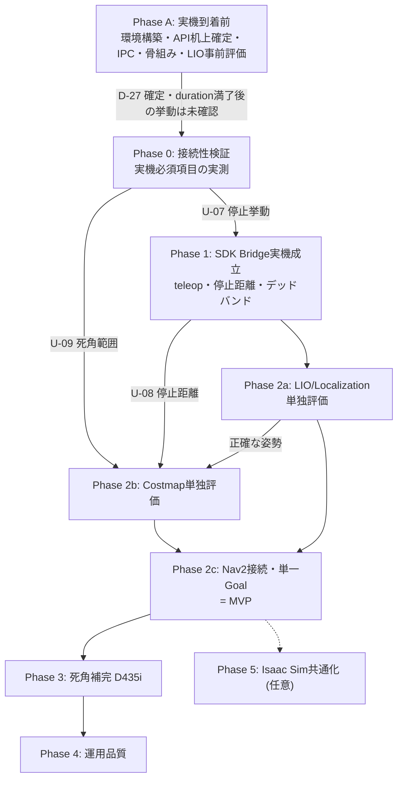

# Unitree G1 ROS 2 Navigation 実装計画

| 項目 | 内容 |
|---|---|
| 文書版 | v0.1 |
| 位置づけ | 実装仕様書 v0.1 の技術検討結果を受けた実装手順計画 |
| 管理単位 | **Nav2 方式の独立トラック**。`Navigation/` 直下の実装とは別系統として `nav2_option/` 配下で管理する |
| 前提 | G1 実機は発注済み・未着。実機到着前に進められる作業を先行フェーズとして分離する |
| 記述粒度 | 各フェーズの作業項目・完了条件・依存関係を記述する。期間・体制は含めない |
| 対象 | Unitree G1 EDU + ROS 2 Jazzy + Nav2 + Unitree SDK2 |

---

## 1. 確定した設計判断

技術検討を経て確定した事項。仕様書 v0.1 からの変更を含む。

### 1.1 ソフトウェア構成

| # | 決定事項 | 根拠 |
|---|---|---|
| D-01 | **ROS 2 Jazzy / Ubuntu 24.04 を継続する** | SDK2 をプロセス分離すれば Unitree 側の Humble 制約を受けない。Isaac Sim 6.0 は Humble/Jazzy 両対応 |
| D-02 | **`unitree_ros2` は使用しない** | 経路から外すことで CycloneDDS 0.10.2 固定の制約が消え、ROS 側の RMW 選択が自由になる。必要な state は SDK 側プロセスが取得し IPC で渡す |
| D-03 | **ROS 側 RMW は FastDDS（Jazzy デフォルト）** | D-02 の帰結。Isaac Sim のデフォルトとも一致し、将来の Sim 共通化で RMW 衝突が起きない |
| D-04 | **`g1_sdk_bridge` は最初から 2 プロセス構成**<br>（競合時のみ分離ではない） | Unitree 公式が「SDK2 は ROS/ROS2 が初期化された環境では起動できない」と明記。競合はほぼ確実に発生する |
| D-05 | **IPC は Unix domain socket（`SOCK_SEQPACKET`）** | メッセージ境界が保たれ、接続断で相手プロセスの死亡を検知できる。全ノードが同一ホスト（Orin）に載るため素直に使える |
| D-06 | **SDK 側プロセスは ROS 2 を一切初期化・リンクしない** | DDS ライブラリ競合の根本回避 |
| D-07 | **SDK 側プロセスは systemd 管理とし、ROS launch から起動しない** | `ExecuteProcess` は `LD_LIBRARY_PATH` / `AMENT_PREFIX_PATH` を継承し ROS 側 CycloneDDS に誤リンクする。加えて、安全の最終防衛線を ROS launch のライフサイクルに従属させない |
| D-08 | **SDK 側プロセスは colcon workspace 外の独立 CMake プロジェクトとしてビルドする** | ROS 環境が source された状態でのビルドを構造的に防ぐ |
| D-29 | **`slam_operate` は `1801`(建図開始) と `1901`(SLAM終了) の 2 つだけを使う**（2026-09-09、ユーザー確認済み）。`1802`(建図保存) / `1804`(地図読込＋自己位置設定) は使わない。送信クライアントには**この 2 つだけを `_RegistApi()` し、`1102`(移動) は構造的に送れないようにする**（[tools/send_slam_api.py](tools/send_slam_api.py)） | 我々が内蔵 SLAM に求めるのは **odometry の供給だけ**（`/unitree/slam_mapping/odom`。これは 1801 で流れる）。`map→odom` は処理済み地図への ICP 合わせ、global costmap は `room_a_map.yaml` で足りるため、地図を PC1 に置く必要がなく 1802/1804 は不要。**これにより「外部で作った地図を PC1 へ転送できない」という制約自体が我々には効かない**。<br>諦めるのは「純正再定位でドリフトを補正する道」だけで、U-16（歩行中のドリフト）が許容範囲なら不要。許容できない場合の代替案として残す（その際はロボット自身に 1801→1802 で地図を作らせ、処理済み地図との変換を ICP で求める。詳細: [findings/g1_dds_sensors.md](findings/g1_dds_sensors.md) §8.6） |
| D-28 | **SDK 側プロセスの本番実装言語は C++ に決定**（2026-09-09、ユーザー確認済み） | 周期送信の安定性（GIL・GC由来のジッタ回避）で有利という当初の判断どおり。`g1_sdk_bridge/` の Python 実装（A-3）はプロトタイプに位置づけ、ロジック（`protocol.py`/`ipc_transport.py`/`sdk_process_mock.py`/`safety_manager.py`）を C++ に移植する。`unitree_sdk2`（C++版）の `LocoClient` シグネチャを正とする（[findings/sdk2_api.md](findings/sdk2_api.md) §4 の C++/Python 差異は、C++版で確定済みのため実質解消） |

### 1.2 制御・安全

| # | 決定事項 | 根拠 |
|---|---|---|
| D-09 | **20 Hz 周期送信と watchdog は SDK 側プロセスに置く** | ROS 側プロセスがクラッシュ・フリーズしても停止指令が発行される |
| D-10 | **watchdog は二重化する**<br>SDK 側: IPC 途絶 → ゼロ速度を周期送信し続ける<br>ROS 側: 異常時に**明示的ゼロ速度送信**＋**送信停止**の両方 | ROS 側が「送信を止めるだけ」に依存すると即効性がない。両方行うことで即効性と冗長性を両立 |
| D-11 | **SDK 側プロセスは起動直後に必ずゼロ速度を送信する** | クラッシュ後の systemd 再起動時に前回の速度が残らないようにする |
| D-12 | **Low-level 関節制御は使用しない。高レベル Locomotion Controller のみ** | 同時使用は転倒に直結。仕様書 v0.1 の方針を維持 |
| D-13 | **異常時はゼロ速度を優先し、Damp / ZeroTorque へ自動遷移させない** | 二足では自動ダンピングが転倒要因になる。モード変更は操作者の明示操作 |
| D-14 | **Safety Manager に速度デッドバンド処理を追加する**<br>（`min_vx` / `min_wz` を新規パラメータ化）。**既定値は0(無効)**（2026-09-09、QUESTIONS.md Q8で(d)を選択） | 二足は極低速で歩容が成立せず足踏みになる。Goal 接近時の微小速度を素通しすると到達判定に入らない。ただし2026-09-09のNav2統合dry-runで、この閾値がNav2のrotate-to-heading起動フェーズの微小角速度(実測0.02 rad/s)も一律ゼロにし、ロボットが永久に動き出せなくなる副作用を発見した。**Phase 1のU-12実測で実際の閾値が判明するまで無効化しておく**方針とした。ApplyDeadband自体のロジックは維持。無効化した状態でNav2からのGoal到達をエンドツーエンドで確認できた |
| D-15 | **MVP は `vy = 0`（横移動無効）から開始する** | 仕様書 v0.1 の方針を維持 |
| D-16 | **速度・加速度・停止距離のパラメータは実測値から逆算して確定する** | 歩容途中の停止で 1〜2 歩進むため、停止距離は数十 cm オーダーになる想定 |
| D-27 | **SDK 呼び出しは `Move()` の既定値に頼らず、`SetVelocity(vx, vy, omega, duration)` を直接呼んで `duration` を明示指定する。`continous_move=True` および `SwitchMoveMode(true)` は使用しない** | `Move(vx,vy,omega)`（3引数・既定）は内部で `SetVelocity(..., duration=1.0)` を呼ぶが、この 1.0 秒は `cmd_timeout`（0.30 秒）より長く、「duration は送信周期より長く watchdog 時間以下」という原則に反する。`continous_move=True` にすると `duration=864000`秒（≒10日）となり、Bridge プロセスが死んだ場合に G1 が指令速度で歩き続ける危険がある。`SetVelocity()` を直接使えば `duration` を `sdk_command_duration`（例: 0.20 秒）に設定でき、原則を満たせる。詳細: [findings/sdk2_api.md](findings/sdk2_api.md) §2, §7 |

### 1.3 Navigation / センサー

| # | 決定事項 | 根拠 |
|---|---|---|
| D-17 | **Navigation スタックはオンボード（Jetson Orin NX）で動かす** | MID-360 は約 20 万点/秒。生点群を WiFi で外部 PC に送る構成は帯域・レイテンシとも成立しない |
| D-18 | **外部 PC は RViz / rosbag / 監視・操作のみ**（軽量トピックのみ DDS で流す） | D-17 の帰結 |
| D-19 | **Localization は FAST-LIO 系（既知点群地図に対する localization）を第一候補とする** | AMCL は 2D LiDAR 前提。MID-360 の非反復走査・3D 特性に合わない。`FAST_LIO_LOCALIZATION_HUMANOID` が G1 を明示対象としている。**加えて、G1 用 `SportModeState_`（`unitree_hg`名前空間）には `fsm_id/fsm_mode/task_id/task_time` の4フィールドしかなく、位置・速度が一切含まれない**（Go2用の同名メッセージには `position`/`velocity` があるが G1 は非対応）。つまり SDK2 側に internal odometry のフォールバックは存在せず、外部 LIO が唯一の位置情報源になる。姿勢（quaternion/rpy）のみ `LowState_.imu_state` から取得可能。詳細: [findings/sdk2_api.md](findings/sdk2_api.md) §6<br>**⚠️ 2026-09-09 追記（要見直し）**: この結論は「SDK2 の IDL に位置フィールドが無い」ことだけを根拠にしていた。実機のDDSを実測したところ、**ロボット自身のSLAMサブシステムが `/unitree/slam_relocation/odom`（`nav_msgs/Odometry`）と `/unitree/slam_relocation/global_map`（`sensor_msgs/PointCloud2`）を標準ROS型で配信する口を持っている**ことが判明した。SDK2 の高レベルAPIとは別系統のため前回の調査では見えていなかった。**「外部LIOが唯一の位置情報源」は誤りである可能性がある**（U-15 として確認する）。詳細: [findings/g1_dds_sensors.md](findings/g1_dds_sensors.md) |
| D-20 | **点群地図の作成（mapping）はオフライン / 操作 PC で行う**<br>運用時の localization のみオンボード | 実機では rosbag 記録のみ。地図生成は高性能 PC でやり直し可能。運用時に mapping 特有の不安定さが入り込まない |
| D-21 | **Local costmap は 3D 点群ベースとする**（`voxel_layer` 等）<br>2D `/scan` は Global costmap / 壁検出用に限定 | ~~頭部 LiDAR の垂直視野は -7°〜+52°。高さ 1.3m から -7° の光線は約 10.6m 先で床に当たるため、足元〜10m の床面と低障害物が原理的に見えない~~<br>**⚠️ この根拠は誤りだった（2026-09-09、立位で実測）。** **MID-360 は逆さ(roll≈180°)に取り付けられており、視野の広い側(52°)が下を向いている。** そのため床は **約1.0m 先から 11.9m 先まで見えており（床平面 inlier 623,965点）、死角は半径 0.91〜1.12m の円だけ**。センサー高さ 1.213m・傾き 3.81°。理論値も「52°が下向き」なら 0.95m で実測と一致し、「7°が下向き」なら 9.88m で実測と矛盾する。<br>**結論そのもの（Local costmap を 3D 点群ベースにする）は変えなくてよい**（3D 点群を使う利点は死角の有無とは別にある）が、**D-24 の適用環境限定と D-25/Phase 3 の優先度は見直すべき**。詳細: [safety/checklist_phase0.md](safety/checklist_phase0.md) 項目6 |
| D-22 | **Controller は Regulated Pure Pursuit から開始する** | MPPI は Orin NX では負荷が厳しい。DWB/MPPI のモデル予測は歩容起因の遅延と乖離する。二足の遅い応答と相性が良い |
| D-23 | **`enable_stamped_cmd_vel = true` とし TwistStamped を標準化する** | Jazzy のデフォルトは false（Twist）だが、Kilted 以降は true。タイムスタンプで stale 指令を弾ける利点もある |

### 1.4 スコープ

| # | 決定事項 |
|---|---|
| D-24 | **MVP は「床に低い障害物が置かれていない管理された区域」に適用環境を限定する**。MID-360 のみで成立させる<br>**⚠️ 根拠が弱まった(2026-09-09)**: この限定は D-21 の「足元〜10m の床が見えない」という前提に基づいていたが、実測では**床は約1.0m 先から見えており死角は半径約1m の円だけ**。**低障害物は 1m 以遠なら見える**ので、限定はここまで厳しくなくてよい可能性が高い。ただし半径1m の死角は残るので、**Phase 2b で costmap 上に死角を可視化してから最終的な適用条件を決める**（D-24 の具体化は元々 Phase 2b の作業項目7）|
| D-25 | **D435i による死角補完は MVP 後の後続フェーズ（Phase 3）で追加する**<br>**⚠️ 優先度が下がった(2026-09-09)**: 補完すべき死角が「足元〜10m」ではなく「半径約1m の円」だと判明したため。加えて D435i は**素の V4L2 では深度・カラーを取り出せず librealsense の導入が必要**（[findings/g1_dds_sensors.md](findings/g1_dds_sensors.md) §3.1）。Phase 3 の投資判断は Phase 2b の死角可視化の結果を見てから |
| D-26 | 屋内・平坦床・単一階層・単一機体・既知地図。階段/段差踏破・ドア操作・人との協調・腕動作は対象外（仕様書 v0.1 の方針を維持） |

---

## 2. 実機構成（確定情報）

| 項目 | 内容 | 実装上の意味 |
|---|---|---|
| 3D LiDAR | Livox MID-360（頭部搭載）<br>360° × 59°（垂直 -7°〜+52°）、内蔵 IMU、非反復走査 | 足元の死角（D-21）。非反復走査のため単一スキャンは疎で、costmap 入力には姿勢に基づく点群累積が必要 |
| Depth カメラ | Intel RealSense D435i（頭部搭載） | Phase 3 で死角補完に使用 |
| Operation and Control Computing Unit | Unitree motion control 専用 | **ユーザーアクセス不可** |
| Development Computing Unit | NVIDIA Jetson Orin NX（Unitree カスタムキャリアボード） | ユーザーコード用。**Locomotion Controller とは物理的に別ユニット**のため、CPU を使い切ってもバランス制御に影響しない |

**FAST-LIO2 系は GPU を使わない CPU 実装**（iKD-Tree ベース）。Orin NX の CPU コアを 1〜2 個占有する想定。GPU は将来の perception 用に空く。

---

## 3. 未確定事項と確定タイミング

計画上の重要な分岐点。**実機なしで確定できるもの**を先行フェーズに寄せる。

### 3.1 実機なしで確定できる（Phase A で実施）

| # | 項目 | 手段 |
|---|---|---|
| U-01 | ~~`LocoClient::Move()` の正確なシグネチャ、duration / `continous_move` 相当の引数の有無~~ | **確定(2026-09-08)。** `Move(vx,vy,omega,continous_move=False)` は内部で `SetVelocity(vx,vy,omega,duration)` を呼ぶ薄いラッパー。`SetVelocity` は仮説に反し**実在する**（API ID 7105）。`duration` 既定値は **1.0秒**、`continous_move=True` なら **864000秒(10日)**。→ D-27 で運用方針を確定。C++/Python間で `Squat`/`StandUp`/`BalanceStand` 系のメソッド名・シグネチャに差異があったが、**実装言語がC++に確定した(D-28)ため、C++版のシグネチャを正として扱う**。詳細: [findings/sdk2_api.md](findings/sdk2_api.md) |
| U-02 | ~~G1 state から取得できる odometry の内容・座標定義・単位~~ | **確定(2026-09-08)。** G1用 `SportModeState_`(`unitree_hg`名前空間) は `fsm_id/fsm_mode/task_id/task_time` のみで**位置・速度フィールドが存在しない**（Go2用にはある）。姿勢(quaternion/rpy)は `LowState_.imu_state` から取得可能。**odometry(x,y)はSDK2に情報源が無く、外部LIOが必須**（D-19強化）。単位・座標系はIDLに明記なし、`terminations.hpp`のデフォルト閾値から rad/s 系と推測されるのみ。詳細: [findings/sdk2_api.md](findings/sdk2_api.md) §6 |
| U-03 | ~~`FAST_LIO_LOCALIZATION_HUMANOID` の Jazzy ビルド可否~~ | **確定(2026-09-08): ビルド可能。** ただし対象は **`humble`ブランチ**（`main`はROS1/catkin_make）。Jazzy固有の非互換は0件。唯一のビルドエラーはOpen3Dのバージョン差分（README指定の0.14.1は入手困難なため0.18.0 develパッケージで代替、1行修正で解決）。Docker上で実際に`colcon build`成功・ノード起動まで確認済み。詳細: [findings/fastlio_jazzy_build.md](findings/fastlio_jazzy_build.md) |
| U-04 | ~~同リポジトリの TF 出力形式~~ | **確定(2026-09-08): 既に正しい2段構成。** `map→base_link`直出しではなかった(当初の懸念は外れた)。`open3d_loc`(localization)が`map→odom`のTFを正しいフレーム名で発行し、`fast_lio`(odometry)が`odom→base_link`相当のTFを`camera_init→body`という**非標準のフレーム名**で発行している。両者は`/Odometry_loc`という**トピック**（TFではない）経由で接続されている。**分解ノードは不要**。必要なのは`fast_lio`側のハードコードされたフレーム名文字列（`"camera_init"`→`"odom"`, `"body"`→`"base_link"`）を書き換える軽微なパッチのみ（Open3D対応と同種の1行修正）。詳細: [findings/fastlio_jazzy_build.md](findings/fastlio_jazzy_build.md)、ソース根拠は `FAST_LIO/src/laserMapping.cpp:642-672` と `open3d_loc/src/global_localization.cpp:279-297,482-505` |
| U-05 | ~~`unitree_mujoco` が G1 の**高レベル** LocoClient をサポートするか~~ | **確定(2026-09-08): 非対応。** README に "Current version only supports low-level development" と明記。`LowCmd`/`LowState` の直接関節制御のみで、`Move(vx,vy,omega)` 相当の高レベル歩行API・歩行コントローラは未実装。`SportModeState` は配信されるが MuJoCo のセンサ値をそのまま流すだけで歩容生成ロジックは含まない。Go2 等の他ロボットも同様。DDSトピック名・IDL(`unitree_hg`)は実機と同一なので**DDS通信層・関節/センサマッピングの前倒し検証のみ可能**。「速度指令→実際の歩行」の統合検証は実機まで持ち越し。詳細: [findings/unitree_mujoco.md](findings/unitree_mujoco.md) |
| U-06 | Isaac Sim 6.0 + Jazzy での Nav2 連携（Sim 共通化を再開する場合） | 差動二輪の単純モデルで先に検証 |
| U-15 | ~~**G1 内蔵の再定位サービス（`/unitree/slam_relocation/*`）が Nav2 の localization を代替できるか**~~ **一部確定(2026-09-09)。**<br>**① 内蔵「再定位」で我々の地図を使う道は、現時点で見つかっていない（※未確定）**: 1804 の `address` は PC1 のファイルシステムを指す。`Navigation/README.md` に「実機で全 address が `errorCode 507`」「PC1 への転送手段が無い」と記録されている。**ただしこれは過去のチームの試行記録で、nav2_option 側では 1804 を一度も送っていない。加えて同 README の「PC1 の主要18ポート全て閉」という根拠は不正確で、実測で `9991` が開いていた。** 未調査の経路（9991 の正体、公式アプリの地図管理、`/unitree_slam/waypoints` の書き込み側、PC2 のゲートウェイ的プロセス）が残っており、「不可」と断定できる段階ではない。<br>**なお転送できなくても代替がある**: ロボット自身に地図を作らせ（`1801`→`1802`）自己位置はそれを使い、**処理済み地図は Nav2 の global costmap 専用**にする。2つの地図間の ICP 合わせが1回必要だが、それは odometry 方式でも必要なので追加コストはほぼ無い。<br>**② ただし内蔵 SLAM の odometry は使える**: `1801`(建図開始) を送ると `/unitree/slam_mapping/odom`(`nav_msgs/Odometry`) が **9.10 Hz**、`frame_id=map` / `child_frame_id=base_link`、**静止時ドリフト 70秒で 0.9cm** で流れることを実測（座位のまま成功、`1901` で完全に元に戻る）。**odometry 目的なら FAST-LIO は不要**で、`map→odom` は処理済み地図への ICP 合わせで与える。TF は出ないので自前で配信する。<br>**残る未確認**: 歩行中のドリフト（要移動）。詳細: [findings/g1_dds_sensors.md](findings/g1_dds_sensors.md) §7-8 |
| U-16 | 上記②の odometry が**歩行中**も使える精度か（二足の上下動・旋回への耐性） | Phase 1 で teleop 歩行させながら計測する。ここが持てば Phase 2a の FAST-LIO 構築（A-6）を丸ごと省略できる | 実機のDDS上に `nav_msgs/Odometry` と点群地図を**標準ROS型**で配信する口があり、現在はサービス未起動でデータが流れていない。`slam_operate` API（純正方式トラック `Navigation/nav/` が使用、例: 1804 = 保存地図の読込＋自己位置設定）で起動して、①出力poseの座標系、②保存地図をどこに置くのか（`Navigation/nav3/README.md` は「`address` は PC1 のファイルシステムを指し、外部で作った地図の転送手段が不明」と記録）を確認する。**成立すれば Phase 2a の FAST-LIO 構築が不要になる可能性がある。** 詳細: [findings/g1_dds_sensors.md](findings/g1_dds_sensors.md) |

### 3.2 実機必須（Phase 0 / Phase 1 で確定）

| # | 項目 | 影響範囲 | 未確定時のリスク |
|---|---|---|---|
| U-07 | ~~**`duration` 経過後に G1 が実際に停止するか、直前速度を保持し続けるか**~~ **確定(2026-09-09、実機実測)。** **自動停止する**（＝§3.3 の安全側の分岐）。`SetVelocity(0.2, 0, 0, 1.0)` を1回だけ送り以後何も送らずに観察したところ、追加指令なしで自分で停止した。**ただし `duration` 満了後に約2秒の"尾"が残る**: 活発な歩容 **1.910 秒** / 完全静止まで **3.419 秒**（LowState の脚12関節を 1017Hz で記録。歩容中の最大関節速度 6.10 rad/s、関節位置変化 23.2°）。D-16 の「歩容途中の停止で1〜2歩進む」がデータで裏付けられた | 安全設計の根幹 | — |
| U-08 | **各速度での停止距離** **一次実測(2026-09-09)**: `SetVelocity(0.3,0,0,1.0)` × 3回で、duration 満了後〜停止までの移動は **4.3〜7.0 cm**（停止まで 3.1〜4.5 秒）。duration 中の移動は 0.208〜0.240m ＝ **速度追従率 70〜80%**。⚠️ **D-16 の「停止距離は数十cmオーダー」という想定より1桁小さい**。理由は「関節は約2秒動き続けるが胴体はほとんど進まない」（最後の数歩は足を揃えて止まる動作）ため。0.3 m/s 以外の速度・歩行中からの急停止は未実測 | Collision Monitor / footprint / 速度上限 | 安全パラメータが根拠なしになる |
| U-09 | ~~**MID-360 の実際の取付角度と死角範囲**~~ **確定(2026-09-09、立位で実測)**: **逆さ取付(roll≈180°)で視野の広い側(52°)が下向き**。センサー高さ **1.213m**、傾き **3.81°**、**死角は半径 0.91〜1.12m**(12方位ほぼ均一)、床は 11.94m 先まで見える。**D-21 の「足元〜10m が見えない」という想定は外れていた**（まさにこのリスク欄が警告していた通り） | costmap 構成、MVP 適用環境の定義 | — |
| U-10 | ~~odometry の符号・単位の実測校正~~ **一次確認済み(2026-09-09)**: 情報源は内蔵SLAM の `/unitree/slam_mapping/odom`（SDK2 の `SportModeState_` には位置が無い、U-02）。**x=機体前方・正**（手で正面へ押して +1.159m、Δyaw +0.15° の純並進として記録）、**yaw 正=反時計回り**（`omega=+0.3` で +10.20°）。y=左 は右手系から導かれる（単独計測はしていない）。静止時のドリフトは 106 秒で ±0.005m/±0.1° 以内 | `g1_state_bridge`、Nav2 全体 | — |
| U-11 | その場旋回時の並進ドリフト量 **一次データ(2026-09-09)**: `omega=+0.3, duration=1.0` の旋回で実測 **+10.20°に対し並進 4.4cm**。ただし1回・1速度のみで、旋回量自体が指令の約1/3しか出ていない条件下の値 | Nav2 の回転動作、localization | Goal 到達精度 |
| U-12 | 微小速度のデッドバンド閾値（歩容が成立する下限速度）**部分解(2026-09-09、実機実測)**:<br>・`vx=0.1`: **歩容が成立しない**（関節が 0.4° 動くだけの姿勢微応答、0.077〜0.2秒で終わる）<br>・`vx=0.2`: **歩容は成立するが進行方向が定まらない**（関節 23.2° 動き、利用者の観察でも「ずれていたが歩けていた」。実際の進行方向が機体前方から **+98.6°** ずれた）<br>・`vx=0.3`: **実用的に前進する**（3回とも Δx +0.228〜+0.231m、方向のずれ -17.7〜-20.4°）<br>→ **D-14 のデッドバンドは「足踏みを防ぐ」だけでなく「進行方向が定まらない速度域を避ける」ためにも要る。`min_vx` は 0.2 より上（0.25〜0.3 程度）が妥当と見込まれる** | D-14 のパラメータ | Goal に到達しない |
| U-13 | G1 の機種・エディション・ファームウェア版・SDK2 版 | 全体 | API 差異 |
| U-14 | Orin NX 上での LIO + Nav2 + costmap の計算負荷 | Controller 選択、周期設定 | 周期遅延 |

### 3.3 duration の扱い（2026-09-08 確定・当初の分岐は解消）

Phase A-2 の調査により、`duration` は `SetVelocity(vx, vy, omega, duration)` で明示制御できることが確定した（D-27）。
当初懸念していた「指令が latch され続ける」ケースは、**API の制約ではなく実装上の選択の問題**だったと判明した。

- `SetVelocity()` を直接呼び、`duration` に `sdk_command_duration`（例: 0.20 秒）を明示指定する
- `Move()` の3引数版（既定 `duration=1.0` 秒）は使わない。`cmd_timeout`（0.30 秒）との関係が原則に反するため
- `continous_move=True` および `SwitchMoveMode(true)` は使用しない。使うと `duration=864000` 秒になり、Bridge 停止時に歩き続けるリスクが生じる

**この方針を守れば、SDK 側 watchdog（D-09）は冗長層として機能する**（G1 自身の `duration` 満了が一次防衛線、SDK 側 watchdog が二次防衛線）。

**残る未確定事項（U-07 として実機必須）**: `duration` 満了後に G1 が実際に停止するのか、それとも直前速度を保持し続けるのかが SDK 内に明記されていない。この一点が未確認のままなので、Phase 0 では**「SetVelocity を1回だけ送り、以後は何も送らずに実機の挙動を観察する」試験を最優先で行う**こと。

| Phase 0 の観察結果 | 対応 |
|---|---|
| **✅ `duration` 満了後に自動的に停止する（2026-09-09 実測でこちらと確定）** | 想定どおり。**D-27 の方針のまま、SDK 側 watchdog を冗長層として運用する。有線 LAN 必須・純正リモコン常時待機を受入要件に格上げする必要は無い** |
| ~~`duration` 満了後も直前速度を保持し続ける（または不定な挙動）~~ | （該当しなかった）D-27 の運用だけでは不十分。SDK 側 watchdog を一次防衛線に格上げし、有線 LAN 必須・純正リモコン常時待機を受入要件に格上げする |

### 3.3.1 ⚠️ ただし「停止までに約2秒かかる」ことが分かった（2026-09-09 実測）

`SetVelocity(0.2, 0, 0, 1.0)` を1回だけ送り、以後何も送らずに LowState の脚12関節を
1017Hz で記録した結果:

| 項目 | 実測 |
|---|---|
| 指令 | vx=0.2 m/s / duration **1.0 秒** |
| 活発な歩容の継続 | **1.910 秒**（最大関節速度 6.10 rad/s） |
| 完全に静止に戻るまで | **3.419 秒** |
| 関節位置の最大変化 | 23.2°（歩容が成立しなかった 0.1 m/s では 0.4°） |

**指令の `duration` が切れても、歩容が完了するまで約2秒動き続ける。** これは
D-16 の「歩容途中の停止で1〜2歩進むため、停止距離は数十cmオーダー」という想定と整合する。
0.2 m/s なら停止距離は 0.2〜0.4m 程度になる見込み。

**設計上の意味**: 「自動停止する」ことは安全側だが、**停止は即時ではない**。
Collision Monitor の停止領域・footprint・速度上限は、この"尾"を前提に
Phase 1 の U-08（各速度での停止距離）を実測してから決めること。
`sdk_command_duration`（D-27、例 0.20 秒）を短くしても、この歩容完了の遅れは縮まらない。

---

## 4. 実装フェーズ

### Phase A — 実機到着前の先行作業

実機に依存しない作業。並行実施可能。

**A-1. 開発環境の構築**
- Ubuntu 24.04 + ROS 2 Jazzy + Nav2 のインストール
- CycloneDDS 0.10.2 を **ROS 環境非 source** の状態で独立ビルド（D-08 の手順を確立）
- SDK 側プロセス用の独立 CMake プロジェクト雛形を作成
- 混入チェックスクリプトを整備: `ldd g1_sdk_proc | grep -E 'rmw|rclcpp|ament'` が空、リンク先 CycloneDDS が 0.10.2

**A-2. SDK2 API の机上確定（U-01, U-02）— 完了**
- `unitree_sdk2` / `unitree_sdk2_python` から `LocoClient` の全メソッドシグネチャを抽出し文書化した
- `duration` は `SetVelocity()` で明示制御できることを確定した（D-27、§3.3）
- G1 の `SportModeState_` には位置・速度フィールドが無いことを確定した（D-19強化）。姿勢は `LowState_.imu_state` から取得可能
- 成果物: [findings/sdk2_api.md](findings/sdk2_api.md)
- 残作業: `Squat`/`StandUp`/`BalanceStand` 等は C++版のシグネチャ（D-28）で実機起動シーケンスに組み込む際に、固定した SDK2 バージョン（U-13）で再確認する

**A-3. IPC プロトコル設計・実装 — プロトタイプ完了**
- ペイロード定義: 固定長構造体 + magic + シーケンス番号 + `CLOCK_MONOTONIC` 送信タイムスタンプ
- cmd 用と state 用で **socket を分離**（state の帯域が cmd のレイテンシに影響しないように）
- 送信側は非ブロッキング、バッファ満杯時は古いものを破棄（最新値優先）
- **モックバックエンド**を用意し、SDK2 なしで IPC 両端の疎通試験ができる状態にした
- 成果物: [g1_sdk_bridge/](g1_sdk_bridge/)（`protocol.py` / `ipc_transport.py` / `sdk_process_mock.py` / `safety_manager.py`）。単体・統合テスト38件、実 Unix domain socket + 実スレッドで動作確認済み（`g1_sdk_bridge/tests/run_tests.sh`）。開発中に見つけたテストのマスキングバグ1件は [FAILURES.md](FAILURES.md) に記録済み
- D-27（`SetVelocity` に常に有限 `duration` を渡す）をコードレベルで強制する設計にした（`SdkBridgeConfig.__post_init__` が `send_period < duration ≤ cmd_timeout` を検証）
- 未実施: 受信側でのタイムスタンプによる stale 指令破棄は cmd_timeout 判定に統合済みだが、独立した stale 破棄ロジックとしては未分離（現状の設計で機能的には充足）
- colcon workspace 化はしていない（QUESTIONS.md Q3）。ロジックは ROS 2 非依存に保ってあるため、rclpy ノードへの移植は薄いラッパーの追加で済む想定
- **C++移植完了(2026-09-09、D-28)**: [g1_sdk_bridge_cpp/](g1_sdk_bridge_cpp/) にPython版を1対1移植した。ワイヤフォーマットはバイト単位で同一(`#pragma pack`+`static_assert`)。テスト38件を1対1でgtestに移植し全通過。ROS 2非source状態でビルド可能(D-06/D-08準拠)。C++化にあたり、Python版のGILが隠していた並行アクセス箇所(`SdkBridgeProcess`の共有状態、`MockMoveBackend`)に明示的なmutex保護を追加した(Python版には無かった対応)。ThreadSanitizerによる検証はAWSサンドボックス環境の制約で実行不可だったため、G1接続PCでの再検証を推奨事項として記録した。詳細: [g1_sdk_bridge_cpp/README.md](g1_sdk_bridge_cpp/README.md)

**A-4. ROS 側ノードの骨組み — 一部完了**
- `safety_manager.py` が `g1_cmd_router` のロジック本体に相当（速度クランプ・加速度制限・デッドバンド(D-14)・状態機械・watchdog を実装済み、単体テスト18件）
- `sdk_process_mock.py` が SDK 側プロセスの watchdog・起動時ゼロ速度(D-11)・FAULT 遷移(D-13) を実装済み
- **ROS 2パッケージ化・完了(2026-09-09)**: このホストに ROS 2 Jazzy が既にインストール済み（2026-09-07、他作業由来）と判明したため前倒しした。[g1_ws/](g1_ws/) に `g1_cmd_router`・`g1_state_bridge` を実際の colcon パッケージ（ament_cmake、rclcpp）として実装し、ビルド・実行を確認した。`g1_sdk_bridge_cpp/`（D-08、ROS非依存）のソースを相対パスで直接コンパイルして使い、ament化はしていない（D-08の前提を壊さないため）
- **エンドツーエンドの疎通を実証**: `g1_sdk_bridge_cpp` に開発用スタンドアロン実行ファイル（`g1_sdk_bridge_mock_server`、MockMoveBackend使用）を追加し、`TwistStamped → g1_cmd_router(クランプ/加速度制限) → IPC → SDK側watchdog → g1_state_bridge → /odom` の全経路が実際に動作することを確認した
- **副産物**: テスト中に D-10 の watchdog が設計どおり動作することを（意図せず）実証した。`enable_navigation` 成功後すぐに Twist を送らないと `cmd_timeout` 超過で自動的に FAULT へ遷移する
- **既知の簡略化**: `STANDBY→READY` の遷移を「SDK接続時に即READY」に簡略化している（本来は TF/センサー鮮度確認後に遷移すべき、仕様書7章）。Phase 2c 着手時に正しい判定へ置き換える必要がある（コード内にTODO明記済み）
- **環境固有の問題と対処法を記録**: このホストで conda が PATH を汚染し `ament_cmake` の python 解決に失敗する現象があった。G1接続PCで同様の環境（miniconda等）がある場合の対処法を [g1_ws/README.md](g1_ws/README.md) に記録した
- **本番バックエンド `RealMoveBackend` 実装完了(2026-09-09、実機で確認済み)**: `unitree_sdk2`(C++)の `LocoClient::SetVelocity()` を呼ぶ実装を [g1_sdk_bridge_cpp/src/real_move_backend.cpp](g1_sdk_bridge_cpp/src/real_move_backend.cpp) に追加し、本番実行ファイル `g1_sdk_bridge_real_server` をPC2でビルド・起動確認した。
  - **発進ゲート(`--arm`)を追加**: 付けない限り SDK を一切呼ばない。ROS 側の状態機械とは独立した防御層（D-10 の二重化方針、`Navigation/real/loco_driver.py` の `--arm` と同じ考え方）。実機で15秒起動し **SDK送信 0 件 / ゲートで停止 292 件**（20Hz周期が回り全て遮断）を確認
  - `ldd` チェック通過（`rmw`/`rclcpp`/`ament` 無し。リンクは SDK 同梱の CycloneDDS のみ）。既存テスト39件も無回帰
  - SDK ヘッダは pimpl で隠し、**ROS 側(`g1_ws`)がこのソースを相対パスでコンパイルしても SDK に依存しない**ようにした（D-08 の前提を保つ）
  - **ビルドで踏んだ落とし穴3件**を README に記録: ①`/usr/local` の install 済みヘッダには G1 の loco ヘッダが無くソースツリー指定が必要 ②C++版 `<dds/dds.hpp>` は `thirdparty/include/ddscxx/` 配下 ③**`LocoClient` を `ChannelFactory::Init()` より前に構築すると segfault する**
  - **未実施**: `--arm` を付けた実際の歩行検証（Phase 0/1 の安全手順に従う）、systemd サービス化
- 未着手: `g1_interfaces`（独自msg/srv）、`g1_bringup`（launch構成）、`g1_description`（URDF・TF、U-09 待ち）。`/g1/stop` の Nav2 Goal キャンセル、E_STOP の手動解除サービスも未実装

**A-5. `unitree_mujoco` 調査（U-05）— 完了・結論: 非対応**
- G1 の高レベル LocoClient は非対応（低レベル `LowCmd`/`LowState` のみ）と確定した
- したがって **Phase 1 の速度指令→歩行の統合検証は前倒しできない**。実機まで持ち越し
- DDS トピック名・IDL は実機と同一なので、**IPC より外側（DDS通信層・関節/センサのマッピング）の検証にのみ**限定的に使える
- **A-3 のモックバックエンド（SDK側プロセスのロジック検証）が、実機到着前に安全設計を検証する唯一の手段になる**ため優先度を上げる

**A-6. LIO / Localization の事前評価（U-03, U-04）— 完了。⚠️ ただし 2026-09-09 の実機実測で「そもそも不要かもしれない」ことが判明**

> **⚠️ 前提の見直し（2026-09-09）**: 実機で `1801`(建図開始) を送ると、G1 内蔵 SLAM が
> `/unitree/slam_mapping/odom`（`nav_msgs/Odometry`、**9.10 Hz**、静止時ドリフト 70秒で **0.9cm**）を
> 標準 ROS 型で配信することを実測した。**odometry の供給源としては、以下で vendoring・修正した
> FAST-LIO は不要になる見込み**（`map→odom` は処理済み地図への ICP 合わせで与える）。
> 歩行中の精度（U-16）が持てば A-6 の成果物は使わずに済む。詳細: [findings/g1_dds_sensors.md](findings/g1_dds_sensors.md) §8
- `FAST_LIO_LOCALIZATION_HUMANOID` の **`humble`ブランチ**を Jazzy でビルド・起動確認済み（`main`はROS1なので対象外）
- Open3D は README指定の0.14.1ではなく**公式devel 0.18.0で代替**（1行修正で対応）。将来のマイナーバージョンアップでのAPI差分に備え、Dockerfileでバージョンを固定する
- TF出力形式を確定: **分解ノードは不要**。`fast_lio`のハードコードされたフレーム名（`camera_init`/`body`）を`odom`/`base_link`に書き換えるパッチのみで、Nav2が要求する`map→odom→base_link`の3段構成になる
- **vendoring完了(2026-09-09)**: `humble`ブランチのソース（`FAST_LIO/`・`open3d_loc/`・サンプル地図）を [vendor/fast_lio_localization_humanoid/](vendor/fast_lio_localization_humanoid/) に取り込んだ。`.git`履歴・動画/GIFのdoc(256MB)は除外し、取り込み後の合計は約7.7MB。`livox_ros_driver2`は改変不要のためvendoringせず、通常の外部依存として都度取得する
- **`open3d_loc`のSIGSEGVバグを修正済み**: `initialpose`パラメータのサイズ検証をC++コードに追加し、不正な場合は`RCLCPP_FATAL`+`std::runtime_error`で明確に停止するようにした。**当初の見立て（config側のノード名不一致が原因）は誤りだった**——実際には正規の起動経路(`launch/open3d_loc_g1.launch.py`)がノード名を明示的にオーバーライドしており、config側と一致していた。config/launchには手を付けず、C++側の検証のみで両方の起動経路に対応した。Docker上で修正前後の挙動差（SIGSEGV→明確なエラー、正常系は無回帰）を実証済み。詳細: [vendor/fast_lio_localization_humanoid/VENDOR_NOTES.md](vendor/fast_lio_localization_humanoid/VENDOR_NOTES.md)
- **新たに判明した残課題**: `kf_baselink2map`パラメータがYAMLのネスト形式(`kf_baselink2map: {x: ...}`)とコード側の宣言(`"kf_baselink2map/x"`、スラッシュ区切り)で一致しておらず、常にデフォルト値`[0,0]`が使われている疑いがある。クラッシュはしないため今回は未修正。Phase 2aで定位精度を評価する際に確認する
- 成果物: [findings/fastlio_jazzy_build.md](findings/fastlio_jazzy_build.md)、[vendor/fast_lio_localization_humanoid/](vendor/fast_lio_localization_humanoid/)（`Dockerfile`、`VENDOR_NOTES.md`）
- 残作業: G1のLiDAR上下逆さま問題への対応が`main`(ROS1)ブランチの独自改造版`livox_ros_driver2`にあるが、`humble`ブランチには未反映。Phase 2a着手時に確認する。`open3d_loc_g1.launch.py`の地図パスのハードコードも運用時に書き換えが必要

**A-7. 点群地図 → 2D occupancy grid 変換ツールの整備 — 完了(2026-09-09)**
- `.pcd`/`.ply` → 高さフィルタ（既定 0.3〜1.8m、D-21）→ 2D 投影 → `.pgm` / `.yaml` → `map_server` の変換パイプラインを実装した
- **未観測を「自由」と誤判定しない3値出力**（occupied/free/unknown）にした。姉妹プロジェクト`Navigation/`が実際に踏んだ「未観測を自由にすると経路が建物の外を回る」問題を踏襲して回避
- vendoring した `vendor/fast_lio_localization_humanoid/data/map.ply`（221,330点）で動作確認。生成した地図をPNG変換して目視し、壁の輪郭・観測済み領域が正しく分離されることを確認した
- 成果物: [tools/pointcloud_to_occupancy_grid/](tools/pointcloud_to_occupancy_grid/)（スクリプト、README、動作確認サンプル出力）
- **G1実機データでの検証・ツール改修完了(2026-09-09)**: `Mapping/real/runs/20260904_203726_room_a` 由来の `map_20260907.pcd`（544,760点、動的物体除去済み）と同セッションの `trajectory.tum`（3,113姿勢）で検証し、実用可能な地図を生成した。生成物: [g1_ws/src/g1_navigation/maps/room_a_map.{pgm,yaml}](g1_ws/src/g1_navigation/maps/)（570x660セル @0.05m、occupied 10.9% / free 48.6% / unknown 40.5%）。この過程でツールの重大な欠陥を3件修正した:
  1. **高さフィルタが絶対Z座標だった（床がZ≒0の前提）**。実データの床は絶対Z≈-1.26m、天井が≈+1.50mで、旧既定値(0.3〜1.8m)は実際には「床上1.55〜3.05m」＝天井付近を見ていた。点群自身のZヒストグラムから床を検出する `find_floor()` を追加し、`--min-height`/`--max-height` を**床からの相対高さ**に変更した。姉妹実装 [Navigation/nav3/pcd_to_ros_map.py](../nav3/pcd_to_ros_map.py) が同じバグを踏んで修正済みで、それに合わせた
  2. **レイトレーシングが無かった**（下記A-9の残課題）。`--trajectory` でmapping時の軌跡を渡し、各姿勢をセンサー原点として2D光線を飛ばして可視セルをfreeにするようにした（実測で free セルを22,842増やした）
  3. **軌跡カーブを新規追加**。`--no-carve` で計測すると、**ロボットが実際に立っていた3,113姿勢のうち476姿勢(15.3%)が occupied 判定になっていた**。原因はnav3が「閾値を上げても消えない斜めの筋」として報告した追従者(PCを持った人物)の胴体が経路上に焼き付いていたこと。Nav2のplannerは開始点が障害物内だと計画自体を拒否するため実質使えない状態だった。機体半径(0.25m)ぶんだけ軌跡沿いの占有を削るようにし、**軌跡100%が単一の連結した自由空間に収まる**状態にした（最大連結成分 397.2m² = free全体の86.9%）
- 副産物: `.pcd` の内蔵リーダーを実装し open3d を任意依存にした（実機PC2など open3d が無い環境でも動く）。連結性の計測レポート（最大連結成分・軌跡が占有セルに乗っていないか）も追加し、「経路計画に使えるか」を数値で判定できるようにした
- **Nav2で経路が引けることを実測確認(2026-09-09)**: `map_server`→`global_costmap`(static_layer)→`planner_server`(NavfnPlanner)を動かし、軌跡の両端（＝ロボットが実際に居た点）間に`ComputePathToPose`を投げて **967点・経路長24.18m（直線距離19.88m、迂回率1.22）** の経路が引けた。`allow_unknown: false`（未観測を通らせない）条件でも成立。RVizでの表示手順は [tools/view_map_rviz.sh](tools/view_map_rviz.sh)（このホストにROS 2が無いため、Nav2を足したMappingのDockerイメージで動かす）
- 残作業: **controller(経路追従)側の検証はまだ**。上記のplanner検証は**Humble**のNav2(1.1.20)で行っており、nav2_option本体の`g1_ws`は**Jazzy**向け(D-01)なので`nav2_params.yaml`そのままでの疎通は別途確認が必要。高さフィルタの既定値はPhase 0のU-09確定後に再調整の可能性あり

**A-8. 安全管理の準備 — 完了(2026-09-09)**
- 試験区域の選定基準・立入管理手順を作成した
- 停止担当者の役割定義、純正リモコンの運用手順を作成した
- Phase 0 / Phase 1 の段階試験チェックシート、停止イベント記録テンプレートを事前作成した
- 成果物: [safety/](safety/)（`README.md` / `roles.md` / `test_area.md` / `checklist_phase0.md` / `checklist_phase1.md` / `incident_log_template.md`）
- 残作業: 試験区域の現地確認（天井高・床材・電源）、実際の人員割り当ては実機到着後に確定する

**A-9. Nav2設定ファイル下書き + 疑似データでの動作確認 — 完了(2026-09-09)。Goal到達をエンドツーエンドで確認**
- [g1_ws/src/g1_navigation/](g1_ws/src/g1_navigation/) にNav2設定一式（costmap/controller/planner、D-14/D-15/D-21/D-22/D-23準拠）と疑似センサー配信を実装
- Nav2の全ライフサイクルノード（map_server, controller_server, planner_server, behavior_server, bt_navigator, velocity_smoother）が正常に起動・activateすることを確認
- **発見1(修正済み)**: `EnableNavigation(true)`直後にcmd_timeoutのカウントが始まり、Nav2のGoal計画時間（実測約1秒）中に最初の指令が届かずFAULTへ誤って遷移していた。「最初の指令を受け取るまではタイムアウト判定を待機する」設計に修正した（`g1_sdk_bridge_cpp`・`g1_sdk_bridge`両方、回帰テスト追加、38→39/39テスト全通過）
- **発見2(解決)**: D-14のデッドバンド(`min_wz`既定0.03)が、Nav2のRegulatedPurePursuitControllerが起動直後の"rotate to heading"フェーズで要求する微小角速度(実測0.02 rad/s)を常時ゼロへ切り捨て、ロボットが永久に動き出せない「にらみ合い」状態に陥ることを発見した。**QUESTIONS.md Q8でユーザーが(d)を選択: Phase 1のU-12実測まで`min_vx`/`min_wz`の既定値を0(無効)にする**。C++・Python両方のデフォルト値を変更した
- **発見3(未修正・運用上の注意点として記録)**: `cmd_timeout`(既定0.30秒)が、Nav2の"Failed to make progress"からの再計画サイクル（実測で数百ms〜1秒程度の間隔）と衝突し、一度FAULTに落ちると（D-13により自動復帰しないため）Nav2が気づかず永久に空振りリトライを続ける状態になることを実際に確認した。**手動で`/g1/clear_fault`+`/g1/enable_navigation`を呼び直すことで復帰し、その後Goalに到達できた。** 本番ではオペレータへのアラート、またはNav2側の再計画間隔とcmd_timeoutの整合を取る調整が必要（Phase 1のU-08/U-12実測と合わせてcmd_timeoutも見直す）
- **副産物の発見**: A-7ツールがレイトレーシングをしていないため、点群由来の地図(`test_room.yaml`)は自由空間がほぼ連結しておらず（最大連結成分3m²未満）、経路計画のデモに使えなかった。連結を保証した合成地図(`synthetic_room.yaml`)に切り替えて検証を継続した。A-7ツールの残課題として記録
  - **⚠️ 上記の帰属を訂正(2026-09-09)**: この `test_room.yaml` は **G1実機の地図ではなく、vendoringしたFAST-LIOのサンプル地図(`vendor/fast_lio_localization_humanoid/data/map.ply`、221,330点)から作ったもの**だった（`tools/.../sample_output/vendored_sample_map.pgm` とバイト単位で同一と実測確認）。この地図は 1120x1102セル中 **90.4%が未観測・freeが7.5%** という極端に疎なデータで、分断はその疎さが主因である。**G1自身のroom_a地図(544,760点)で計測すると、レイトレーシング無しでも最大連結成分は376.7m²あり、「3m²未満」は実機データの性質ではない**。実機データで実際に効いた修正は「絶対Z高さフィルタの是正」と「追従者による偽障害物の除去」で、レイトレーシングの寄与は限定的だった（詳細はA-7の項）
- **最終確認**: 発見1・2の修正後、`NavigateToPose`アクションでGoal(map座標 3.0, 4.0)を送信し、`Reached the goal!` / `Goal succeeded`（Nav2自身のログ）を確認。途中で発見3のFAULTに一度遭遇したが、手動復帰後に到達した
- 成果物: [g1_ws/src/g1_navigation/](g1_ws/src/g1_navigation/)、[g1_ws/src/g1_navigation/README.md](g1_ws/src/g1_navigation/README.md)、[g1_ws/README.md](g1_ws/README.md)

**A-10. 実機データで Nav2 の配線を通す（足は繋がない）— 完了(2026-09-09)**
- `1801`(内蔵SLAM起動) → TF配線 → `map_server`(実地図 `room_a_map.yaml`) + **実機LiDARのlocal costmap** → planner → controller → `/cmd_vel` → velocity_smoother の**全経路を実機センサーで通した**
- 全ライフサイクルノードが `active`、local costmap が 1.677Hz で配信、`NavigateToPose` のゴール受理、**`/cmd_vel` 214件（非ゼロ210件、`wz=0.300 rad/s`）・`/cmd_vel_smoothed` 499件**を確認
- **⚠️ 内蔵SLAMの姿勢は重力整列されていないことが判明**。静止座位で SLAM は pitch `-7.469°±0.027°`（＝**胴体**の姿勢）を報告する一方、IMU が示すセンサーの傾きは約3.9°。無補正だと costmap が使う `map←livox_frame` の重力ずれが **6.10°（生の3.9°より悪化）**になる。[tools/g1_slam_odom_tf.py](tools/g1_slam_odom_tf.py) の `--auto-level` が起動時に IMU と SLAM 姿勢から `R(base_link←livox) = R(map←base_link)ᵀ·R_level` を逆算し、**残差 0.06°** まで追い込んだ
  - ただしこの自動校正は「起動時の姿勢＝運用中の姿勢」でしか正しくない。歩行中は胴体姿勢が振動するので**U-09 の実測値で置き換えるべき**近似
- **副産物（D-14/U-12への示唆）**: A-9 では疑似データの rotate-to-heading が 0.02 rad/s しか出ずデッドバンドに食われる問題があったが、**実機構成では 0.300 rad/s 出ている**ので同じ「にらみ合い」は起きにくい
- **限界**: `map→odom` は恒等変換のままなので、**確認できたのは配線が通ることだけ**。経路の妥当性・到達判定は未検証
  - ⚠️ **訂正(2026-09-09)**: 当初「現在地が room_a ではない」と記録したが**誤り**だった。利用者によると**ロボットは map 原点付近に居る**。照合が失敗したのは場所ではなく手法の問題で、MID-360 の視野が -7°〜+52° と上向きに偏っているため、静止した1視点では見える点の61%が「近い天井」（水平距離の中央値1.65m）・2.7%しか床側に無く、位置を特定できる構造がほとんど無いことが原因（[findings/g1_dds_sensors.md](findings/g1_dds_sensors.md) §6.3）。**静止での自己位置合わせは諦め、歩かせるか内蔵SLAMのodomに任せるのが正しい**
  - ⚠️ **姿勢は同じ「座位」のままでも変動する**（実測: 5.9° → 約4° → 33.16°）。§9.2 の起動時自動校正は脆く、**U-09 の取付角実測が必要**という結論は変わらない
- 成果物: [tools/g1_slam_odom_tf.py](tools/g1_slam_odom_tf.py)、[tools/nav2_live_wiring.yaml](tools/nav2_live_wiring.yaml)、[tools/run_nav2_live.sh](tools/run_nav2_live.sh)、[tools/send_goal_watch.py](tools/send_goal_watch.py)、[tools/check_gravity_tf.py](tools/check_gravity_tf.py)

**完了条件**
- SDK2 の API シグネチャが文書として確定し、§3.3 の分岐が決定している
- IPC 両端がモックで疎通し、単体テストが全て通る
- `ldd` 混入チェックが通る SDK 側プロセスがビルドできる
- LIO の Jazzy ビルド可否と TF 分解方針が確定している
- 実機試験の安全手順書が完成している

---

### Phase 0 — 接続性検証（実機到着直後）

**前提**: Phase A 完了。安全支持具・純正リモコン・補助者の準備完了。

**作業項目**
1. G1 の機種・エディション・ファームウェア版・SDK2 版を記録し、SDK2 バージョンを固定（U-13）
2. 公式サンプルで `Move()` と停止が動作することを確認（ROS を一切介さない状態で）
3. **G1 を安全支持した状態で、`SetVelocity()` を1回だけ送り、以後は何も送らずに `duration` 満了後の挙動を観察する**（U-07）→ 自動停止か直前速度の保持かを確定し、§3.3 の対応表に従って watchdog の一次/二次防衛線を確定
4. SDK 側プロセスの ROS 非依存性を実機環境で検証（`ldd` 混入チェック、CycloneDDS 0.10.2）
5. Unix domain socket の往復レイテンシを実測（20 Hz 周期に対する余裕確認）
6. **MID-360 の取付角度を実測し、死角範囲を数値で確定**（U-09）→ 仕様書に記載、MVP 適用環境の定義を確定
7. G1 state の odometry を記録し、座標系・単位・符号を確認（U-10 の一次確認）
8. Orin NX のリソース状況を確認（CPU コア数、メモリ、他プロセスの負荷）

**完了条件**
- SDK 公式サンプルで G1 が動き、停止できる
- 指令途絶時の G1 挙動が実測値として記録され、設計分岐が確定している
- SDK 側プロセスに ROS ライブラリが混入していないことが確認されている
- MID-360 の死角範囲が数値で確定している

**次への依存**: U-07 の結果が Phase 1 の watchdog 設計を確定させる。U-09 の結果が Phase 2b の costmap 構成を確定させる。

---

### Phase 1 — SDK Bridge の実機成立

**前提**: Phase 0 完了（2026-09-09 に完了条件4つすべて達成）。

> ## ✅ 作業項目1・3を達成した（2026-09-09）
>
> **私たちのソフトウェア経路で実機が初めて歩いた。**
>
> ```
> teleop クライアント → IPC(Unix domain socket) → SdkBridgeProcess(20Hz・状態機械)
>   → RealMoveBackend(--arm) → LocoClient::SetVelocity(0.3, 0, 0, 0.20) → G1 が前進
> ```
>
> | 確認項目 | 結果 |
> |---|---|
> | 発進ゲート(`--arm`) | 開で SDK 送信 **252 件** / ゲート停止 0 件、`sdk_err=0` |
> | 状態遷移 | `DISCONNECTED` → **`NAVIGATING`**(非ゼロ指令中) → **`READY`**(ゼロ指令) |
> | 20Hz 周期送信（D-09） | 成立 |
> | 起動時ゼロ速度（D-11） | 成立（起動直後に SDK送信 1 件） |
> | 状態フィードバック | IPC 経由で `status`/`pose`/`sdk_error_count` が返る |
> | `sdk_command_duration_s = 0.20`（D-27） | **この値で歩容が成立する**ことを確認 |
>
> **ROS を介していない点に注意**: IPC は Unix domain socket なので ROS 側は SDK 側と
> 同一ホストで動く必要があるが、PC2 の ROS は Foxy で `g1_ws` は Jazzy 向け(D-01)。
> そこで [g1_sdk_bridge_cpp/src/teleop_client_main.cpp](g1_sdk_bridge_cpp/src/teleop_client_main.cpp)
> （ROS 非依存の IPC クライアント）で SDK 側プロセス単体を検証した。
> **`g1_cmd_router` を実機で動かすには ROS のバージョン問題を解く必要がある**（残作業）。
>
> ### ✅ SDK 側 watchdog（D-10）も実機で検証した（2026-09-09）
>
> **走行中に teleop クライアントを `kill -9` で突然死させた**（正常なゼロ送信をさせない）。
>
> | 項目 | 実測値（kill を 0 秒とする）|
> |---|---|
> | 歩容の区間 | **t=-2.913 〜 +0.786 秒**（継続 3.699s、最大 7.26 rad/s）|
> | kill の瞬間に歩容が継続中だったか | **はい** |
> | 最後に歩容が観測された時刻 | **t=+0.786 秒** |
> | **完全に静止した時刻** | **t=+3.772 秒 ＝ kill から 3.77 秒後** |
>
> SDK 側の状態遷移: `NAVIGATING` → **`DISCONNECTED`**（kill 検知）。
> `SDK送信` は 262→332 件と増え続けており、**IPC 途絶後もゼロ速度を 20Hz で
> 送り続けている**（`Tick()` が `!cmd_connected` で `effective={0,0,0}` にする）。
> D-10 の設計がそのまま実機で成立した。
>
> **二重の防御が両方効く構造になっている**:
> 1. SDK 側 watchdog（D-10）: IPC 途絶を検知してゼロを送り続ける
> 2. `duration` 満了（D-27/U-07）: 最後の `SetVelocity(duration=0.20s)` が 0.2 秒で失効
>
> ⚠️ **ただし「即停止」ではない。** kill から **0.79 秒**は歩容が1歩を終えるまで動き続け、
> その間も前進する（0.3 m/s 換算で約 0.16m）。Collision Monitor の設定はこれを前提にすること。
>
> ⚠️ **はまった点**: 最初「動かない」となったが、原因は **SDK 側プロセスが起動して
> いなかった**こと（`/tmp/g1_bridge/` が作られていないのが証拠）。
> このとき筆者は「`duration=0.20` が短すぎて歩容が始まらない」という仮説を立てたが
> **誤りだった**。SDK 呼び出しの成功（`sdk_err=0`）は「指令が届いた」ことしか意味せず、
> **機体が動いたかどうかは別に確認する必要がある**という教訓。

**作業項目**
1. ✅ SDK 側プロセスを実機接続し、`/cmd_vel_safe` → IPC → `Move()` の経路を成立させる
   （ただし ROS 側は未接続。teleop クライアントで代替）
2. systemd サービス化（`Restart=always`、起動直後ゼロ速度送信）
3. ✅ 20 Hz 周期送信と SDK 側 watchdog を実機で検証（下記）
4. `g1_state_bridge` 経由で odometry を ROS 側に出し、**符号と単位を校正**（U-10 は 2026-09-09 に内蔵SLAM の odom で確定済み。ROS 側への配線は残作業）
5. teleop による低速試験（仕様書 14.3 段階 1〜5 に相当）
   - 段階 1: 安全支持、ゼロ指令・通信確認
   - 段階 2: 純正リモコンによる停止介入確認
   - 段階 3: 0.5m 直進（低速）
   - 段階 4: 左右旋回 → **旋回前後の並進ドリフトを実測**（U-11）
   - 段階 5: 横移動の符号確認（MVP では無効化するが符号は確認しておく）
6. **各速度での停止距離を実測**（U-08）
7. **歩容が成立する下限速度を実測**し、デッドバンド閾値を決定（U-12）
8. ✅ **通信断・指令断試験（2026-09-09 に実施。下記）**

   **① 指令断（クライアントの突然死）— 安全に止まる**
   走行中に teleop を `kill -9`（正常なゼロ送信をさせない）→ SDK 側 watchdog が検知。
   kill から **0.79 秒**で歩容終了、**3.77 秒**で完全静止（詳細は Phase 1 冒頭の枠内）。

   **② ⚠️⚠️ 通信断（`g1-link` の切断）— 止まらない**

   走行中に操作PC側で `nmcli connection down g1-link` を実行した結果:

   | 項目 | 実測値（切断を 0 秒とする）|
   |---|---|
   | 切断の瞬間に歩容が継続中だったか | **はい** |
   | 最後に歩容が観測された時刻 | **t=+4.045 秒** |
   | 完全に静止した時刻 | t=+5.469 秒 |
   | **切断後の前進距離** | **約 0.85 m** |

   **原因**: `sshd` が 14 秒間 TCP 切断を検知せず **SIGHUP を出さなかった**ため、
   SSH セッションに紐づけた teleop クライアントが**生き残って指令を送り続けた**。
   止まったのは「クライアントが `--seconds 5` で有限時間に終わる設計だったから」であり、
   **通信断が止めたわけではない**。**対話的・無制限のクライアントなら歩き続けていた。**

   **これは Planning.md §7 の警告を数値で裏付けた**:
   > ソフトウェア E-stop は通信が生きている前提の機構であり、通信断では無力

   さらに切断中は操作PC側から `pkill` もできず、**`--arm` 付きのサーバープロセスが
   リンク復旧まで残り続けた**（復旧後に停止した）。

   **設計への要求（新規）**:
   - **「ケーブルを抜く」「ネットワークを切る」は停止手段として使えない。**
     物理的な停止手段（純正リモコン）が唯一の最終防衛線であることが実証された
   - **オンボードで指令を出すプロセスは、それ自体が有限時間で終わるか、
     操作側の生存確認（heartbeat）に依存する必要がある。**
     Nav2 を載せる場合、`bt_navigator` は Goal を受けたら通信断でも実行を続けるので、
     **操作PCとの heartbeat を監視して停止させる仕組みを別に用意すべき**（Phase 2c で設計する）
9. 実測値から安全パラメータを逆算して確定し、根拠を設定ファイルに記録
10. rosbag 記録の構成を確定（軽量常時セット + イベントトリガの点群）

**完了条件**
- teleop で低速の前進・後退・旋回ができ、任意時点で停止できる
- 指令途絶後、規定時間内に **G1 の実速度がゼロになる**ことが実測で確認されている
- 停止距離・デッドバンド閾値・速度上限が実測値に基づいて確定している
- SDK 側プロセスをクラッシュさせても G1 が暴走しないことを確認（systemd 再起動含む）
- Nav2 は未接続

**次への依存**: 停止距離（U-08）が Phase 2b の Collision Monitor / footprint 設定の前提になる。

---

### Phase 2a — LIO / Localization の実機成立

**前提**: Phase 1 完了。Phase A-6 の TF 分解方針が確定済み。

**Nav2 を接続せずに、pose 推定の品質を単独で評価する。**

**作業項目**
1. `livox_ros_driver2` をオンボードで動かし、MID-360 の点群と IMU を取得
2. teleop で対象エリアを歩かせ、rosbag を記録
3. **操作 PC でオフラインに点群地図を生成**（D-20）
4. 生成した点群地図をオンボードに配置し、localization モードで実行
5. **歩行中の pose 推定品質を評価**
   - 二足の上下動・ロール/ピッチ振動に対する pose の安定性
   - 同一経路の往復での再現性
   - その場旋回時の pose 挙動
6. TF が `map → odom → base_link` の 3 段で正しく出ることを確認（`fast_lio` のフレーム名パッチが実データでも機能するか、`open3d_loc` の `initialpose` バグ修正後に `map→odom` が正しく発行されるかを検証）
7. Orin NX 上での CPU 負荷を実測（U-14 の一次確認）

**完了条件**
- 歩行中に localization が破綻せず、`map → odom → base_link` が連続的に発行される
- 同一地点への復帰時の pose 誤差が Goal 許容誤差（0.20m / 0.20rad）に対して十分小さい
- CPU 負荷に余裕がある（Nav2 を載せられる見込みがある）
- Nav2 は未接続

**次への依存**: pose 品質が Phase 2c の Goal 到達判定の成否を決める。ここで破綻する場合、Nav2 を接続しても解決しない。

---

### Phase 2b — Costmap の実機成立

**前提**: Phase 2a 完了（正確な姿勢が得られていること）。Phase 0 の死角測定（U-09）と Phase 1 の停止距離（U-08）が確定済み。

**Nav2 の planner / controller を動かさずに、costmap の品質を単独で評価する。**

**作業項目**
1. 3D 点群ベースの Local costmap を構成（D-21）
   - LIO の姿勢を用いた点群の de-skew と累積（MID-360 の非反復走査への対応）
   - 高さフィルタの設定
2. 点群地図から生成した 2D occupancy grid を Global costmap として読み込む（Phase A-7 のツールを使用）
3. **歩容揺れによるゴースト障害物が出ないことを確認**
   - 床面が障害物として書き込まれないか
   - 天井が空き領域として誤って書き込まれないか
   - 障害物の保持時間（`obstacle persistence`）の調整
4. **footprint を歩容中の脚の包絡線から決定**（胴体幅ではなく）
5. Collision Monitor の停止領域を **Phase 1 の停止距離実測値から逆算**して設定
6. 静的障害物を置いて costmap に正しく現れることを確認
7. **死角の範囲を costmap 上で可視化し、MVP 適用環境の条件として文書化**（D-24 の具体化）

**完了条件**
- 歩行中に costmap にゴースト障害物が現れない
- 静的障害物が正しく costmap に現れる
- footprint と Collision Monitor が実測停止距離に基づいて設定されている
- 死角範囲が可視化・文書化され、MVP 適用区域の条件が明確になっている
- Nav2 の planner / controller は未接続

---

### Phase 2c — Nav2 接続と単一 Goal

**前提**: Phase 2a・2b 完了。各層が単独で合格していること。

**作業項目**
1. Nav2 を起動し、`NavigateToPose` で単一 Goal を実行
2. Controller は Regulated Pure Pursuit（D-22）。`vy = 0`（D-15）
3. `enable_stamped_cmd_vel = true` で TwistStamped に統一（D-23）
4. **歩容起因の応答遅延に対する Controller チューニング**
   - 速度追従が歩容周期（概ね 0.5〜0.7 秒/歩）に律速されることを前提に調整
   - Velocity Smoother の加速度制限は保守的な初期値を維持
5. Goal 到達判定の調整
   - デッドバンド（D-14）が効いて足踏みが起きないことを確認
   - 二足の周期振動で判定が振れる場合、速度判定にローパス済み推定速度を使用
6. 段階試験（仕様書 14.3 段階 6〜7）
   - 段階 6: 単一 Goal への移動、到達・衝突なし
   - 段階 7: 静的障害物の回避
7. 状態機械の全遷移を実機で検証（E-stop、FAULT、Clear）
8. Nav2 再起動・Bridge 再起動時に不意に歩行しないことを確認
9. Orin NX 上での総合的な計算負荷を実測し、周期遅延がないことを確認（U-14 確定）

**完了条件**（= MVP 受入基準、仕様書 15章）
- RViz から指定した単一 Goal へ自律移動できる
- 実機固有コードが `g1_sdk_bridge` / `g1_state_bridge` に分離されている
- 非ゼロ速度が Navigation Enable かつ正常状態のときだけ SDK へ送られる
- 指令途絶後、規定時間内に **G1 の実速度がゼロになる**
- E-stop、SDK 異常、TF 異常、センサー期限切れをログ付きで検出できる
- Low-level 関節制御と高レベル Locomotion Controller を同時使用していない
- rosbag から Goal・経路・姿勢・速度指令・停止理由を追跡できる

---

### Phase 3 — 死角補完（D435i 併用）

**前提**: Phase 2c 完了（MVP 成立）。

MVP の適用環境限定（D-24）を解除するフェーズ。

**作業項目**
1. D435i の取付角度を決定（前下方）し、TF を確定
2. D435i の点群を costmap の obstacle source に追加
3. MID-360 と D435i の融合 costmap で、**足元〜近距離の低い障害物が検出できることを確認**
4. 床置きの箱・椅子の脚・段差などの実物で検出試験
5. 埋まらない死角が残ることを前提に、速度上限と Collision Monitor で守る設定を維持
6. Orin NX の計算負荷を再評価（D435i の点群処理が追加される）
7. MVP の適用環境条件を更新

**完了条件**
- 床置きの低い障害物に対して停止または回避ができる
- 残存死角が文書化され、運用上の制約として明記されている
- 計算負荷が許容範囲内

---

### Phase 4 — 運用品質

**前提**: Phase 3 完了。

**作業項目**
1. 動的障害物への対応（人が横切る等）— 停止・再開の挙動
2. `vy`（横移動）の段階的な解放（D-15 の解除）
3. 狭路でのその場旋回可否の確認
4. 自動診断の充実、異常時の復旧手順の整備
5. 長時間試験（localization のドリフト、メモリリーク、熱）
6. 速度・加速度パラメータの段階的な向上と最適化
7. 複数 Goal / waypoint follower への拡張

---

### Phase 5（任意）— Isaac Sim との共通化

**前提**: 実機で Nav2 が成立していること（Phase 2c 以降）。

現時点では優先度を下げて保留。再開する場合の要点:

1. **Isaac Sim + Jazzy で Nav2 が動くことを、差動二輪の単純モデルで先に成立させる**（U-06）
   - NVIDIA フォーラムに Isaac Sim 5.x + Jazzy での Nav2 連携不具合の報告が複数ある。G1 モデルと混ぜると切り分けが困難になる
2. Isaac Sim の内部 ROS libs を無効化し、システムの Jazzy を `system_default` で使う設定に固定
   - 内部ライブラリは Python 3.11、Ubuntu 24.04 のシステム ROS は Python 3.12 で不整合が起きる
3. `g1_sim_bridge` を実装し、`backend:=sim|real` の排他起動を成立させる
4. 同一試験シナリオで軌跡・到達誤差・停止距離を比較

**期待値の設定**: 共通化できるのは **Nav2 の設定と Topic 構成まで**。Isaac Sim 側の歩行コントローラは実機の Unitree 純正 Locomotion Controller とは別物であり、速度追従特性・停止距離・旋回時の横滑りは一致しない。受入基準は「一致」ではなく「**Nav2 パラメータが両方で成立する範囲を見つける**」と位置づける。

---

## 5. 依存関係



**Phase 2a / 2b を Nav2 接続前に切り出すことが計画の要点**。実機で Nav2 が動かないとき、原因が localization / costmap / controller / SDK bridge のどれかを切り分けるのは極めて困難なため、各層を単独で合格させてから積む。

---

## 6. リスクと対策

| リスク | 影響フェーズ | 対策 |
|---|---|---|
| `Move()` の既定（`duration=1.0`秒）をそのまま使うと `cmd_timeout`（0.30秒）との整合が崩れる | Phase A・0〜1 | **解消済み**: `SetVelocity()` を直接呼び `duration` を明示指定する（D-27）。残るのは `duration` 満了後の実挙動が未確認な点のみ（U-07、Phase 0 で最優先確認） |
| `continous_move=True` を誤って使うと通信断で G1 が歩き続ける | Phase A〜運用全体 | D-27 でコーディング規約として明記。コードレビュー・単体テストで `SetVelocity` 呼び出しの `duration` が常に有限値であることを検証する |
| **⚠️ 通信断（操作PC↔オンボード）はロボットを止めない。実測で切断後 0.85m 前進した** | Phase 1・2c・運用全体 | 2026-09-09 実測。`sshd` が TCP 切断を 14 秒検知せず SIGHUP が出ないため、オンボードの指令プロセスが生き残って指令を送り続けた。**「ケーブルを抜く」は停止手段にならない。** 物理的な停止手段（純正リモコン）が唯一の最終防衛線。オンボードの指令プロセスは有限時間で終わるか、操作側の heartbeat に依存させる必要がある（Phase 2c で設計） |
| SDK2 と ROS 2 の DDS 競合 | Phase A・0 | D-04〜D-08 で構造的に回避。`ldd` 混入チェックを受入項目化 |
| ~~`FAST_LIO_LOCALIZATION_HUMANOID` が Jazzy でビルドできない~~ | Phase A-6 | **解消済み(2026-09-08)**: `humble`ブランチでビルド・起動確認済み。Jazzy継続方針に対するリスクは無くなった |
| ~~LIO の TF が `map→base_link` 直出しで Nav2 の Local costmap が壊れる~~ | Phase A-6 / 2a | **解消済み(2026-09-08)**: 実際は既に`map→odom`/`odom→base_link`の2段構成だった。フレーム名パッチのみで対応可能(分解ノードは不要) |
| ~~`open3d_loc`(localizationノード)の`initialpose`パラメータ未適用によるSIGSEGV~~ | Phase 2a | **解消済み(2026-09-09)**: vendoring先の`open3d_loc/src/global_localization.cpp`にサイズ検証を追加し、SIGSEGVを`RCLCPP_FATAL`+例外に変えた。Docker上で無回帰も確認済み。詳細: [vendor/fast_lio_localization_humanoid/VENDOR_NOTES.md](vendor/fast_lio_localization_humanoid/VENDOR_NOTES.md) |
| `kf_baselink2map`パラメータがYAML/コード間の区切り文字不一致(`.`/`/`)で常にデフォルト値になっている疑い | Phase 2a | クラッシュしないため今回は未修正。Phase 2aの定位精度評価時に実際の値を確認する |
| Open3Dのバージョン差分で将来ビルドが壊れる | Phase 2a以降 | devel 0.18.0にバージョン固定(pin)し、Dockerfileに明記して再現性を確保する |
| 二足歩行の振動で costmap にゴースト障害物が出る | Phase 2b | LIO 姿勢での点群 de-skew、高さフィルタ、障害物保持時間の調整 |
| 頭部 LiDAR の死角で低障害物を検出できない | Phase 2b・3 | MVP は適用環境を限定（D-24）。Phase 3 で D435i 併用 |
| Goal 接近時に微小速度で足踏みし到達しない | Phase 1・2c | デッドバンド処理（D-14）。閾値は Phase 1 で実測 |
| ~~D-14デッドバンドがNav2起動直後のランプアップ中の微小指令もゼロにし、ロボットが永久に動き出せない~~ | Phase 2c | **解消済み(2026-09-09)**: `min_vx`/`min_wz`の既定値を0(無効)にした（QUESTIONS.md Q8(d)）。Phase 1のU-12実測後に再度有効化を検討する |
| `cmd_timeout`がNav2の再計画リトライ間隔と衝突し、一度FAULTになると永久に空振りリトライが続く | Phase 1・2c | 2026-09-09のdry-runで確認済み。手動`clear_fault`で復帰可能なことは確認済みだが、本番ではオペレータ通知の仕組みか、Nav2の再計画間隔とcmd_timeoutの整合調整が必要。Phase 1のU-08実測と合わせて見直す |
| ~~A-7の占有格子ツールがレイトレーシングをしておらず自由空間が連結しない~~ | Phase 2a | **解消済み(2026-09-09)**: レイトレーシング（軌跡をセンサー原点とした2D光線）を実装。併せて、より影響の大きかった2件（絶対Z高さフィルタ、追従者による偽障害物）も修正した。G1実機のroom_a地図で軌跡100%が単一の連結自由空間に収まることを実測確認（A-7の項）。なお「最大連結成分3m²未満」はvendoringした疎なサンプル地図での値で、実機データの性質ではなかった |
| 地図に写り込んだ追従者・機体自身が偽の障害物になり、ロボットが実際に通った場所が occupied になる | Phase 2a・2c | 2026-09-09に実測で発覚（room_a地図で軌跡の15.3%が occupied 上）。A-7ツールに軌跡カーブ（機体半径ぶん占有を削る）を実装して解消。**ただし根本的には Mapping 側の動的物体除去の精度に依存する**。軌跡カーブは「ロボットが通れた場所は自由」という事実に基づく事後補正であり、軌跡がドリフトしている場合は本物の障害物を削る危険があるため半径を機体半径以上に広げないこと |
| 歩容起因の応答遅延で Controller が発振・不安定になる | Phase 2c | Regulated Pure Pursuit を採用（D-22）。Velocity Smoother の保守的な加速度制限を維持 |
| その場旋回で位置がずれ Goal 精度が悪化 | Phase 1・2c | Phase 1 でドリフト量を実測し、Nav2 の回転動作の設定に反映。**一次データ(2026-09-09): +10.20°の旋回で並進 4.4cm** |
| ~~低速時に「指令方向」と「実際の進行方向」が大きく食い違う~~ → **低速固有と判明。速度下限で回避する** | Phase 1・2c | `vx=0.2` では進行方向が機体前方から **+98.6°** ずれたが、**`vx=0.3` では -17.7〜-20.4° に収まる**（3回、Δx は 3mm 以内で再現）。**D-14 の `min_vx` を 0.25〜0.3 程度に設定して低速域を使わないようにする**のが対処。U-12 の項も参照 |
| **⚠️ 系統的に右へ veer する（3回とも約19°、yaw も毎回 -1.3〜-5.8°）** | Phase 1・2c | 2026-09-09 実測。ランダムなばらつきではない。**原因（機体の較正／支持具の引っ張り／床の傾き）は未切り分け**。Nav2 の経路追従では無視できないので Phase 1 で切り分ける。機体固有の偏りなら `g1_cmd_router` での補正、支持具由来なら支持を外して再測定 |
| **odom の瞬間速度が指令の 175〜183% を示す（歩容の振動を拾う）** | Phase 1・2c | 実測: 平均 0.21〜0.24 m/s に対し瞬間値は 0.52〜0.55 m/s。**9Hz の odom では歩容の上下・前後動を分離できない**。速度フィードバック（controller の progress checker、goal checker の速度判定）に使うならローパスが必須（D-14 の「速度判定にローパス済み推定速度を使用」と整合） |
| Orin NX の計算負荷不足 | Phase 2a・2c・3 | Controller を軽量なものから開始。負荷を各フェーズで実測。Locomotion Controller は別ユニットなので Orin は使い切れる |
| 停止距離が想定を超え安全距離が不足 | Phase 1・2b | 停止距離を実測してから Collision Monitor を設定する順序を厳守 |
| `unitree_mujoco` が高レベル API 非対応で、速度指令→歩行の統合検証を実機前倒しできない | Phase A・1 | A-3 の SDK 側プロセスのモックバックエンド（`sdk_process_mock.py`）で watchdog・状態機械・デッドバンド等のロジックのみ先行検証する。歩行そのものの検証は Phase 1 の実機まで持ち越す |

---

## 7. 実機試験の安全前提（全フェーズ共通）

Phase 0 以降の全ての実機作業で以下を満たす。

- 試験区域を立入禁止にし、補助者と純正リモコンを配置する
- **純正リモコンまたは物理停止手段を常に使用可能な状態に保つ**（ソフトウェア E-stop は通信が生きている前提の機構であり、通信断では無力）
- 停止担当者を明示的に指名する
- Phase 0〜1 の初期段階は G1 を安全支持した状態で実施する
- 速度は低速から段階的に上げ、各段階の合格を確認してから次に進む
- 全ての停止イベントに、時刻・状態・停止理由・最後の指令・SDK 結果を記録する
- 異常時は自動で Damp / ZeroTorque へ遷移させない。まずゼロ速度、モード変更は手動承認（D-13）

---

## 8. 仕様書 v0.1 からの変更点（反映が必要な箇所）

| 仕様書の箇所 | 変更内容 |
|---|---|
| 6.2 速度変換 | `SetVelocity(vx, vy, omega, duration)` は実在する正しい API と確定（Phase A-2）。ただし `Move()` 経由の既定値（1.0秒）ではなく、`SetVelocity()` を直接呼んで `duration` を明示指定すること（D-27）を明記。`continous_move` の禁止事項も追記 |
| 4. ソフトウェア構成 | 「競合時のみ分離」→ **最初から 2 プロセス分離**（D-04） |
| 5.1 Topic | TwistStamped を標準とする（D-23） |
| 5.3 TF | LIO は分解ノード不要と確定。`fast_lio`のフレーム名パッチ（`camera_init`→`odom`, `body`→`base_link`）を追記（D-19、U-04） |
| 8. Safety Manager | `min_vx` / `min_wz`（デッドバンド）を追加（D-14） |
| 9.1 Navigation MVP | 2D `/scan` ベース → **3D 点群ベースの Local costmap**（D-21）。Controller は Regulated Pure Pursuit（D-22） |
| 9.1 | 点群地図 → 2D occupancy grid 変換工程を追記 |
| 2. 前提と未確定事項 | Navigation PC はオンボード確定（D-17）。適用環境の限定を明記（D-24） |
| 15. MVP 受入基準 | 「指令途絶後 0.5 秒以内にゼロ速度指令を**発行**」→「規定時間内に **G1 の実速度がゼロになる**」（実測値で確定） |
| 16. 実装フェーズ | 本計画書の Phase 構成に置き換え |
| 19. 実装前レビュー項目 | SDK2実装言語はC++に確定(D-28)。残る未決定はSafety ManagerとCommand Routerを同一プロセスにするか、G1との物理接続（有線/WiFi）の2点 |

---

## 9. 参考資料

**Unitree**
- [Unitree SDK2](https://github.com/unitreerobotics/unitree_sdk2) — C++ SDK。`LocoClient` のヘッダを Phase A-2 で確認
- [Unitree SDK2 Python](https://github.com/unitreerobotics/unitree_sdk2_python) — [G1 LocoClient サンプル](https://github.com/unitreerobotics/unitree_sdk2_python/blob/master/example/g1/high_level/g1_loco_client_example.py)
- [G1 Sport Services Interface（公式）](https://support.unitree.com/home/en/G1_developer/sport_services_interface)
- [CycloneDDS and UnitreeSDK（競合の解説）](https://github.com/unitreerobotics/xr_teleoperate/wiki/CycloneDDS-and-UnitreeSDK-(en))
- [SLAM and Navigation Services Interface（ROS 環境との競合明記）](https://support.unitree.com/home/en/developer/SLAM%20and%20Navigation_service)
- [unitree_mujoco](https://github.com/unitreerobotics/unitree_mujoco) — SDK2 互換シミュレータ（Phase A-5 で調査。結論: 高レベル非対応）
- [G1 Development Guide（Weston Robot）](https://docs.westonrobot.com/tutorial/unitree/g1_dev_guide/) — 計算ユニット構成
- [Unitree G1 Overview（QRE DOCS）](https://docs.quadruped.de/projects/g1/html/g1_overview.html)

**本プロジェクトの調査成果物（`nav2_option/findings/`）**
- [findings/sdk2_api.md](findings/sdk2_api.md) — `LocoClient`/`SetVelocity` の確定シグネチャ、State型のフィールド一覧（Phase A-2, 2026-09-08）
- [findings/unitree_mujoco.md](findings/unitree_mujoco.md) — 高レベルAPI非対応の確定根拠（Phase A-5, 2026-09-08）
- [findings/fastlio_jazzy_build.md](findings/fastlio_jazzy_build.md) / [findings/fastlio_jazzy.Dockerfile](findings/fastlio_jazzy.Dockerfile) — `humble`ブランチのJazzyビルド確認、Open3D対応、TF構成の実測（Phase A-6, 2026-09-08）
- [findings/g1_dds_sensors.md](findings/g1_dds_sensors.md) — **実機のDDSトピック一覧・センサー疎通の実測**（2026-09-09）。MID-360は9.998Hz/20,064点で正常、IMUは200.1Hz（ただしorientationは無効・単位はg）。**G1に内蔵の再定位サービス（`/unitree/slam_relocation/odom` 等、標準ROS型）が存在することを発見**（D-19の見直し材料）。頭部カメラはIRと深度のみ取得可で、Mappingが「color」として記録していた画像も実はIRだった

**Localization / LIO**
- [FAST_LIO_LOCALIZATION_HUMANOID](https://github.com/deepglint/FAST_LIO_LOCALIZATION_HUMANOID) — G1 を明示対象とした LiDAR localization。**`humble`ブランチがROS2実装**（`main`はROS1）。Jazzyでのビルド・起動を確認済み（2026-09-08）
- [g1pilot](https://github.com/hucebot/g1pilot) — G1 向け ROS 2 パッケージ。MOLA odometry + planner
- [FAST-LIO2 論文](https://arxiv.org/pdf/2107.06829)

**Nav2 / ROS 2**
- [Nav2 ドキュメント](https://docs.nav2.org/)
- [Nav2 Iron→Jazzy 移行（TwistStamped、`enable_stamped_cmd_vel`）](https://docs.nav2.org/migration/Iron.html)
- [Nav2 Velocity Smoother](https://docs.nav2.org/configuration/packages/configuring-velocity-smoother.html)

**Isaac Sim（Phase 5）**
- [Isaac Sim ROS 2 Installation](https://docs.isaacsim.omniverse.nvidia.com/latest/installation/install_ros.html)
- [Isaac Sim 5.1 + Jazzy Nav2 連携の既知問題](https://forums.developer.nvidia.com/t/isaac-sim-5-1-navigation-not-working-with-ros2-jazzy-on-ubuntu-24-04/349766)
