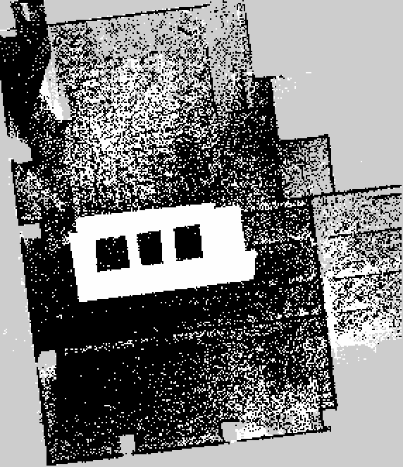
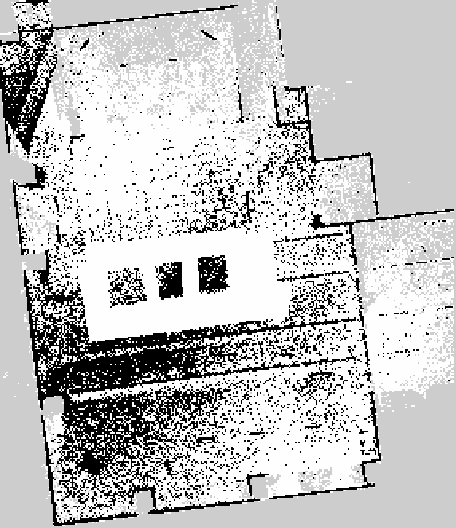
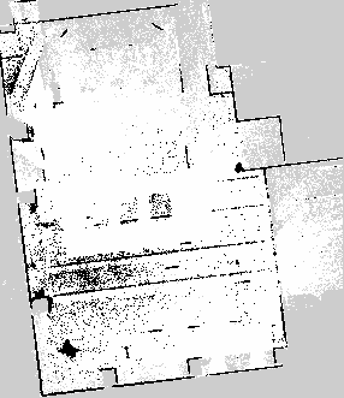
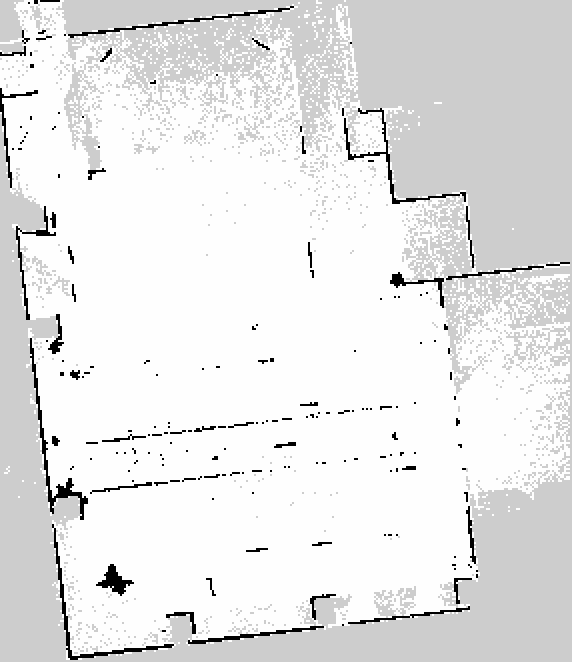
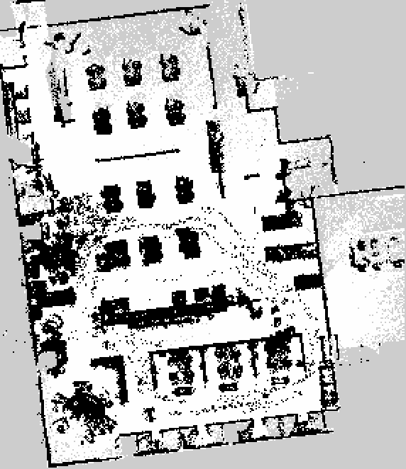
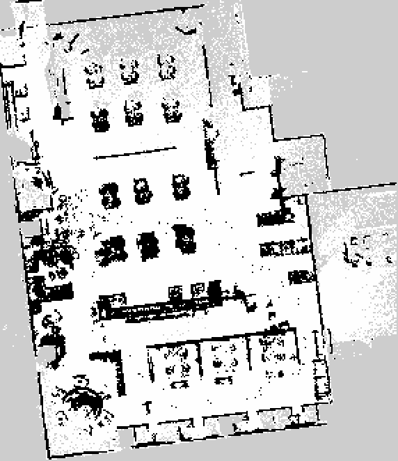
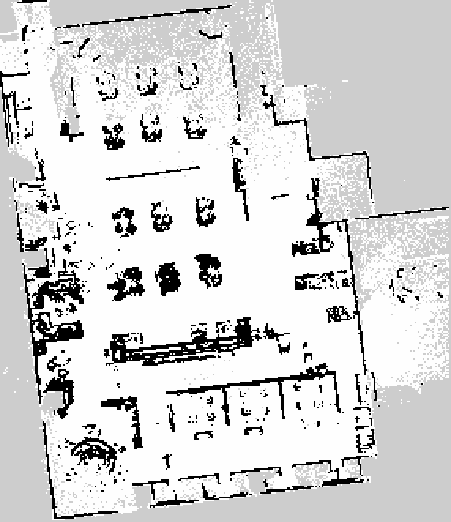
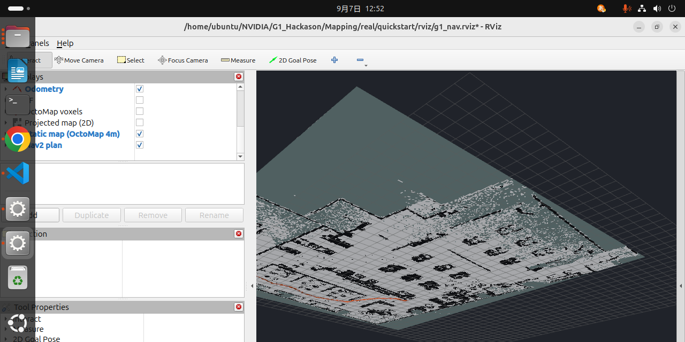
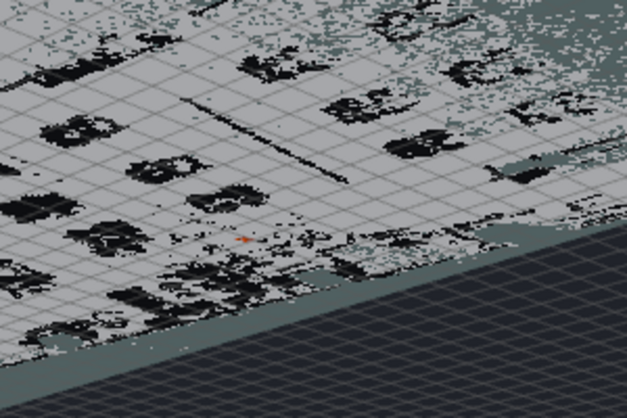
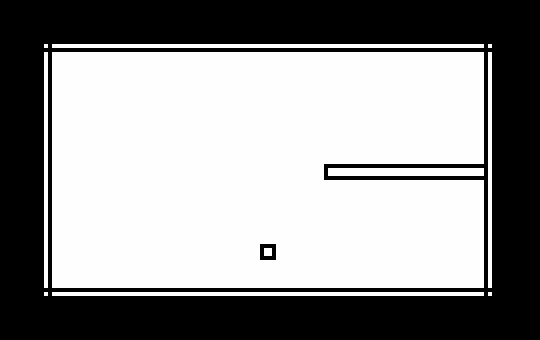

# Navigation / nav2_static_map（`map_server`起動まで検証済み、`nav_stack.sh`への統合は未実施）

⚠️ **これは新しい検討用フォルダ。`../nav/`・`../real/`・`../nav2/`は一切変更していない。**
既存の純正方式・Nav2方式（`real/README.md`参照）とは別に、
「今日除去・補正した地図(`map_20260907.pcd`)をNav2に静的地図として読ませられないか」
を検討する。

## 動機

純正方式(`../nav/`)の`1804`は保存地図の読込＋自己位置設定を行うが、`address`は
**PC1(运控PC)のファイルシステム**を指しており、外部で作った/加工した地図をPC1へ
転送する手段が見つかっていない（`../README.md`「`address`はPC1のファイルシステムを
指す」節）。つまり今日Mapping班が作った`map_20260907.pcd`は、純正方式では使えない。

一方Nav2方式(`../real/`)は`slam_operate`を経由しないので、この制約を受けない。
ただし`../nav2/g1_nav2.yaml`を読むと、Nav2側もまだ**静的地図を使っていない**ことが
分かった:

- `global_costmap`に`static_layer`は**設定済み**（`map_topic: /map`から読む）
- しかしそれを配信する`nav2_map_server`の`map_server`ノードは、
  `Mapping/real/quickstart/nav_stack.sh`のどこにも起動されていない
- 地図ファイル(`.yaml`+`.pgm`)自体もリポジトリに存在しない

つまり「設定は半分書かれているが、地図ファイルも配信ノードも無い」状態だった。
ここを埋めるのが本フォルダの目的。

## やったこと

### 1. PCD → ROS map_server形式の変換ツール（`pcd_to_ros_map.py`）

`../nav/occupancy.py`の`build_grid()`は「通れない」を1つのboolに潰す設計
（A*経路探索が未知という概念を持たないための安全側の判断）。しかしROSの
`map_server`形式は本来**自由・占有・未知の3値**を区別でき、`g1_nav2.yaml`の
`track_unknown_space: true`もこの3値を前提にしている。そこで`nav/occupancy.py`は
**一切変更せず**、高さ帯・解像度の定数だけ再利用して3値判定を別途実装した。

```bash
cd Navigation/nav2_static_map
python3 pcd_to_ros_map.py <地図.pcd> <出力名> --bounds X_MIN X_MAX Y_MIN Y_MAX
```

`--bounds`を省略すると点群のbounding box全体を使うが、**今回の計測は外れ値で
x方向に52mまで伸びており**、素直にやると614x410セルの大半が「未知」の
巨大でスカスカな地図になる（実測: 自由8.4% / 占有16.9% / 未知74.7%）。

### 2. `map_20260907.pcd`で実際に変換・検証した

1%タイル基準で実際の部屋の範囲(`x[-5.5,23] y[-17.5,15.5]`)に絞って変換:

```
[grid] 286x331セル（0.1m/セル）
[grid] 範囲内の点: 537,126/544,760
[grid] 自由 19,230 (20.3%) / 占有 41,549 (43.9%) / 未知 33,887 (35.8%)
```

出力画像:



## ⚠️ 分かった問題: 部屋のほとんどが「占有」になる → 閾値実験で切り分けた

画像を見ると、中央の白い長方形（自由空間）以外、**部屋の内部がほぼ真っ黒（占有）**
になっている。これは`../nav/route.py`での検証（自由セルが全体の約1%、5つに分断）と
**同じ傾向**で、独立した2つの実装が同じ結論に達したことになる。

原因の仮説として「1点でもセルを占有にする閾値が厳しすぎる」を疑い、
`--occupied-min-points`（セルあたり何点以上あれば占有とみなすか）を追加して
1〜30点で振った。

| 閾値(点) | 自由 | 占有 | 未知 |
|---|---|---|---|
| **1**(既定) | 20.3% | **43.9%** | 35.8% |
| 2 | 36.6% | 27.6% | 35.8% |
| **3** | 47.6% | 16.6% | 35.8% |
| **5** | 58.6% | **5.6%** | 35.8% |
| 8 | 61.7% | 2.5% | 35.8% |
| 12 | 62.4% | 1.8% | 35.8% |
| 20 | 62.9% | 1.3% | 35.8% |
| 30 | 63.3% | 0.9% | 35.8% |

**結論: 1点で占有と判定する既定の設計が原因の大半だった。** 閾値を1→5に上げるだけで
占有率は44%→5.6%まで落ちる。ご指摘の通り、「床に少しでも物が落ちている(≒什器の縁の
1点ノイズ)」が原因だった。

### ただし上げすぎると本物の什器まで消える

| 閾値=3 | 閾値=5 | 閾値=8 |
|---|---|---|
|  |  |  |

- **閾値3**: まだ塩胡椒状のノイズが残るが、部屋の内部構造（机の列）が見え始める
- **閾値5**: 壁・通路がはっきりし、ノイズはほぼ消える。**現状のバランス案として採用**
- **閾値8**: 壁は残るが**本物の机・椅子まで大半が消えてしまう**。効きすぎ

`room_a_map.pgm`/`.yaml`は**閾値5**で更新済み（自由58.6% / 占有5.6% / 未知35.8%）。

### 面白い副産物: 閾値8でも消えない「例の帯」

閾値8の画像をよく見ると、壁がほぼ消えた中でも**部屋中央を横切る薄い斜めの筋**が
まだ残っている。これは`Mapping`班が今日ずっと除去に苦労していた「追従者(PC/人物)の
軌跡」の残り(`Mapping/.../DYNAMIC_OBJECT_REMOVAL_SUMMARY.md`参照。マスク編集で
大幅に薄くしたが完全には消えていないと明記されている)と同一箇所だと考えられる。

つまり**この筋は「1点ノイズ」問題とは別物**で、閾値を上げても消えない
（ロボットが同じ場所を何度も周回したため、点数で見ると実は本物の什器より
「密」になっている）。閾値実験で解決できるのは床の散発的なノイズだけで、
追従者の軌跡のような**繰り返し観測された動的物体**にはMapping班の手法
（視認性ベース・手動マスク）が引き続き必要、という切り分けができた。

**⚠️ ただしこの節（閾値実験そのもの）は、次に見つかったバグの影響下で行っている。
傾向（1点ノイズが支配的）自体は正しいが、「何を数えていたか」が誤っていた。
修正後の再実験は次節。**

## ⚠️⚠️ 重大なバグ発覚: 高さ閾値が「絶対Z」で「床からの高さ」ではなかった（2026-09-07）

利用者から「床から10cm以上の点で判断できないか」と聞かれ、床基準になっているか
確認したところ、**なっていなかった**。

`nav/occupancy.py`の`DEFAULT_OBSTACLE_Z_MIN/MAX`(0.30〜1.80m)は**絶対座標のZ**への
閾値で、`nav/occupancy.py`自身のコメントに「床（実測でz≒0）」とある通り、
**Z=0が床にある点群を前提**にしている。しかし`map_20260907.pcd`の実際のZ分布を
ヒストグラムで確認すると:

```
床:  絶対Z ≈ -1.30m 付近に全体の36.7%が集中（巨大なピーク）
天井: 絶対Z ≈ +1.50m 付近に全体の16.5%が集中
```

**Z=0は床ではなかった。** この状態で`z_min=0.30, z_max=1.80`（絶対座標）を適用すると、
実際には「**床から1.6〜3.1m**（天井を突き抜けた範囲）」を見ていたことになる。
机・椅子（床から0〜1m付近）はほとんど範囲外で、代わりに**天井の点（全体の約16%）を
「占有」として大量に誤検出していた。** 前節までの検証画像・閾値実験は、
この誤った高さ帯に対して行っていたことになる。

### 修正: 点群自体から床を検出し、相対高さで判定する

`find_floor()`（Mapping班の各ツールと同じヒストグラムのピーク検出）を追加し、
`--z-min`/`--z-max`は**床からの相対高さ[m]**として扱うよう変更した。既定値も
利用者の提案どおり**下限0.10m**（床の小物・ケーブルの厚みは拾わない）、
上限1.50m（人の頭・天井際を除く）に変更した。

### 修正後の結果（劇的に改善した）

| 閾値=1(既定, 修正後) | 閾値=3 | 閾値=5 |
|---|---|---|
|  |  |  |

修正前後の比較（同じ閾値=1）:

| 修正前（絶対Z、バグ） | 修正後（床からの相対高さ） |
|---|---|
| 自由20.3% / **占有43.9%** / 未知35.8% | 自由46.0% / **占有18.3%** / 未知35.8% |

**閾値を上げなくても（閾値=1のままでも）占有率が44%→18%に半分以下になった。**
さらに床基準になったことで、初めて**机・椅子の列がそれらしい黒い塊として
はっきり見えるようになった**（前節までの画像は正体不明の斑点だったが、これは
実質「天井のノイズ」を見ていたため形が什器と一致していなかった）。

閾値=3の画像には、中央左に**円形/ループ状の点線パターン**もうっすら見える。
これも`Mapping`班が苦労していた追従者の軌跡と同一箇所・同一形状だと考えられる
（今度は正しい高さ帯で見ているので、これは実際に本物の可能性が高い）。

`room_a_map.pgm`/`.yaml`は**修正後・閾値=3**の版に更新済み
（自由52.0% / 占有12.2% / 未知35.8%）。

### この教訓が`nav/route.py`側にも波及する可能性

`nav/occupancy.py`は`DEFAULT_OBSTACLE_Z_MIN/MAX`を絶対座標のまま使っており、
**同じ問題が`nav/route.py`の経路計画（自由セル約1%という結果）にも
影響している可能性がある。** ただし`nav/occupancy.py`自体は`../nav/`の一部で
本フォルダでは変更しない方針のため、これは`Mapping`班・`Navigation`班本体への
申し送り事項として記録するにとどめる。`uis_main_floor.pcd`など他の地図では
床が実際にZ≈0付近だった可能性もあり、**地図ごとに検算が必要**。

## ✅ 実際にNav2で読み込んで検証した（2026-09-07）

上記「まだやっていないこと」のうち1・2・4を、**Dockerを使わずホスト直接**で検証した。

### 実行環境: Dockerではなくホストの`/opt/ros/jazzy`を使用

`nav_stack.sh`は`tiryoh/ros2-desktop-vnc:humble`というDockerイメージ前提だが、
**ホストに直接フルセットのROS2 Jazzy(`/opt/ros/jazzy`)が入っている**ことが判明した
（Nav2一式・`rviz2`・`octomap_server`すべて確認済み）。不足していた
`rmw_cyclonedds_cpp`だけ`apt install`し、Dockerもネットワーク越しのイメージ取得も
使わずに検証できた。

つまずいた点（再現用にメモ）:
- `room_a`のrosbagは`metadata.yaml`が`rosbag2_0.db3`を指すが、実ファイルは
  `rosbag2_0-002.db3`（ダウンロード時の重複回避で改名されたとみられる）。
  シンボリックリンクで解決（元ファイルは変更していない）
- `CYCLONEDDS_URI`で`lo`インターフェースをmulticast指定すると
  `"lo" is not multicast-capable`で失敗する。指定を外し、代わりに
  `ROS_DOMAIN_ID`を専用の値(42)にして他プロセスと衝突しないようにした
- `odom_to_tf.py`は`rclpy`が要るが、PATH上の`python3`はminiconda
  (3.14、rclpy無し)を指す。`/usr/bin/python3`(system、3.12、rclpy+yaml入り)を
  明示する必要があった

### 手順（実行したコマンド）

```bash
source /opt/ros/jazzy/setup.bash
export RMW_IMPLEMENTATION=rmw_cyclonedds_cpp
export ROS_DOMAIN_ID=42

# 1) rosbagを再生
ros2 bag play <room_a>/raw/rosbag2 --rate 3 --clock --loop &

# 2) TFを流す（nav_stack.shと同じ較正値を流用）
/usr/bin/python3 Mapping/real/quickstart/odom_to_tf.py --nav2-frames \
    --livox-rpy-deg 178.35 -8.41 -0.72 --livox-xyz -0.004 0.016 -0.037 &

# 3) OctoMapを作る（生LiDARから）
ros2 run octomap_server octomap_server_node --ros-args \
    -p resolution:=0.10 -p frame_id:=map -p base_frame_id:=base_link \
    -p sensor_model.max_range:=2.0 -p use_sim_time:=true \
    -r cloud_in:=/utlidar/cloud_livox_mid360 &

# 4) map_serverを起動してActivate
ros2 run nav2_map_server map_server --ros-args \
    -p yaml_filename:=room_a_map.yaml -p use_sim_time:=true &
ros2 run nav2_util lifecycle_bringup map_server

# 5) RVizで確認（既存のg1_nav.rvizがそのまま使えた）
rviz2 -d Mapping/real/quickstart/rviz/g1_nav.rviz
```

### 結果: 全部通った

- `map_server`が`room_a_map.yaml`/`.pgm`を**エラーなく読み込み**、`mode: trinary`
  （3値）として正しく認識した。`286 x 331 map @ 0.1 m/cell`とログに出た
- `/map`トピックが実際に配信されていることを`ros2 topic echo /map --once`で確認
- `map -> base_link`のTFが解決できることを`tf2_echo`で確認（並行して動く
  `octomap_server`も生LiDARを問題なく`map`座標系へ変換できていた）
- **RVizで実際に地図を表示**（`g1_nav.rviz`の「Static map (OctoMap 4m)」表示が
  そのまま`/map`を指していた）。真上から見た形は`verification/`の事前プレビュー
  画像と完全に一致した



### 座標系の整合性 → 一致することを確認できた

**懸念していた「地図とodomフレームの原点が一致しているか」が、実際に一致していた。**
`Odometry`表示（オレンジの矢印・軌跡）を重ねたところ、再生したrosbagの自己位置が
**地図の自由空間（廊下部分）の上に正しく乗り、壁を突き抜けていなかった**。



`room_a`セッション自身のrosbagを再生する限り、`map_20260907.pcd`から作った
静的地図はそのままNav2の`static_layer`に統合できる、という結論になった。

## まだやっていないこと

1. ~~座標系の整合性~~ → ✅ 上記で確認できた（ただし`room_a`セッション自身の
   rosbagに限る。別セッションや実機ライブでは未確認のまま）
2. **`map_server`の起動が`nav_stack.sh`本体には組み込まれていない。** 今回は
   `nav2_static_map`フォルダ内で個別に起動して検証しただけで、`nav_stack.sh`
   自体は変更していない（統合案は本セクションの下に残す）
3. **占有マップの「部屋の一部が黒くなりすぎる」問題は、閾値調整で緩和したが
   根本解決ではない。** `--occupied-min-points`の最適値は経験則であり、
   `global_costmap`の`inflation_layer`と組み合わせたときの実際の通行可能領域は
   まだ見ていない
4. 実際に`Nav2`の`bt_navigator`/`planner_server`まで起動して、目標地点への
   経路計画が`static_layer`込みで正しく動くかは未確認（今回は`map_server`と
   `octomap_server`の疎通までで、フルの`navigation_launch.py`は起動していない）
5. **実行に使ったプロセス群は全て今回限りの手動起動。** `nav_stack.sh`への
   統合案（下記コード片）は未適用のまま

### `nav_stack.sh`への統合案（未適用）

```bash
# nav_stack.sh の 2/4 と 3/4 の間あたりに追加するイメージ
spawn mapserver.log "ros2 run nav2_map_server map_server --ros-args \
    -p yaml_filename:=/work/G1_Hackason/Navigation/nav2_static_map/room_a_map.yaml \
    -p use_sim_time:=$SIM_TIME"
spawn lifecycle.log "ros2 run nav2_util lifecycle_bringup map_server"
```

`map_server`はライフサイクルノードなので`lifecycle_bringup`（か`nav2_bringup`の
自動起動オプション）で`configure`→`activate`させる必要がある（今回はこれで成功した）。

## 次の一手（提案）

1. `navigation_launch.py`(bt_navigator/planner_server込みのフル起動)まで動かし、
   `2D Goal Pose`で実際に目標地点を指定して経路計画が通るか確認する
2. `nav_stack.sh`本体に上記の統合案を適用し、Docker版でも同じ手順が通るか確認する
   （今回はホスト直接のJazzyで検証したため、Humble/Docker版は未確認のまま）
3. 占有判定の閾値・`inflation_layer`の組み合わせを実際の`global_costmap`表示で
   見ながら追い込む

---

## AMCL検証（2026-09-07・MuJoCoシミュレーション）

`g1_nav2.yaml`は`map -> odom`を恒等変換にしており、AMCL（LiDARスキャンを地図と
照合して自己位置を求め直す仕組み）は使われていない。外部で作った地図・別セッションへの
再利用にはこれが要る（`../README.md`参照）。ここでは**AMCLが実際に機能するか**を、
MuJoCo上のG1シミュレーションで検証した。**作業はすべて`Navigation/`配下**
（`nav2_static_map/amcl_sim_verify.py`・`.venv_amcl/`）にとどめている。

### 実行環境: 3つ目のPython環境が必要だった

`rclpy`(ROS2 Jazzy、Python 3.12)と`mujoco`/`torch`(Navigation本体の`.venv`、
Python 3.10固定)は**同じプロセスで同居できない**（`cyclonedds`のwheel都合で
`.venv`は3.10に固定されているが、`rclpy`は3.12でビルドされている）。

そこで本フォルダ専用に`--system-site-packages`付きの3.12 venv
（`nav2_static_map/.venv_amcl/`）を新規に作り、そこへ`mujoco`/`mujoco-lidar`/
`torch`(CPU版)/`scipy`/`scikit-image`を追加インストールした。ROS2側の共有ライブラリ
（`librcl_action.so`等）を見つけるには`source /opt/ros/jazzy/setup.bash`が要る
（`--system-site-packages`だけでは`/opt/ros/jazzy/...`は入らないため、
site-packagesへ`.pth`ファイルでパスを追加した）。

`Navigation/.venv`（`uv sync`管理、3.10、実機接続用）とは完全に別物で、
依存関係も混ぜていない。

### 設計: 地図とMuJoCoの世界を同じ元から作る

`sim/rooms.py`の`Room.grid()`（占有格子）を、そのままROS `map_server`形式の
`.pgm`/`.yaml`に変換する（`amcl_sim_verify.py`の`grid_to_ros_map()`）。合成の部屋
なので「未観測」は無く、占有/自由の2値で足りる。これにより**地図と
MuJoCoの物理世界が最初から一致していることが保証**される（`sim/rooms.py`自身が
掲げている「地図とMuJoCoの世界の食い違いを防ぐ」設計方針をそのまま踏襲）。

`test_room`（11m×6m、柱1本+仕切り1枚）で検証した:



### ブリッジの設計

`mujoco_lidar`（`sim/g1_walker.py`の`Mid360`）が返すworld座標のLiDARヒット点群を、
ロボット基準の`sensor_msgs/LaserScan`（360ビン・等角度）に変換して`/scan`へ流す。
`odom`は**簡略化してground truthをそのまま流している**（確かめたいのは
「AMCLがスキャンマッチングで地図に対する位置を求められるか」であって
「オドメトリ誤差への耐性」ではないため）。

```
MuJoCo(G1Walker) --LiDARヒット点--> LaserScan(/scan)
                 --ground truth位置--> Odometry(/odom) + TF(odom->base_link)
                                            ↓
                                     amcl (map_server の /map と照合)
                                            ↓
                                      /amcl_pose を購読して ground truth と比較
```

### 結果: パイプラインは通った。精度は要チューニング

`map_server`→`amcl`を起動（初期位置は開始姿勢`(-4.5,-2.0,0)`を種として付与）し、
前進・旋回・横移動を混ぜた25秒間の台本を走らせた。

```
出発姿勢:       (-4.50, -2.00, yaw=0.00)
最終ground truth: (-2.05, -1.28, yaw=-0.50)
最終AMCL推定:    (-2.60, -1.24)  誤差 0.547m

時刻ごとの誤差: 0.15m 〜 0.65m の範囲で推移（明確な収束は見られなかった）
```

**確認できたこと**:
- `/scan`→AMCL→`/amcl_pose`の**パイプライン自体は正しく機能する**（エラー・警告なし、
  継続的に位置推定が更新される）
- 誤差は常に1m未満に収まっており、突拍子もない誤推定（別の部屋に飛ぶ等）は起きていない

**確認できなかった/課題**:
- 誤差が0.15〜0.65mの間で**振動しており、時間とともに収束していく傾向が明確ではない**。
  考えられる原因（未切り分け）:
  1. `test_room`が柱1本+仕切り1枚だけの**特徴の乏しい部屋**で、特に開けた向きでは
     スキャンマッチングの手がかりが少ない
  2. `mujoco_lidar`のLivox非反復スキャンパターンは**間引き済み**
     （`sim/g1_walker.py`の`LIDAR_DOWNSAMPLE`）で、1回のスキャンが疎い可能性がある
  3. AMCLのパーティクル数・センサモデルのパラメータを既定値のまま使っており、
     この用途向けに調整していない
- より特徴の多い部屋（`room_a`由来の実地図など）や、パーティクル数・
  センサモデルパラメータの調整で改善するかは未検証

### 動かす

```bash
# 1) 地図を作る（Navigation/nav2_static_map/amcl_test_map.pgm/.yaml ができる）
cd Navigation/nav2_static_map
.venv_amcl/bin/python amcl_sim_verify.py --map-only

# 2) map_server と amcl を起動（別ターミナル、ROS_DOMAIN_IDは他と衝突しない値に）
source /opt/ros/jazzy/setup.bash
export RMW_IMPLEMENTATION=rmw_cyclonedds_cpp
export ROS_DOMAIN_ID=43
ros2 run nav2_map_server map_server --ros-args -p yaml_filename:=amcl_test_map.yaml &
ros2 run nav2_util lifecycle_bringup map_server
ros2 run nav2_amcl amcl --ros-args -p base_frame_id:=base_link \
    -p set_initial_pose:=true -p initial_pose.x:=-4.5 -p initial_pose.y:=-2.0 &
ros2 run nav2_util lifecycle_bringup amcl

# 3) シミュレーションを走らせて比較する
.venv_amcl/bin/python amcl_sim_verify.py --duration 25
```

## フルNav2 bringup検証（2026-09-07・MuJoCoシミュレーション）

上のAMCL単体検証の続き。「ゴールを与えたら実際にそこまで自律的に歩くか」を、
`controller_server`/`planner_server`/`behavior_server`/`bt_navigator`まで含めた
フルスタックで検証した。`map_server`/`amcl`は上と同じ`amcl_test_map`(`test_room`由来)
を使う。

### 構成

- `nav2_sim_params.yaml`: フルスタック用のNav2パラメータ。`real/g1_nav2.yaml`
  （実機・OctoMap・純正SLAM前提）とは別物で、センサが`/scan`(LaserScan)のため
  costmapは`VoxelLayer`ではなく`ObstacleLayer`を使う。`use_sim_time`は使わない
  （`/clock`を出していないので壁時計のまま）
- `nav2_sim_bridge.py`: `amcl_sim_verify.py`の`Bridge`を継承し、
  `controller_server`が出す`/cmd_vel`をそのまま`G1Walker.set_command()`へ渡す。
  決め打ちの動作台本ではなく、Nav2が実際に決めた速度指令で歩かせる
- `run_nav2_sim.sh`: `map_server`→`amcl`→(MuJoCoシム起動)→`controller_server`→
  `planner_server`→`behavior_server`→`bt_navigator`の順で起動し、
  `navigate_to_pose`アクションにゴールを送って結果を見る

### つまずいた点（すべて実測で踏んだ）

1. **起動順序のデッドロック**: `controller_server`/`planner_server`の
   local/global costmapは`on_activate`時に`base_link→odom`・`base_link→map`の
   TFを同期的に待つ。先に全ライフサイクルノードを起動してからMuJoCoシムを
   起動する順だと、シムが無い間TFが一切流れず**activateが永遠に終わらない**。
   → シム(TFを出す側)を`amcl`起動直後、他のNav2ノードより**先に**起動するよう変更。
   `nav2_sim_bridge.py`側は`navigate_to_pose`アクションサーバの出現を
   `wait_for_server()`（ブロッキング）ではなく`server_is_ready()`（非ブロッキング）
   でポーリングするようにし、他ノードがまだ無くても物理ループを止めない設計にした
2. **pluginlibのクラス名区切り**: `nav2_navfn_planner/NavfnPlanner`や
   `nav2_behaviors/Spin`のように`/`区切りで書くと「そのようなクラスは無い」と
   `FATAL`で落ちる。正しくは`::`区切り（`nav2_navfn_planner::NavfnPlanner`）。
   しかも`lifecycle_bringup`バイナリは遷移要求を送るだけで**最終状態を確認せずに
   成功終了する**ため、この失敗はbashのエラーチェックをすり抜けた
   （`ros2 lifecycle get <node>`で明示的に最終状態を確認するよう修正）
3. **`ros2 run` はexecではなくfork**: バックグラウンドジョブの`$!`を`kill`しても、
   実体（`map_server`等のCバイナリ）は孤児として生き残る。前回実行の残骸が
   `map_server`を複数同時に立ち上げる状態になり、`-p`で渡したはずの
   `yaml_filename`が別プロセスに飲まれたような不可解な失敗を引き起こした。
   → `set -m`でジョブごとに専有プロセスグループを作り、`kill -- -$pid`で
   グループごと止めるよう修正。加えてスクリプト冒頭で前回の残骸を`pkill`で掃除
4. **`map_server`は`--params-file`だけでは動かない**: `nav2_sim_params.yaml`に
   `map_server:`ブロックを書いていなかったため`yaml_filename`が未初期化で
   `on_configure`が例外を出した。`amcl_sim_verify.py`の検証時と同じく、
   `yaml_filename`は`-p`で直接渡す
5. **ゴール送信の早撃ち拒否**: `server_is_ready()`はDDSレベルの発見
   （`bt_navigator`の`on_configure`時点でアクションサーバが存在する）を見ており、
   `on_activate`が終わって内部的に「active」になる前に真を返すことがある
   （実測で約250msの隙間）。この隙間でゴールを送ると
   `"Action server is inactive. Rejecting the goal."`で拒否される。
   → 拒否を致命的エラーにせず、1秒待って再送するリトライ(最大10回)を追加
6. **機体自身をLiDARが障害物として拾う**: `real/g1_nav2.yaml`には
   `obstacle_min_range: 0.30`（「至近は機体自身が写る」という注記付き）が
   既にあったのに、シム版を書くとき見落として`0.0`にしていた。近距離の
   自己ヒットが常にcostmapを汚し、`RegulatedPurePursuitController`が
   前進を安全と判断できず足踏み/回頭ばかりになる一因になっていた
   （0.35mに修正）
7. **「静止」は実際には静止しない**: 歩行ポリシーは速度指令への追従だけを
   学習しており、「その場に留まる」ための目的関数を持たない。指令(0,0,0)でも
   実測でゆっくり特定方向へ**ドリフトする**。プランナ待ちで数十秒立たせている間に
   このドリフトだけで壁際まで押し出され、global costmapのinflationに
   引っかかって`GridBased plugin failed to plan ... "Failed to create plan"`
   が起き続けた（`/cmd_vel`受信が0のまま位置だけ動いていたことから発覚）。
   → シムなのでground truthを使える特権を利用し、`/cmd_vel`が途絶えた瞬間の
   姿勢を覚えて小さな補正指令でその場に留める`stop_if_stale()`をシム専用に実装

### 結果

障害物(柱)を大きく迂回する必要がない、開けたゴールで検証:

```
出発: (-2.75, -1.76)
ゴール: (-1.00, +1.50)
終了: SUCCEEDED
最終姿勢: (-0.33, +0.80)  ゴールまでの距離: 0.97m
/cmd_vel 受信回数: 323
```

`compute_path_to_pose`→`FollowPath`→`G1Walker`という**Nav2が決めた経路・速度指令で
実際に歩いてゴールに到達した**ことを確認できた。ただし最終ground truthはゴールから
0.97m離れており、`general_goal_checker`の`xy_goal_tolerance`(0.30m)より大きい。
`goal_checker`はAMCL推定位置（map座標系）で判定するため、これは上のAMCL検証で見た
0.15〜0.65mの推定誤差が積み重なった結果と考えられる（未確定）。

柱(0,-2)を北へ回り込む必要があるゴール(4.5,-2.0)では、経路追従中に柱の至近
（中心から0.14m、機体半径0.40mより内側）まで接近してしまい、そこから
`GridBased plugin`が「開始点が障害物内」を理由に再計画に失敗し続けて
最終的にタイムアウトした。狭い迂回が必要な経路での追従精度は未検証のまま残っている。

### 動かす

```bash
source /opt/ros/jazzy/setup.bash
cd Navigation/nav2_static_map
bash run_nav2_sim.sh --goal-x -1.0 --goal-y 1.5 --timeout 90
```

### RVizでゴールを地図上から指定する

`--goal-x/--goal-y`は決め打ちの座標だが、`--interactive`を付けると
自分ではゴールを送らず、RViz2の「2D Goal Pose」ツールでクリックしたゴールを待つ
（`navigate_to_pose`のアクションサーバはbt_navigatorが立てているので、
送信元がどのクライアントでも受け付ける）。`--viewer`を足すとMuJoCoのGUIも
同時に開き、実際に歩く様子を目視できる（`nav2_sim_bridge.py`の`--viewer`。
`sim/run_sim.py`と同じ`mujoco.viewer.launch_passive`）。

```bash
# ターミナル1: フルスタックを起動し、外部からのゴール送信を待つ
source /opt/ros/jazzy/setup.bash
export DISPLAY=:1         # --viewerでMuJoCoのGUIも見るなら必須
cd Navigation/nav2_static_map
bash run_nav2_sim.sh --viewer --interactive

# ターミナル2: RVizを開き、地図上でゴールを指定する
source /opt/ros/jazzy/setup.bash
export ROS_DOMAIN_ID=44   # run_nav2_sim.shと同じドメインに合わせる
export DISPLAY=:1         # このマシンのX表示先
rviz2 -d Navigation/nav2_static_map/nav2_sim.rviz
```

RVizが開いたらツールバーの「2D Goal Pose」を選び、地図上でクリック＆ドラッグして
位置と向きを指定する。`nav2_sim.rviz`には`/map`・`/scan`・TF・AMCLパーティクル雲
(`/particle_cloud`)の表示も入れてあるので、経路追従の様子を目視できる。

⚠️ **`nav2_rviz_plugins/GoalTool`（ツールバー表示名「Nav2 Goal」）は使わないこと。
このROS2 Jazzy環境では機能しない（2026-09-08判明）。** ボタンの見た目上は
反応する（クリック＆ドラッグ後にツールが元のMove Cameraへ戻る）が、
`ros2 topic info /goal_pose --verbose`で確認すると`Publisher count: 0`のまま、
`ros2 node info /rviz`でも`Action Clients:`が空で、**ROS側には何も送られていない**。
何度も丁寧にドラッグして再現するので、操作ミスではなくツール自体の不具合と判断した。
`bt_navigator`（`NavigateToPoseNavigator::onGoalPoseReceived`）は`/goal_pose`
(`geometry_msgs/PoseStamped`)を購読しているので、標準の`rviz_default_plugins/SetGoal`
（表示名「2D Goal Pose」）に差し替えたところ即座に`/goal_pose`へ発行され、
実際に`bt_navigator`が`Begin navigating from ... to ...` → `Goal succeeded`まで
到達することを確認済み（`nav2_sim.rviz`は修正済み）。

### 確認できたこと / 残った課題

**確認できたこと**:
- `map_server`/`amcl`/`controller_server`/`planner_server`/`behavior_server`/
  `bt_navigator`という**フルNav2スタックが、MuJoCoシムを相手に一括起動できる**
- `navigate_to_pose`にゴールを送ると、Nav2が経路計画→速度指令生成を行い、
  その指令でMuJoCoの歩行ポリシーが実際に歩いてゴールへ到達する
  （閉ループでの自律歩行を実証）

**残った課題**:
- 障害物を狭く迂回する経路での追従精度・再計画の頑健性
- AMCL推定誤差(0.15〜0.65m)がgoal_checkerの成否判定にそのまま乗る
- `use_collision_detection`や`inflation_radius`など、安全マージン系パラメータは
  実機G1の実測に基づく調整をしていない（すべて仮値）
